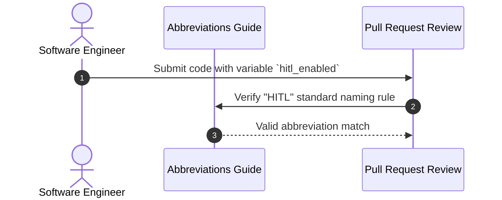

# 1. Overview
This reference document catalogs all technical acronyms, initialisms, and shorthand abbreviations used across the **Automated Job Agent** engineering handbook, APIs, database schemas, and codebase comments.

---

# 2. Why This Exists
Modern software systems combine terminology from distributed systems, machine learning, web scraping, and recruitment software. Clarifying technical acronyms prevents ambiguity across backend, frontend, and AI engineering teams.

---

# 3. Responsibilities
- Provide a single, authoritative reference for technical acronyms across the repository.
- Ensure consistent variable and documentation naming standards.

---

# 4. Inputs
- Platform architecture specifications across all 26 phases.

---

# 5. Outputs
- Categorized reference table linking short-form acronyms to expanded terms and architectural descriptions.

---

# 6. Components
- **ATS**: Applicant Tracking System (e.g. Greenhouse, Lever, Workday, Ashby, SmartRecruiters).
- **RAG**: Retrieval-Augmented Generation (Hybrid BM25 + Vector Retrieval + Reranking).
- **HITL**: Human-in-the-Loop (Approval Intercept Nodes).
- **MCP**: Model Context Protocol (JSON-RPC standard for AI agents).
- **DOM**: Document Object Model (Browser HTML/CSS tree).
- **FSM**: Finite State Machine (LangGraph workflow state model).
- **MMR**: Maximal Marginal Relevance (Vector diversity ranking algorithm).

---

# 7. Folder Structure
```text
docs/
├── Abbreviations.md
└── Glossary.md
```

---

# 8. Data Models
| Acronym | Full Form | Domain | Description |
| :--- | :--- | :--- | :--- |
| **ATS** | Applicant Tracking System | Recruitment | Employer software managing job postings and candidate application forms. |
| **RAG** | Retrieval-Augmented Generation | AI / ML | Pattern enriching LLM prompts with semantic context retrieved from vector stores. |
| **HITL** | Human-in-the-Loop | Architecture | Safety mechanism interrupting automated execution to request manual user approval. |
| **MCP** | Model Context Protocol | Agent Specs | Open standard for connecting AI clients to external context tools and resources. |
| **FSM** | Finite State Machine | System Design | Model of computation defining discrete states and explicit transition triggers. |
| **MMR** | Maximal Marginal Relevance | Information Retrieval | RAG algorithm balancing similarity against document redundancy. |
| **OCR** | Optical Character Recognition | Vision / DOM | Visual text extraction fallback used when standard DOM selectors fail. |
| **RBAC** | Role-Based Access Control | Security | Authorization model restricting system actions based on user enterprise roles. |
| **DLQ** | Dead Letter Queue | Infrastructure | Storage queue holding messages that failed processing after max retry attempts. |
| **SLO** | Service Level Objective | Production | Target metric bound defining acceptable operational performance standards. |

---

# 9. API Contracts
N/A (Reference Specification).

---

# 10. Sequence Diagram


---

# 11. Flow Diagram


---

# 12. Internal Working
Acronyms are organized into domain categories (AI & LLMOps, Recruitment Tech, Web Automation, Infrastructure & Security).

---

# 13. Configuration
- Synchronized with release specification `v1.0.0`.

---

# 14. Error Handling
- Linter checks prevent non-standard acronym usage in user-facing documentation headings.

---

# 15. Retry Strategy
- N/A.

---

# 16. Security
- Security-related acronyms (e.g. `AES`, `JWT`, `RBAC`, `TLS`) adhere strictly to NIST standards.

---

# 17. Logging
- System logs use standardized uppercase acronym prefixes (`[ATS_ROUTER]`, `[HITL_INTERRUPT]`, `[RAG_RETRIEVAL]`).

---

# 18. Metrics
- N/A.

---

# 19. Testing Strategy
- Verified by documentation lint suite (`scripts/validate_docs.py`).

---

# 20. Performance Considerations
- Clear acronym standards simplify codebase readability and debugging log analysis.

---

# 21. Best Practices
- Always define uncommon acronyms on first mention in document introductions.

---

# 22. Production Improvements
- Auto-generate tooltip expansion popups in the developer documentation website.

---

# 23. Common Failure Scenarios
- **Scenario**: Confusing "ATS" (Applicant Tracking System) with "ATS" (Abstract Syntax Tree).
  - **Resolution**: Context in this project universally maps "ATS" to Applicant Tracking System.

---

# 24. Future Enhancements
- Add international recruitment standards acronyms (e.g., GDPR, EEA, EEOC).

---

# 25. References
- [NIST Security Acronym Dictionary](https://csrc.nist.gov/glossary)
