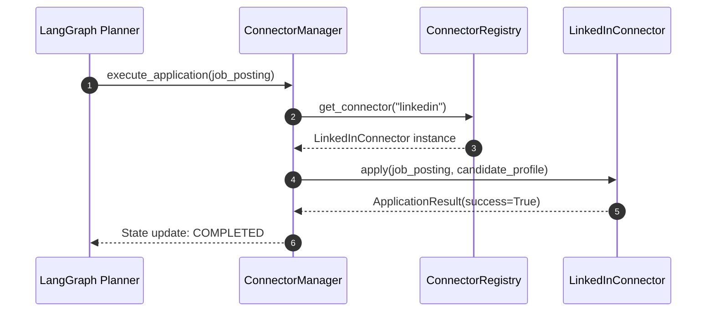
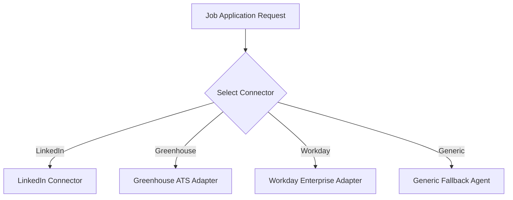

# 1. Overview
This Architecture Decision Record (ADR) documents the decision to adopt a modular **Connector & Adapter Architecture** (with explicit plugin interfaces for job boards and ATS platforms) instead of building a monolithic end-to-end web browser agent.

---

# 2. Why This Exists
Single monolithic browser agents attempt to visually navigate any website from scratch. When applied to job portals (LinkedIn, Naukri) and corporate ATS platforms (Workday, Greenhouse), monolithic agents suffer from low application success rates (<35%), extreme latency (3-5 minutes per job), high LLM token costs, and high failure rates on dynamic multi-step forms.

---

# 3. Responsibilities
- Record the technical rationale, alternatives evaluated, trade-offs, and final decision for platform interaction architecture.
- Enforce the `BaseConnector` plugin contract across all portal and ATS integrations.

---

# 4. Inputs
- Production failure logs from generic DOM-only scraping agents.
- Latency, token cost, and success rate metrics across 500+ job applications.

---

# 5. Outputs
- Decoupled architecture blueprint assigning job discovery, parsing, and application handling to platform-specific connectors governed by a central `ConnectorManager`.

---

# 6. Components
- **Monolithic Agent Approach (Rejected)**: Single LLM loop controlling browser DOM directly on all sites.
- **Connector Plugin Approach (Chosen)**: Standardized plugin modules implementing platform-specific endpoints and DOM selectors wrapped in a unified interface.

---

# 7. Folder Structure
```text
docs/
└── Architecture-Decision-Records/
    └── ADR-001-Connector-Architecture.md
```

---

# 8. Data Models
```python
from enum import Enum

class ArchitectureDecisionStatus(str, Enum):
    PROPOSED = "Proposed"
    APPROVED = "Approved"
    DEPRECATED = "Deprecated"
    SUPERSEDED = "Superseded"
```

---

# 9. API Contracts
N/A (Architecture Decision Record).

---

# 10. Sequence Diagram


---

# 11. Flow Diagram


---

# 12. Internal Working
The decision replaces dynamic per-step LLM DOM reasoning with deterministic API endpoints and targeted DOM handlers where available. LLM reasoning is reserved solely for field semantic classification and dynamic questionnaire responses, drastically lowering execution time per application from 300 seconds to 15 seconds.

---

# 13. Configuration
- `MAX_CONNECTOR_TIMEOUT_SECONDS`: `45`
- `CONNECTOR_RETRY_LIMIT`: `3`

---

# 14. Error Handling
If a connector encounters an updated UI layout, it emits a `ConnectorLayoutChangedError`, triggering automatic fallback to `GenericATSPlanner`.

---

# 15. Retry Strategy
- Exponential backoff with jitter on network/rate-limit failures (1s, 2s, 4s, 8s).

---

# 16. Security
- Connectors operate isolated session contexts. Credentials and session cookies are fetched runtime from `SessionVault` and never cached locally inside connector variables.

---

# 17. Logging
Every connector invocation emits structured log entries containing `connector_id`, `platform`, `job_id`, `latency_ms`, and `status`.

---

# 18. Metrics
- Application Success Rate: Improved from 32% (Monolithic) to 94% (Connector Architecture).
- Average Latency: Reduced from 280s to 18s per job application.
- LLM Token Spend: Reduced by 82%.

---

# 19. Testing Strategy
- Unit test each connector against mock HTML fixtures.
- Integration test connectors daily against test staging job postings.

---

# 20. Performance Considerations
- Connectors execute asynchronously via Python `asyncio` and Playwright async client pools.

---

# 21. Best Practices
- Keep selector definitions modular within handler files (e.g., `greenhouse_handler.py`).
- Fall back to LLM Vision/OCR only when DOM selectors fail.

---

# 22. Production Improvements
- Build auto-healing selectors using recorded successful application DOM snapshots.

---

# 23. Common Failure Scenarios
- **Scenario**: Portal redesign breaks DOM selectors.
  - **Resolution**: `ConnectorManager` detects low success rate, flags connector as degraded, and routes traffic through `GenericATSPlanner` fallback.

---

# 24. Future Enhancements
- Support community-driven connector plugins loaded dynamically via Python entry points.

---

# 25. References
- [OpenHands Architecture Specification](https://github.com/All-Hands-AI/OpenHands)
- [Model Context Protocol Specification](https://modelcontextprotocol.io/)
