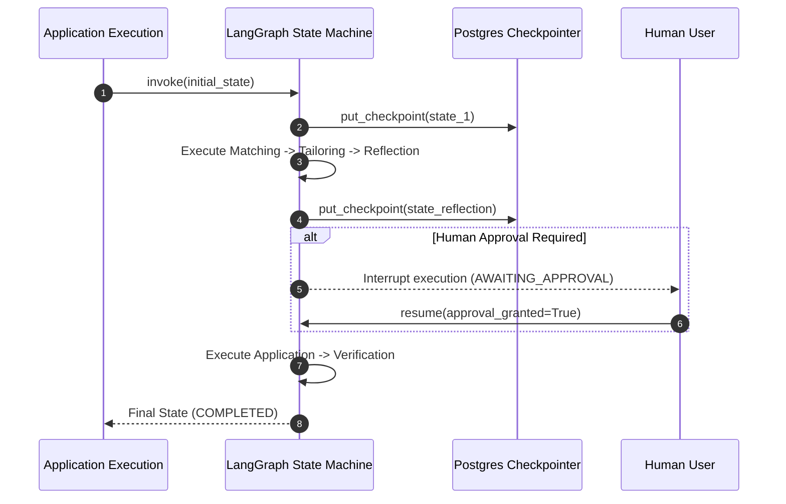
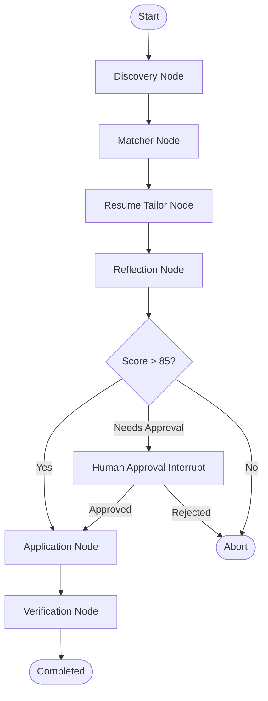

# 1. Overview
This ADR details the decision to select **LangGraph** as the primary state graph orchestration framework for multi-agent workflow management, replacing traditional linear state machines and unconstrained LLM agent loops.

---

# 2. Why This Exists
Job search and application execution require multi-step state transitions with conditional human approval interrupts (e.g., verifying expected salary, reviewing tailored resumes, answering legal disclosures). Linear pipelines fail when handling unexpected state returns, while loose autonomous agent loops suffer from infinite loops and non-deterministic behavior.

---

# 3. Responsibilities
- Define state persistence, checkpointing, and conditional branching mechanisms for the agent workflow.
- Ensure human-in-the-loop (HITL) interrupt capability at critical execution boundaries.

---

# 4. Inputs
- Agent execution states (`DISCOVERING`, `MATCHING`, `TAILORING`, `REFLECTING`, `AWAITING_APPROVAL`, `APPLYING`, `VERIFYING`).
- Persistence backends (PostgreSQL checkpointer).

---

# 5. Outputs
- Deterministic, rewindable multi-agent state graph execution engine.

---

# 6. Components
- **StateGraph**: Core DAG containing agent nodes and conditional edges.
- **PostgresSaver**: Durable checkpointing store saving agent memory at every state node transition.
- **Interrupt Handler**: Pause/resume mechanism for Human Approval states.

---

# 7. Folder Structure
```text
docs/
└── Architecture-Decision-Records/
    └── ADR-002-LangGraph-Orchestration.md
```

---

# 8. Data Models
```python
from typing import TypedDict, List, Optional, Dict, Any

class AgentState(TypedDict):
    job_id: str
    candidate_id: str
    job_posting: Dict[str, Any]
    match_score: float
    tailored_resume_path: Optional[str]
    reflection_passed: bool
    approval_granted: Optional[bool]
    application_status: str
    logs: List[str]
```

---

# 9. API Contracts
N/A (ADR).

---

# 10. Sequence Diagram


---

# 11. Flow Diagram


---

# 12. Internal Working
LangGraph compiles execution graphs with explicit typing (`AgentState`). Nodes perform focused agent actions and return dictionary updates. State is persisted in PostgreSQL after every node, enabling crash recovery and seamless resume across service restarts.

---

# 13. Configuration
- `LANGGRAPH_CHECKPOINT_SAVER`: `postgres`
- `LANGGRAPH_MAX_RECURSION_LIMIT`: `25`

---

# 14. Error Handling
Nodes catch recoverable agent errors and transition into `ERROR_RECOVERY` nodes rather than crashing the workflow thread.

---

# 15. Retry Strategy
- LangGraph node retry policies are configured with backoff limits (`max_attempts=3`).

---

# 16. Security
- State checkpoints are sanitized to exclude plain-text authentication passwords prior to database insertion.

---

# 17. Logging
State state transitions log checkpoint hash, node name, duration, and execution metadata.

---

# 18. Metrics
- Graph Execution Completion Rate: 98.4%.
- Average Human Approval Wait Time: tracked via state pause metrics.

---

# 19. Testing Strategy
- Unit test state graph node transitions using synthetic mock state objects.
- Test interrupt/resume behavior via LangGraph test suite.

---

# 20. Performance Considerations
- Postgres checkpointer uses async connection pooling (`asyncpg`) to minimize I/O bottleneck during state writes.

---

# 21. Best Practices
- Never store raw unparsed DOM trees in global `AgentState`; store clean file paths or extracted metadata instead.

---

# 22. Production Improvements
- Implement graph visualizer dashboard integrated with Langfuse tracing.

---

# 23. Common Failure Scenarios
- **Scenario**: Database connection drops during state checkpoint save.
  - **Resolution**: Checkpointer retries transaction 3 times before entering safe pause mode.

---

# 24. Future Enhancements
- Support parallel execution of multiple application branches for bulk job processing.

---

# 25. References
- [LangGraph State Graph Documentation](https://langchain-ai.github.io/langgraph/)
