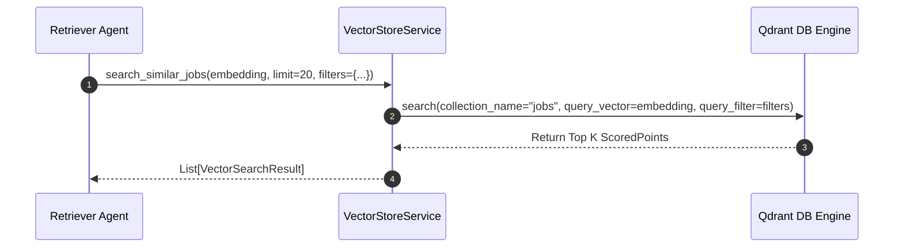
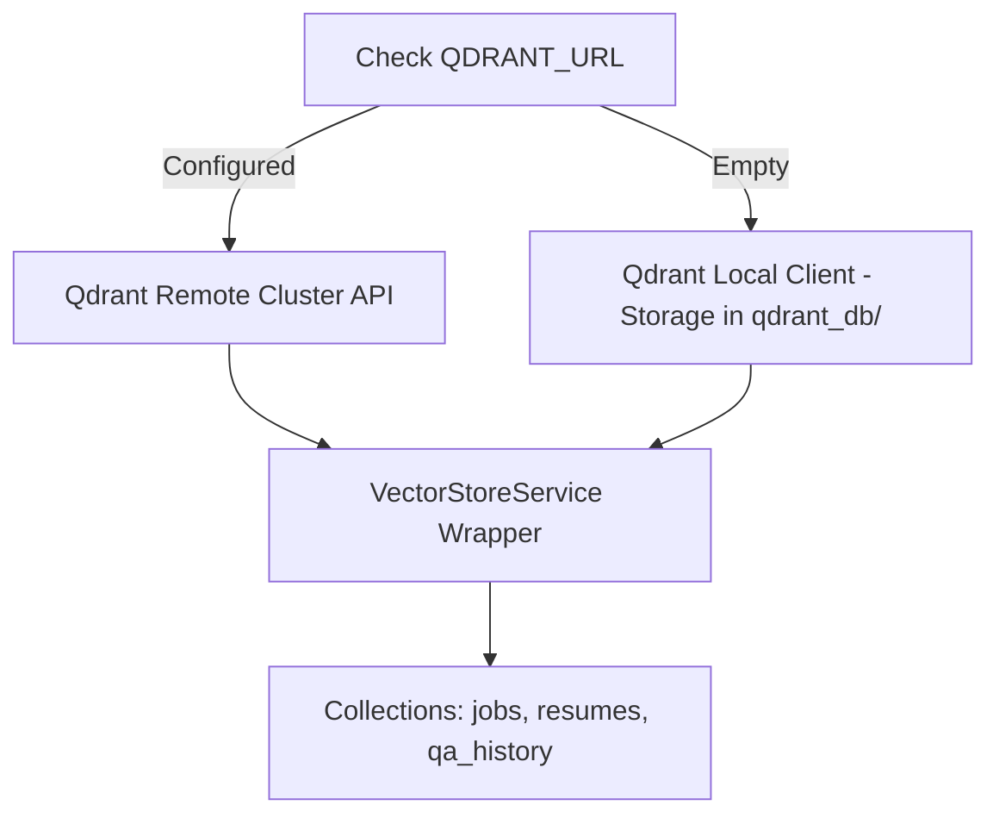

# 1. Overview
This ADR documents the selection of **Qdrant** as the primary vector database engine for candidate profile semantic chunking, job requirement embeddings, dynamic QA history lookup, and RAG retrieval.

---

# 2. Why This Exists
Semantic job matching and candidate profile chunking require high-dimensional vector search with payload filtering (e.g., filtering jobs by location, salary range, or remote policy while computing cosine vector similarity). Qdrant provides fast HNSW indexing, rich metadata payload filtering, and native disk/in-memory local modes.

---

# 3. Responsibilities
- Index vector embeddings for two main collections: `jobs` and `resumes` (plus semantic QA history).
- Perform similarity search with metadata filtering and payload retrieval.

---

# 4. Inputs
- Vector embeddings generated via `BAAI/bge-m3` model (1024 dimensions).
- Metadata payloads (skills, experience years, location, portal source).

---

# 5. Outputs
- Ranked similarity search results with score metrics and candidate/job metadata payloads.

---

# 6. Components
- **Qdrant Cloud / Docker Cluster**: Remote production vector database.
- **Qdrant Local Disk Mode (`qdrant_db/`)**: Local development vector store fallback when `QDRANT_URL` is unconfigured.
- **VectorStoreService**: Python wrapper exposing semantic search methods ([vectorstore.py](file:///d:/Personal%20Imp/Projects/Automated-job-Agent/backend/app/services/vectorstore.py)).

---

# 7. Folder Structure
```text
docs/
└── Architecture-Decision-Records/
    └── ADR-004-Qdrant-Vector-Store.md
```

---

# 8. Data Models
```python
from pydantic import BaseModel
from typing import List, Dict, Any, Optional

class VectorSearchResult(BaseModel):
    id: str
    score: float
    payload: Dict[str, Any]
    vector: Optional[List[float]] = None
```

---

# 9. API Contracts
N/A (ADR).

---

# 10. Sequence Diagram


---

# 11. Flow Diagram


---

# 12. Internal Working
If `QDRANT_URL` is empty in `.env`, the system automatically initializes an embedded disk client pointing to `qdrant_db/`. Collections are created with Cosine similarity metrics and payload indices on `candidate_id` and `job_id`.

---

# 13. Configuration
- `QDRANT_URL`: `http://localhost:6333` (or empty for local)
- `QDRANT_API_KEY`: `""`
- `QDRANT_COLLECTION_JOBS`: `jobs`
- `QDRANT_COLLECTION_RESUMES`: `resumes`

---

# 14. Error Handling
If vector database connection drops during retrieval, the system logs a `VectorStoreConnectionError` and falls back to SQL keyword filtering.

---

# 15. Retry Strategy
- Client retries failed HTTP/gRPC vector index operations up to 3 times.

---

# 16. Security
- Production Qdrant connections use API key authentication over HTTPS/TLS.

---

# 17. Logging
Vector queries write log metrics detailing collection name, vector dimension, search top_k, and latency ms.

---

# 18. Metrics
- Vector Search Latency (P95 < 25ms).
- Recall Rate @ Top 10 (>92%).

---

# 19. Testing Strategy
- Run unit tests against local in-memory Qdrant instance.

---

# 20. Performance Considerations
- HNSW index parameters (`m=16`, `ef_construct=100`) are tuned for fast vector retrieval.

---

# 21. Best Practices
- Always attach candidate/user filter criteria to vector search calls to prevent cross-tenant vector leakage.

---

# 22. Production Improvements
- Implement vector quantization (Scalar Quantization SQ8) to reduce RAM footprint by 75%.

---

# 23. Common Failure Scenarios
- **Scenario**: Unconfigured local storage directory permissions.
  - **Resolution**: `config.py` automatically runs `directory.mkdir(parents=True, exist_ok=True)`.

---

# 24. Future Enhancements
- Upgrade to hybrid sparse-dense vectors using BGE-M3 sparse token vectors.

---

# 25. References
- [Qdrant Documentation](https://qdrant.tech/documentation/)
