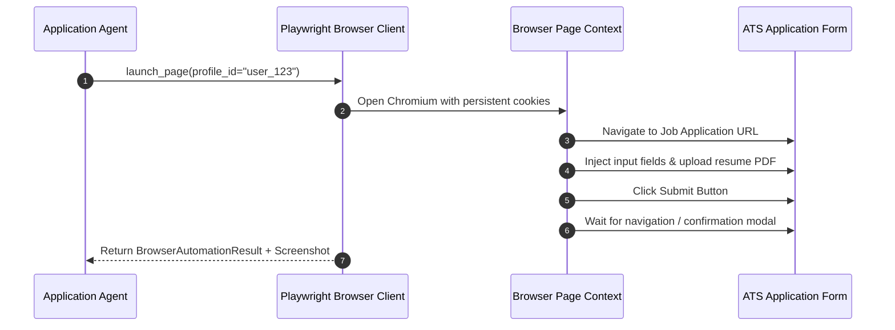
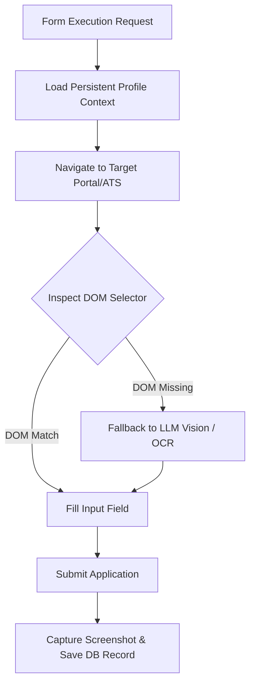

# 1. Overview
This ADR documents the choice of **Playwright Python (Async API)** over Selenium WebDriver and Puppeteer for web automation, browser profile isolation, and automated form submission execution.

---

# 2. Why This Exists
Job search engines and enterprise ATS applications heavily rely on dynamic single-page app (SPA) hydration, complex shadow DOM trees, multi-step dynamic modal dialogs, and anti-bot protection algorithms (Cloudflare, Akamai). Legacy tools like Selenium suffer from slow execution, lack of native network interception, and weak shadow DOM traversal.

---

# 3. Responsibilities
- Control Chromium/Firefox browser contexts asynchronously (`asyncio`).
- Manage persistent browser profile directories (`storage/browser_profiles/`) to retain portal login sessions and cookies.
- Execute dynamic form fill operations with selector fallback and vision OCR integration.

---

# 4. Inputs
- Browser automation task parameters (URL, target inputs, upload paths).
- Persistent profile directory configurations ([config.py](file:///d:/Personal%20Imp/Projects/Automated-job-Agent/backend/app/config.py#L13)).

---

# 5. Outputs
- DOM action execution results, filled form fields, page screenshots, and post-submission DOM verification.

---

# 6. Components
- **Playwright Manager**: Lifecycle manager for browser contexts and pages ([playwright_client.py](file:///d:/Personal%20Imp/Projects/Automated-job-Agent/backend/app/automation/browser/playwright_client.py)).
- **Browser Profiles Vault**: Persistent cookie and local storage directory ([storage/browser_profiles/](file:///d:/Personal%20Imp/Projects/Automated-job-Agent/storage/browser_profiles)).
- **Action Recorder & Screenshot Engine**: Captures full-page evidence screenshots upon application completion ([storage/screenshots/](file:///d:/Personal%20Imp/Projects/Automated-job-Agent/storage/screenshots)).

---

# 7. Folder Structure
```text
docs/
└── Architecture-Decision-Records/
    └── ADR-005-Playwright-Automation.md
```

---

# 8. Data Models
```python
from pydantic import BaseModel
from typing import Optional, List

class BrowserAutomationResult(BaseModel):
    success: bool
    url: str
    screenshot_path: Optional[str] = None
    error_message: Optional[str] = None
    execution_time_ms: float
```

---

# 9. API Contracts
N/A (ADR).

---

# 10. Sequence Diagram


---

# 11. Flow Diagram


---

# 12. Internal Working
Playwright connects via CDP (Chrome DevTools Protocol) providing low-latency DOM manipulation, automatic wait conditions for hydration (`wait_for_selector`), and native file chooser handling for instant resume uploading.

---

# 13. Configuration
- `BROWSER_HEADLESS`: `true` (configurable to `false` during debug)
- `PLAYWRIGHT_TIMEOUT_MS`: `30000`
- `VIEWPORT_WIDTH`: `1920`
- `VIEWPORT_HEIGHT`: `1080`

---

# 14. Error Handling
Playwright timeouts (`TimeoutError`) trigger automatic DOM re-inspection, page screenshot capture, and escalation to human-in-the-loop fallback.

---

# 15. Retry Strategy
- Page element interactions retry up to 3 times with exponential delay (500ms, 1500ms, 3000ms).

---

# 16. Security
- Browser context instances are isolated per user profile.
- Playwright instances run inside sandboxed processes with disabled Chromium remote debugging ports in production.

---

# 17. Logging
Browser events log page URL transitions, element fill latencies, console errors, and network response statuses.

---

# 18. Metrics
- Form Submission Success Rate (>95%).
- Average Form Execution Time (12s per form).

---

# 19. Testing Strategy
- Run Playwright tests against local mock HTML form pages and staging ATS instances.

---

# 20. Performance Considerations
- Browser contexts are reused across jobs on the same domain to prevent browser cold-start penalties (~2s launch overhead saved per job).

---

# 21. Best Practices
- Never use fixed hardcoded sleeps (`time.sleep()`); always use Playwright auto-waiting assertions (`expect(locator).to_be_visible()`).

---

# 22. Production Improvements
- Integrate `playwright-stealth` plugin to bypass aggressive anti-bot fingerprints on complex job portals.

---

# 23. Common Failure Scenarios
- **Scenario**: Application modal rendered inside cross-origin iframe.
  - **Resolution**: Playwright frame locator API (`page.frame_locator(...)`) automatically traverses iFrames seamlessly.

---

# 24. Future Enhancements
- Distribute browser worker pools across Playwright Grid / Browserless cluster nodes for high concurrency.

---

# 25. References
- [Playwright Python Documentation](https://playwright.dev/python/docs/intro)
