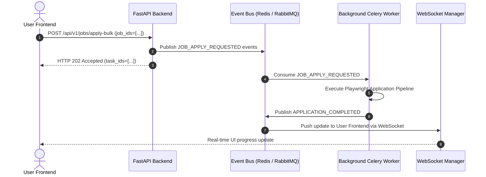
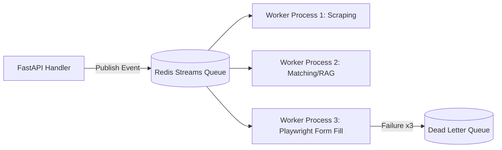

# 1. Overview
This ADR details the decision to introduce an **Event Bus and Distributed Task Queue System** (powered by Redis Streams / Celery / RabbitMQ) to decouple synchronous HTTP REST endpoints from background job discovery, vector indexing, and Playwright application execution workers.

---

# 2. Why This Exists
Executing job scraping, LLM resume tailoring, and Playwright form fills synchronously inside FastAPI HTTP request handler threads leads to request timeouts (HTTP 504), worker thread exhaustion, inability to retry failed applications cleanly, and lack of horizontal scaling for bulk job processing tasks.

---

# 3. Responsibilities
- Decouple API request handling from long-running background tasks.
- Provide asynchronous task scheduling, retries, rate limiting, and dead-letter queue (DLQ) capabilities.

---

# 4. Inputs
- Asynchronous application triggers (`job.apply`, `discovery.crawl`, `resume.tailor`).
- Redis broker connection configurations.

---

# 5. Outputs
- Event-driven task dispatches, real-time status notifications via WebSockets, and durable job task queues.

---

# 6. Components
- **FastAPI Producer**: Publishes application event payloads to the Event Bus.
- **Redis Streams / RabbitMQ**: High-throughput message broker.
- **Celery / Arq Background Workers**: Distributed worker pool executing browser automation and RAG matching tasks.

---

# 7. Folder Structure
```text
docs/
└── Architecture-Decision-Records/
    └── ADR-006-Event-Bus-Architecture.md
```

---

# 8. Data Models
```python
from pydantic import BaseModel, Field
from typing import Dict, Any
from datetime import datetime

class TaskEventPayload(BaseModel):
    event_id: str
    event_type: str = Field(..., description="e.g. JOB_DISCOVERED, APPLICATION_SUBMITTED")
    candidate_id: str
    job_id: str
    data: Dict[str, Any]
    timestamp: datetime = Field(default_factory=datetime.utcnow)
```

---

# 9. API Contracts
N/A (ADR).

---

# 10. Sequence Diagram


---

# 11. Flow Diagram


---

# 12. Internal Working
Events are serialized as JSON payloads and pushed to Redis Streams. Background workers maintain consumer groups (`cg_application_workers`). Tasks are processed idempotently; if a worker node crashes mid-execution, Redis reclaims unacknowledged messages after `visibility_timeout` (60s) and reassigns them to healthy workers.

---

# 13. Configuration
- `REDIS_URL`: `redis://localhost:6379/0`
- `CELERY_WORKER_CONCURRENCY`: `8`
- `TASK_VISIBILITY_TIMEOUT`: `60`

---

# 14. Error Handling
Tasks that fail after maximum retries are routed to the Dead Letter Queue (DLQ) for operator manual inspection and alerting.

---

# 15. Retry Strategy
- Exponential backoff retry policy: 5s, 15s, 45s, 135s up to 5 retries.

---

# 16. Security
- Redis connections require TLS encryption and password authentication (`rediss://`).
- Event payloads exclude sensitive candidate passwords.

---

# 17. Logging
Task execution logs capture `task_id`, `event_type`, `queue_name`, `worker_pid`, and `execution_duration_ms`.

---

# 18. Metrics
- Queue Depth / Backlog.
- Task Throughput (tasks/sec).
- Task Error Rate (<1%).

---

# 19. Testing Strategy
- Unit test event producers and consumer handlers using in-memory mock task queues.

---

# 20. Performance Considerations
- Redis Streams handle >50,000 events/sec with sub-millisecond dispatch latency.

---

# 21. Best Practices
- Ensure all event consumer tasks are strictly **idempotent** (re-running a task produces identical database state without duplicate job submissions).

---

# 22. Production Improvements
- Deploy KEDA (Kubernetes Event-driven Autoscaling) to auto-scale background worker pods based on queue depth.

---

# 23. Common Failure Scenarios
- **Scenario**: Celery worker runs out of memory during headless browser execution.
  - **Resolution**: Configure `--max-tasks-per-child=50` to automatically recycle worker processes after 50 executions.

---

# 24. Future Enhancements
- Migrate to Kafka or AWS SQS / SNS for multi-region global deployment scaling.

---

# 25. References
- [Redis Streams Documentation](https://redis.io/docs/data-types/streams/)
- [Celery Distributed Task Queue Documentation](https://docs.celeryq.dev/)
