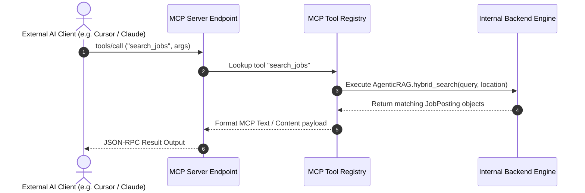
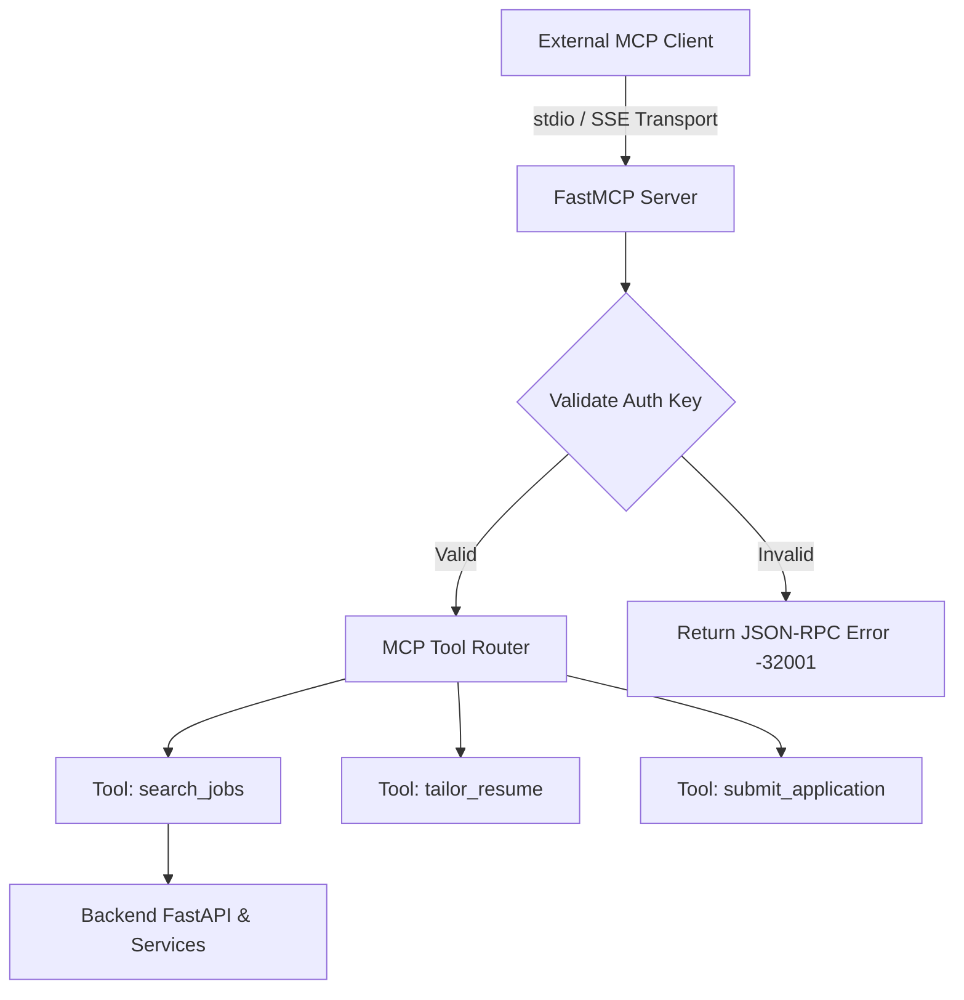

# 1. Overview
This ADR details the integration of **Model Context Protocol (MCP)** server interfaces into the Automated Job Agent backend. By exposing platform tools (job search, resume tailoring, candidate profile lookup, application submission) as standardized MCP tools, external AI agents (e.g. Claude Desktop, Cursor, Custom LLM Agents) can interact seamlessly with the job engine.

---

# 2. Why This Exists
Closed proprietary APIs isolate automated agents from external AI ecosystems. Implementing the open MCP standard enables external AI clients to inspect available candidate profiles, trigger job discovery, perform match scoring, and monitor application state natively over standard JSON-RPC 2.0 transports.

---

# 3. Responsibilities
- Expose an MCP-compliant server endpoint (`mcp_server.py`) wrapping internal connector and matching services.
- Provide strict JSON schema validation for all exposed MCP tools.

---

# 4. Inputs
- Incoming MCP JSON-RPC protocol requests (`initialize`, `tools/list`, `tools/call`).
- System services (Connector Registry, VectorStore, Matching Engine).

---

# 5. Outputs
- MCP JSON-RPC protocol responses formatted according to Model Context Protocol specification v1.0.

---

# 6. Components
- **MCP Server Core**: FastMCP / Python MCP SDK wrapper service.
- **Tool Registry**: Maps MCP tool names (`search_jobs`, `submit_application`, `get_profile`) to internal Python handler methods.
- **Security & Authorization Guard**: Validates OAuth2 / API Key tokens before executing MCP tool calls.

---

# 7. Folder Structure
```text
docs/
└── Architecture-Decision-Records/
    └── ADR-007-MCP-Tool-Exposition.md
```

---

# 8. Data Models
```python
from pydantic import BaseModel, Field
from typing import Dict, Any, List

class MCPToolDefinition(BaseModel):
    name: str
    description: str
    inputSchema: Dict[str, Any]

class MCPToolCallRequest(BaseModel):
    name: str
    arguments: Dict[str, Any]
```

---

# 9. API Contracts
MCP Server JSON-RPC Sample Payload:
```json
{
  "jsonrpc": "2.0",
  "id": 1,
  "method": "tools/call",
  "params": {
    "name": "search_jobs",
    "arguments": {
      "query": "Senior Python Engineer",
      "location": "Remote",
      "limit": 10
    }
  }
}
```

---

# 10. Sequence Diagram


---

# 11. Flow Diagram


---

# 12. Internal Working
The backend registers tools using `@mcp.tool()` decorators. Requests are received via `stdio` or Server-Sent Events (SSE) transports. Arguments are parsed and checked against Pydantic schemas before executing corresponding service workflows.

---

# 13. Configuration
- `MCP_SERVER_ENABLED`: `true`
- `MCP_TRANSPORT`: `sse` (or `stdio`)
- `MCP_PORT`: `8001`

---

# 14. Error Handling
Tool execution errors wrap internal exceptions into standardized JSON-RPC error payloads (`code: -32603`, `message: "Internal Tool Execution Error"`).

---

# 15. Retry Strategy
- Transports support automatic reconnection protocol on SSE disconnects.

---

# 16. Security
- MCP tool execution is restricted to authenticated client sessions. High-risk tools (`submit_application`) strictly require explicit human approval flags.

---

# 17. Logging
All MCP tool invocations log caller client identity, tool name, argument hash, execution status, and response latency.

---

# 18. Metrics
- MCP Tool Invocations Count.
- MCP Tool Failure Rate.

---

# 19. Testing Strategy
- Unit test MCP tool handlers using official MCP Python SDK testing utilities.

---

# 20. Performance Considerations
- MCP responses utilize stream buffering to minimize latency when transferring large job payload datasets.

---

# 21. Best Practices
- Provide detailed markdown docstrings in tool definitions to enable high-accuracy LLM tool selection.

---

# 22. Production Improvements
- Implement rate limiting per MCP API client token.

---

# 23. Common Failure Scenarios
- **Scenario**: LLM passes invalid argument types to MCP tool call.
  - **Resolution**: FastMCP Pydantic validator rejects payload with code `-32602 (Invalid Params)` and descriptive field error list.

---

# 24. Future Enhancements
- Expose live application execution DOM state as an MCP Resource stream (`resource://application/{id}/dom`).

---

# 25. References
- [Model Context Protocol Specification](https://modelcontextprotocol.io/introduction)
