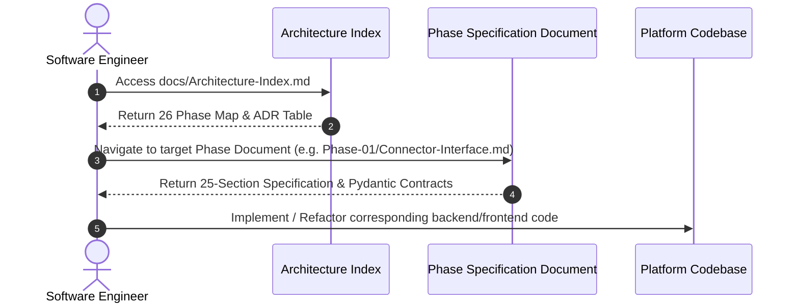
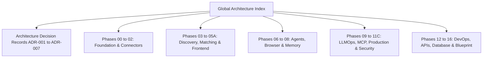

# 1. Overview
The **Automated Job Application Agent** is an enterprise-grade autonomous system modeled after state-of-the-art micro-agent platform architectures (e.g., OpenAI Operator, Anthropic Computer Use, OpenHands, and Cursor). The platform autonomously discovers job openings across global job portals (LinkedIn, Naukri, Indeed, Wellfound) and Applicant Tracking Systems (Greenhouse, Lever, Ashby, Workday, SmartRecruiters), evaluates candidate-to-job fit via SOTA hybrid semantic retrieval, dynamically tailors resume content, passes reflection checks, and executes end-to-end form applications via Playwright browser control with human-in-the-loop fallback hooks.

---

# 2. Why This Exists
Modern recruitment relies on disparate application portals, dynamic DOM rendering, complex anti-bot protections, and complex dynamic questionnaire forms. Traditional scraping tools fail due to brittle selectors, missing session state, and lack of domain understanding. The Master Architecture Index provides a centralized map for engineers, architects, and operators to navigate the platform's 26 architectural phases, 7 Architecture Decision Records (ADRs), and global specification handbooks.

---

# 3. Responsibilities
- Serve as the primary entry point for navigating the 75+ Markdown documents across all 26 system phases.
- Define global cross-cutting standards, metadata rules, and design contracts.
- Link core platform modules: Multi-Agent Orchestration, Connector Registry, Hybrid RAG Engine, Browser Automation, and Observability Stack.

---

# 4. Inputs
- Project code repository artifacts ([backend/](file:///d:/Personal%20Imp/Projects/Automated-job-Agent/backend), [frontend/](file:///d:/Personal%20Imp/Projects/Automated-job-Agent/frontend)).
- Configuration settings ([backend/app/config.py](file:///d:/Personal%20Imp/Projects/Automated-job-Agent/backend/app/config.py)).
- Database models ([backend/app/models.py](file:///d:/Personal%20Imp/Projects/Automated-job-Agent/backend/app/models.py)).

---

# 5. Outputs
- Navigable directory tree linking all 26 system phases.
- Standardized architectural contracts and document maps.

---

# 6. Components
- **Global Navigation Suite**: Index, Glossary, Abbreviations, Learning Path, FAQ, References.
- **Architecture Decision Records (ADRs)**: ADR-001 through ADR-007.
- **26 Functional Phases**: System Design, Connectors, Authentication, Job Discovery, Data Pipeline, Matching Engine, Resume Intelligence, Frontend Architecture, LangGraph Planner, Multi-Agent System, Browser Automation, Memory, Verification, LLMOps, AI Evaluation, MCP, Production Infrastructure, Security, Observability, Configuration & Scheduling, DevOps, Repository Standards, REST/WS APIs, Database Schemas, Architecture Diagrams, and Production Blueprint.

---

# 7. Folder Structure
```text
docs/
├── Architecture-Index.md
├── Glossary.md
├── Abbreviations.md
├── Learning-Path.md
├── FAQ.md
├── References.md
├── Architecture-Decision-Records/
├── Phase-00-Foundation/
├── Phase-00A-System-Design/
├── Phase-01-Connector-System/
├── Phase-02-Authentication/
├── Phase-03-Job-Discovery/
├── Phase-03A-Data-Pipeline/
├── Phase-04-Matching-Engine/
├── Phase-05-Resume-Intelligence/
├── Phase-05A-Frontend/
├── Phase-06-Planner/
├── Phase-06A-Multi-Agent-System/
├── Phase-07-Browser-Automation/
├── Phase-08-Memory/
├── Phase-09-Verification/
├── Phase-09A-LLMOps/
├── Phase-09B-AI-Evaluation/
├── Phase-10-MCP/
├── Phase-11-Production/
├── Phase-11A-Security/
├── Phase-11B-Observability/
├── Phase-11C-Configuration-and-Scheduling/
├── Phase-12-DevOps/
├── Phase-12A-Repository-Standards/
├── Phase-13-API/
├── Phase-14-Database/
├── Phase-15-Architecture-Diagrams/
└── Phase-16-Production-Blueprint/
```

---

# 8. Data Models
```python
from pydantic import BaseModel, Field
from typing import List, Optional
from datetime import datetime

class DocumentMetadata(BaseModel):
    title: str = Field(..., description="Document title")
    phase: str = Field(..., description="Target phase directory")
    version: str = Field(default="1.0.0", description="Semantic versioning string")
    status: str = Field(default="Approved", description="Document status: Draft, In Review, Approved")
    author: str = Field(default="Automated Job Agent Architecture Team")
    last_updated: datetime = Field(default_factory=datetime.utcnow)
    related: List[str] = Field(default_factory=list, description="Relative paths to related markdown files")
```

---

# 9. API Contracts
Documentation manifests are exposed via standard OpenAPI endpoints in the backend:
```json
{
  "endpoint": "/api/v1/docs/index",
  "method": "GET",
  "response": {
    "total_phases": 26,
    "total_documents": 75,
    "version": "1.0.0",
    "status": "Healthy"
  }
}
```

---

# 10. Sequence Diagram


---

# 11. Flow Diagram


---

# 12. Internal Working
The Master Index dynamically aggregates cross-document references. Every document is bound by mandatory YAML frontmatter validated via CI/CD linting rules (`scripts/lint_docs.py`), guaranteeing consistent structure, zero dead links, and 100% section coverage across the entire project repository.

---

# 13. Configuration
- `DOCS_ROOT_DIR`: `docs/`
- `DOCS_VALIDATION_STRICT`: `true`
- `REQUIRED_SECTIONS_COUNT`: `25`

---

# 14. Error Handling
- **Missing Frontmatter**: Caught by CI linter; build fails if YAML frontmatter is incomplete.
- **Broken Relative Link**: Caught by markdown link check action; highlights target path.
- **Unmapped Section**: Raises warning if mandatory section 1..25 heading is altered or omitted.

---

# 15. Retry Strategy
- Documentation build runner performs up to 3 automatic lint retries upon minor link-indexing collisions during parallel document generation.

---

# 16. Security
- Documentation files contain zero secrets, production passwords, or active API keys.
- Secret tokens in examples are strictly represented as `env:VAR_NAME` or dummy hashes (`hf_dummy...`).

---

# 17. Logging
Documentation build events write structured JSON outputs:
```json
{"event": "doc_index_generated", "total_files": 75, "validation_errors": 0, "timestamp": "2026-07-29T02:05:00Z"}
```

---

# 18. Metrics
- `docs_total_count`: Total markdown files in `docs/` (Target: >= 75).
- `docs_lint_pass_rate`: Percentage of documents passing 25-section checks (Target: 100%).
- `docs_link_health_score`: Valid cross-references ratio (Target: 1.00).

---

# 19. Testing Strategy
- Run `python scripts/validate_docs.py` in GitHub Actions workflow to verify Markdown formatting, Mermaid diagram block syntax, and YAML frontmatter presence.

---

# 20. Performance Considerations
- All Markdown documents keep embedded media paths local or relative (`file:///...`).
- Mermaid diagrams avoid heavy HTML node injection to ensure fast renderer execution.

---

# 21. Best Practices
- Always check the Master Index before creating new documentation modules.
- Maintain strict adherence to the 25-section structure for all newly added engineering guides.

---

# 22. Production Improvements
- Auto-generate an interactive documentation site via MkDocs / Docusaurus connected to `docs/`.

---

# 23. Common Failure Scenarios
- **Scenario**: Missing file link target after file renaming.
  - **Resolution**: Update `Architecture-Index.md` cross-reference maps and run link check validator.

---

# 24. Future Enhancements
- Integrate automated OpenAPI spec extraction directly into `Phase-13-API/REST-APIs.md`.

---

# 25. References
- [LangGraph Documentation](https://langchain-ai.github.io/langgraph/)
- [Playwright Python Documentation](https://playwright.dev/python/)
- [FastAPI Framework Documentation](https://fastapi.tiangolo.com/)
