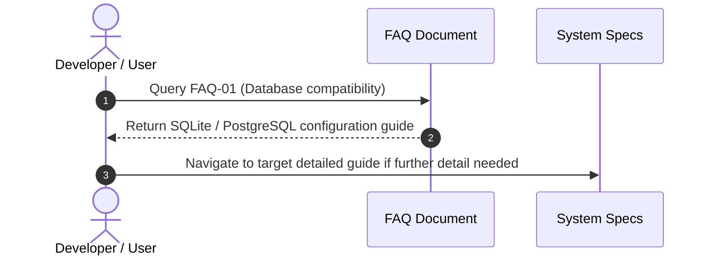
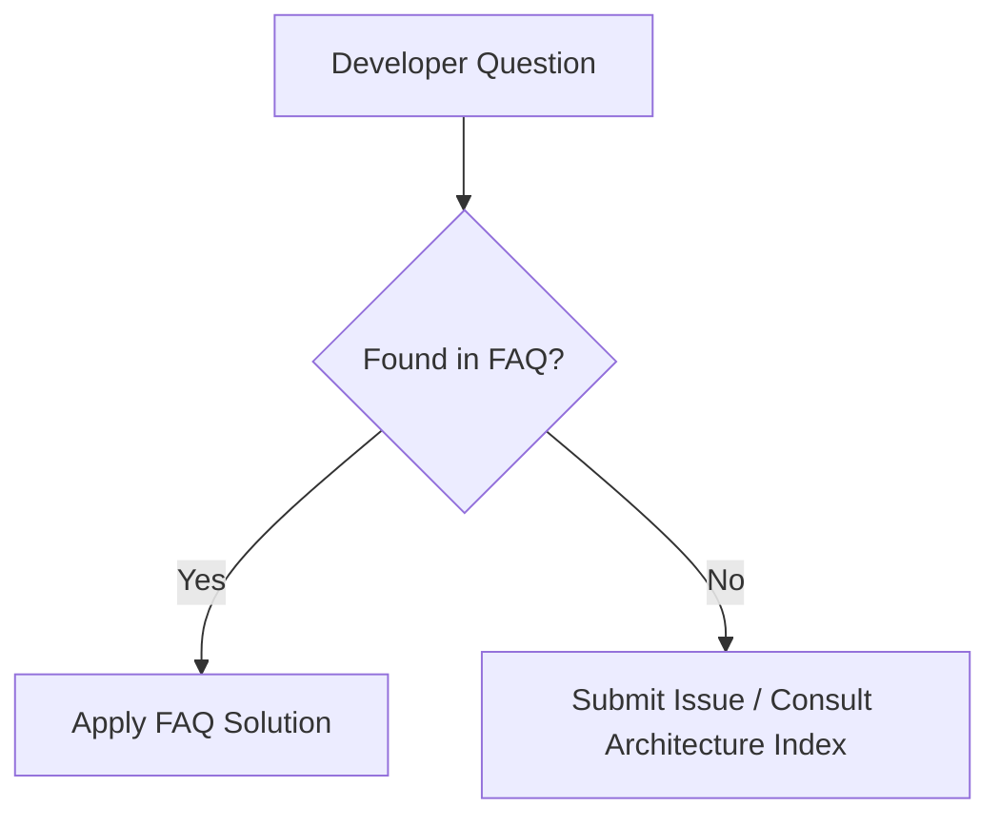

# 1. Overview
This FAQ document provides immediate answers to common architectural, operational, and development questions regarding the **Automated Job Application Agent** platform.

---

# 2. Why This Exists
Consolidating recurring questions prevents duplicated engineering discussions, resolves developer setup bottlenecks quickly, and serves as an instant troubleshooting reference.

---

# 3. Responsibilities
- Answer top questions across System Architecture, Connectors, AI/RAG, Browser Automation, and Deployment.

---

# 4. Inputs
- Developer questions, GitHub issues, and operational troubleshooting logs.

---

# 5. Outputs
- Categorized FAQ catalog organized by functional domain.

---

# 6. Components
- **Architecture FAQs**: Why separate connectors from planner? Why PostgreSQL + SQLite?
- **AI/RAG FAQs**: How does hybrid retrieval work? How is hallucination prevented?
- **Browser Automation FAQs**: How are CAPTCHAs handled? How is session state preserved?
- **Deployment FAQs**: How to switch from SQLite to PostgreSQL? How to deploy on Kubernetes?

---

# 7. Folder Structure
```text
docs/
├── FAQ.md
└── Architecture-Index.md
```

---

# 8. Data Models
| Question ID | Category | Question | Summary Answer |
| :--- | :--- | :--- | :--- |
| **FAQ-01** | Database | Can I run the agent without PostgreSQL? | Yes, default setting runs SQLite (`job_agent.db`) automatically out-of-the-box. |
| **FAQ-02** | Scraping | How are anti-bot protections handled? | Persistent browser profiles + Playwright stealth + CAPTCHA human interrupt triggers. |
| **FAQ-03** | LLM Ops | What LLMs are supported? | Hugging Face Serverless, Google Gemini, OpenAI, Qwen 72B via unified LLM router service. |
| **FAQ-04** | Agent | What happens if matching score is low? | Reflection engine rejects job; application is aborted before touching browser. |

---

# 9. API Contracts
N/A (FAQ Reference).

---

# 10. Sequence Diagram


---

# 11. Flow Diagram


---

# 12. Internal Working
The FAQ is categorized into functional domain blocks for rapid navigation.

---

# 13. Configuration
- Synchronized with release version `v1.0.0`.

---

# 14. Error Handling
- N/A.

---

# 15. Retry Strategy
- N/A.

---

# 16. Security
- Answers strictly exclude proprietary production access keys or passwords.

---

# 17. Logging
- FAQ queries in documentation search write analytics events.

---

# 18. Metrics
- FAQ Resolution Efficiency Score.

---

# 19. Testing Strategy
- Documentation linter ensures all cross-referenced document paths inside answers exist.

---

# 20. Performance Considerations
- Concise, direct answers reduce developer context-switching time.

---

# 21. Best Practices
- Update `FAQ.md` whenever a new non-obvious architecture pattern or bug resolution is introduced.

---

# 22. Production Improvements
- Integrate AI search assistant over FAQ content.

---

# 23. Common Failure Scenarios
- **Scenario**: Application fails on dynamic form step.
  - **Resolution**: Check `Phase-07-Browser-Automation/Dynamic-Forms.md` and verify selector fallback rules.

---

# 24. Future Enhancements
- Auto-generate FAQ entries from resolved GitHub issues.

---

# 25. References
- Project issue tracker and architecture decision logs.
