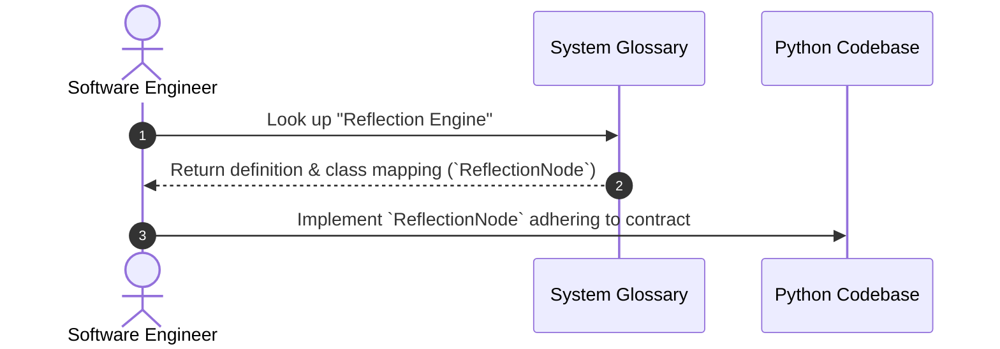
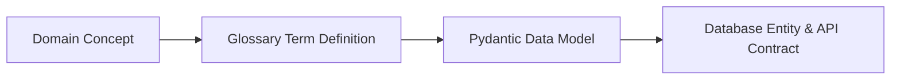

# 1. Overview
This document defines the core domain terminology, technical vocabulary, and concepts used throughout the **Automated Job Agent** engineering handbook and codebase.

---

# 2. Why This Exists
In a complex multi-agent platform combining web automation, LLM orchestration, hybrid retrieval, and Applicant Tracking System (ATS) adapters, ambiguous terminology causes miscommunication between frontend, backend, and AI engineers. This glossary enforces domain clarity.

---

# 3. Responsibilities
- Provide unambiguous definitions for all core concepts across the platform.
- Serve as the authoritative dictionary for code naming conventions (Pydantic models, database entities, agent states).

---

# 4. Inputs
- Codebase definitions in [backend/app/models.py](file:///d:/Personal%20Imp/Projects/Automated-job-Agent/backend/app/models.py).
- ATS adapter registries in [backend/app/automation/ats/ats_router.py](file:///d:/Personal%20Imp/Projects/Automated-job-Agent/backend/app/automation/ats/ats_router.py).

---

# 5. Outputs
- Standardized reference dictionary accessible across all engineering documentation.

---

# 6. Components
- **Job Discovery Terms**: Connector, Adapter, Portal, ATS, Scraper.
- **Matching & Vector Terms**: Hybrid Retrieval, BM25, Dense Embedding, Cross-Encoder Reranking, Score Fusion.
- **Agentic Terms**: State Graph, Planning Node, Reflection Engine, Human-in-the-Loop (HITL), Model Context Protocol (MCP).
- **Execution Terms**: DOM Inspector, Vision/OCR Fallback, Fingerprint Evasion, Session Vault.

---

# 7. Folder Structure
```text
docs/
├── Glossary.md
└── Abbreviations.md
```

---

# 8. Data Models
| Term | Category | Definition | Code Mapping |
| :--- | :--- | :--- | :--- |
| **Connector** | Architecture | A standardized plugin implementing platform interaction rules for a job site/ATS. | `BaseConnector` |
| **Unified Job Schema** | Data Contract | Standardized Pydantic structure for normalized job postings across portals. | `JobPosting` |
| **Hybrid Retrieval** | Search | Multi-stage search combining keyword (BM25) + dense vector + MMR + reranker. | `AgenticRAG` |
| **Reflection Engine** | Agent Governance | Pre-submission evaluation module enforcing safety, salary, and visa constraints. | `ReflectionNode` |
| **Session Vault** | Security | Encrypted storage manager handling browser cookies, JWTs, and MFA tokens. | `SessionManager` |

---

# 9. API Contracts
Glossary entities directly correspond to backend status endpoints:
```json
{
  "entity_type": "GlossaryEntry",
  "terms": [
    {"term": "Connector", "type": "Plugin"},
    {"term": "AgenticRAG", "type": "RetrievalEngine"}
  ]
}
```

---

# 10. Sequence Diagram


---

# 11. Flow Diagram


---

# 12. Internal Working
Terms are grouped logically into domain clusters (Connector System, Agent System, RAG Engine, Security & Memory). Every term includes its official Python class or database table mapping.

---

# 13. Configuration
- Glossary versioning is synchronized with system release tags (`v1.0.0`).

---

# 14. Error Handling
- Invalid term usage in codebase code reviews triggers a pull request change request referring to `Glossary.md`.

---

# 15. Retry Strategy
- N/A (Static Reference Specification).

---

# 16. Security
- Terms related to encryption (`Session Vault`, `AES-256-GCM`, `Token Encryption`) strictly describe secure handling algorithms without disclosing secret keys.

---

# 17. Logging
- System logging formats mirror terms defined in this glossary (`connector_id`, `application_status`, `reflection_score`).

---

# 18. Metrics
- N/A.

---

# 19. Testing Strategy
- Automated documentation linter verifies that all Pydantic model names match terms listed in `Glossary.md`.

---

# 20. Performance Considerations
- Clean terminology alignment reduces developer onboarding time and prevents architectural drift.

---

# 21. Best Practices
- Never invent redundant terminology in code; check `Glossary.md` first.

---

# 22. Production Improvements
- Embed glossary hover tooltips in the web documentation portal.

---

# 23. Common Failure Scenarios
- **Scenario**: Misinterpreting "ATS" vs "Portal".
  - **Resolution**: Portals (LinkedIn/Naukri) aggregate jobs; ATS (Greenhouse/Workday) host employer job forms.

---

# 24. Future Enhancements
- Expand terms to include international labor visa category classifications.

---

# 25. References
- [OpenAI Agent Terminology Guide](https://platform.openai.com/docs/guides/agents)
- [LangGraph System Architecture Terms](https://langchain-ai.github.io/langgraph/)
