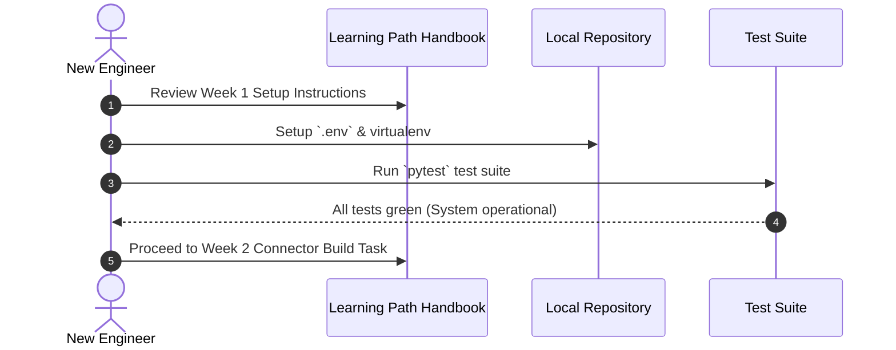
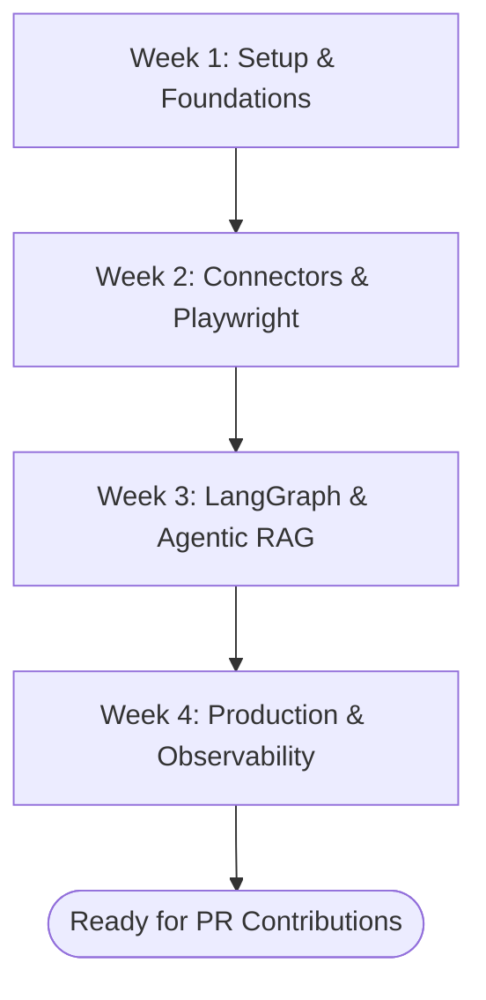

# 1. Overview
This document provides a structured **Developer Learning Path & Onboarding Curriculum** designed for software engineers, AI developers, and system operators joining the Automated Job Application Agent project.

---

# 2. Why This Exists
The project spans multiple advanced domains: LangGraph multi-agent state graphs, Playwright browser automation, hybrid vector retrieval (BM25 + Dense + Reranking), FastAPI async APIs, PostgreSQL/Qdrant databases, and Model Context Protocol (MCP) integrations. A step-by-step learning path accelerates developer ramp-up from zero to productive contributor.

---

# 3. Responsibilities
- Guide new engineers through setting up the local environment (`.env`, Python venv, PostgreSQL/SQLite, Qdrant).
- Provide a 4-week structured reading and practical execution roadmap across all 26 documentation phases.

---

# 4. Inputs
- Project codebase structure ([backend/](file:///d:/Personal%20Imp/Projects/Automated-job-Agent/backend), [frontend/](file:///d:/Personal%20Imp/Projects/Automated-job-Agent/frontend)).
- System configuration settings ([backend/app/config.py](file:///d:/Personal%20Imp/Projects/Automated-job-Agent/backend/app/config.py)).

---

# 5. Outputs
- Fully onboarded developer capable of building new connectors, optimizing RAG pipelines, and deploying production services.

---

# 6. Components
- **Week 1: Foundations & Architecture**: System Overview, Architecture Principles, Code Base Tour, Development Environment Setup.
- **Week 2: Connector & Scraping Subsystems**: `BaseConnector` API, ATS Adapters (Greenhouse, Workday, Lever), Playwright Automation.
- **Week 3: AI, RAG & Multi-Agent Planning**: Hybrid Search (BM25 + Vector), LangGraph State Graphs, Reflection Engine, Resume Tailoring.
- **Week 4: Production, Security & DevOps**: Event Queues, Docker/K8s Deployment, Observability Stack, Security & MCP Exposition.

---

# 7. Folder Structure
```text
docs/
├── Learning-Path.md
└── Phase-00-Foundation/
```

---

# 8. Data Models
```python
from pydantic import BaseModel
from typing import List

class OnboardingModule(BaseModel):
    week: int
    title: str
    required_reading: List[str]
    hands_on_tasks: List[str]
    validation_milestone: str
```

---

# 9. API Contracts
N/A (Learning Path).

---

# 10. Sequence Diagram


---

# 11. Flow Diagram


---

# 12. Internal Working
The curriculum divides learning into clear theoretical reading assignments paired directly with practical codebase exercises (e.g. implementing a new custom ATS handler in [backend/app/automation/ats/handlers/](file:///d:/Personal%20Imp/Projects/Automated-job-Agent/backend/app/automation/ats/handlers)).

---

# 13. Configuration
- Prerequisites: Python 3.11+, Node.js 18+, Docker Desktop, Git.

---

# 14. Error Handling
- Common environment setup issues (e.g. missing Playwright browser binaries) are documented with resolution runbooks.

---

# 15. Retry Strategy
- Environment setup script (`scripts/setup_dev_env.sh` or `.ps1`) automatically re-attempts package installations.

---

# 16. Security
- Engineers are instructed never to commit active HF / Gemini API tokens to version control.

---

# 17. Logging
- Onboarding test scripts log execution health to stdout.

---

# 18. Metrics
- Time to First Pull Request (TTFPR) metric (Target: < 5 days).

---

# 19. Testing Strategy
- Validation requires passing all backend pytest suites (`pytest backend/tests`).

---

# 20. Performance Considerations
- Local SQLite and disk-mode Qdrant allow developers to run the entire system offline without expensive cloud infrastructure.

---

# 21. Best Practices
- Always create feature branches from `main` using standard naming (`feature/add-connector-x`).

---

# 22. Production Improvements
- Provide automated dev container configuration (`.devcontainer/devcontainer.json`).

---

# 23. Common Failure Scenarios
- **Scenario**: `playwright install` not executed after pip install.
  - **Resolution**: Run `python -m playwright install` to download required browser binaries.

---

# 24. Future Enhancements
- Add interactive CLI walkthrough script (`python -m app.cli.onboard`).

---

# 25. References
- [FastAPI Tutorial](https://fastapi.tiangolo.com/tutorial/)
- [LangGraph Onboarding Guide](https://langchain-ai.github.io/langgraph/)
