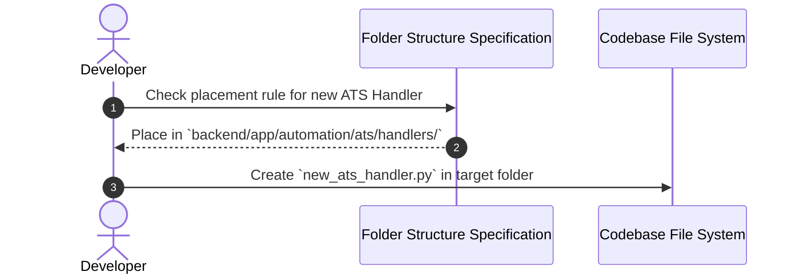
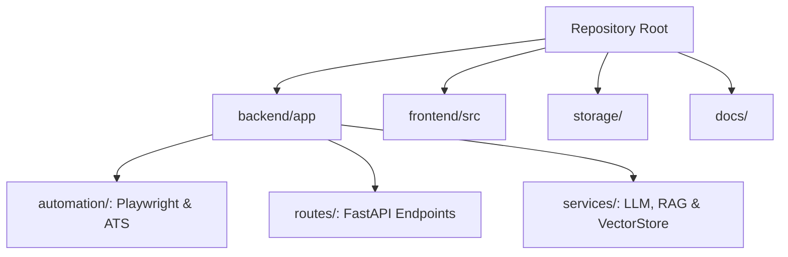

# 1. Overview
This document specifies the authoritative **Directory Structure, Module Organization, and File Placement Rules** for the Automated Job Application Agent repository.

---

# 2. Why This Exists
As a codebase expands to cover multi-portal scrapers, ATS form handlers, vector stores, multi-agent state graphs, and frontend React components, maintaining strict folder organization prevents circular imports, spaghetti code, and module location ambiguity.

---

# 3. Responsibilities
- Detail top-level and nested directory layouts for both `backend/` and `frontend/`.
- Enforce strict placement conventions for modules, services, handlers, routes, and tests.

---

# 4. Inputs
- Existing project files ([backend/app/](file:///d:/Personal%20Imp/Projects/Automated-job-Agent/backend/app), [frontend/src/](file:///d:/Personal%20Imp/Projects/Automated-job-Agent/frontend/src)).

---

# 5. Outputs
- Complete file tree layout and file mapping guide.

---

# 6. Components
- **Top-Level Root**: Project configs (`.env`, `job_agent.db`), backend, frontend, docs, storage directories.
- **Backend Directory (`backend/app/`)**: Automation handlers, portal plugins, classifiers, services, models, routes.
- **Frontend Directory (`frontend/src/`)**: Components, pages, hooks, state context, styles.
- **Storage Directory (`storage/`)**: Browser profiles, resumes, tailored resumes, screenshots, logs.

---

# 7. Folder Structure
```text
Automated-Job-Agent/
├── .env                                # Project environment settings
├── .gitignore
├── job_agent.db                        # Local SQLite database fallback
├── README.md
│
├── backend/                            # FastAPI Python Backend
│   ├── app/
│   │   ├── __init__.py
│   │   ├── main.py                     # FastAPI Application Entrypoint
│   │   ├── config.py                   # Pydantic Settings Parser
│   │   ├── database.py                 # SQLAlchemy Session & Engine Setup
│   │   ├── models.py                   # SQLAlchemy ORM Database Schemas
│   │   │
│   │   ├── automation/                 # Browser Automation & Handlers
│   │   │   ├── state_machine.py        # Finite State Machine Definition
│   │   │   ├── ats/                    # ATS Adapters & Handlers
│   │   │   │   ├── base_ats.py         # Base ATS Abstract Class
│   │   │   │   ├── ats_router.py       # ATS Routing Engine
│   │   │   │   └── handlers/           # Platform Handlers (Workday, Lever, etc.)
│   │   │   ├── browser/                # Playwright Async Client Pool
│   │   │   ├── candidate/              # Candidate Profile & Embeddings
│   │   │   ├── classifier/             # Application Classifier
│   │   │   ├── portal_plugins/         # Job Board Plugins (LinkedIn, Naukri)
│   │   │   └── question_engine/        # Question Classification Engine
│   │   │
│   │   ├── routes/                     # FastAPI Endpoint Routers
│   │   │   ├── applications.py
│   │   │   ├── credentials.py
│   │   │   ├── jobs.py
│   │   │   ├── matching.py
│   │   │   └── profile.py
│   │   │
│   │   └── services/                   # Business Logic & Infrastructure Services
│   │       ├── browser_manager.py
│   │       ├── llm.py                  # Unified LLM Service Interface
│   │       ├── parser.py               # Resume Parser Service
│   │       ├── scraper.py              # Web Scraper Orchestrator
│   │       ├── vectorstore.py          # Qdrant Vector Store Service
│   │       ├── matching/               # Hybrid Matcher & Agentic RAG
│   │       └── scraper/                # Scraper Modules & Registries
│   │
│   ├── requirements.txt                # Python Dependencies
│   └── tests/                          # Backend Pytest Test Suites
│
├── frontend/                           # React + Vite UI
│   ├── src/
│   │   ├── App.jsx                     # Core Application Component
│   │   ├── main.jsx                    # React DOM Entrypoint
│   │   ├── index.css                   # Global Tailwind Styles
│   │   ├── components/                 # Reusable UI Components
│   │   └── pages/                      # Dashboard Pages
│   ├── package.json
│   └── vite.config.js
│
├── docs/                               # 26-Phase Engineering Handbook
└── storage/                            # Media & File System Vault
    ├── browser_profiles/               # Persistent Browser Session Storage
    ├── logs/                           # Runtime Log Files
    ├── resumes/                        # Original Candidate Resumes
    ├── screenshots/                    # Application Proof Screenshots
    └── tailored_resumes/               # Generated Tailored PDF Resumes
```

---

# 8. Data Models
```python
from pydantic import BaseModel

class DirectoryLocation(BaseModel):
    module_path: str
    purpose: str
    allowed_file_types: list[str]
```

---

# 9. API Contracts
N/A (Folder Structure Spec).

---

# 10. Sequence Diagram


---

# 11. Flow Diagram


---

# 12. Internal Working
Directory paths are validated using Python `pathlib.Path` objects in [backend/app/config.py](file:///d:/Personal%20Imp/Projects/Automated-job-Agent/backend/app/config.py#L8-L18). Storage subdirectories are automatically initialized at app startup.

---

# 13. Configuration
- Base Directory resolve: `BASE_DIR = Path(__file__).resolve().parent.parent.parent`

---

# 14. Error Handling
- Attempting to access uninitialized storage folders raises a custom `StorageDirectoryNotFoundError` with auto-creation fallback.

---

# 15. Retry Strategy
- N/A.

---

# 16. Security
- The `storage/` directory is listed in `.gitignore` to prevent committing sensitive user resumes or session browser profile cookies to Git repositories.

---

# 17. Logging
- Folder creation events log path initialization at application startup.

---

# 18. Metrics
- N/A.

---

# 19. Testing Strategy
- Pytest suite checks for mandatory folder structure presence prior to running integration tests.

---

# 20. Performance Considerations
- Local path resolution using `Path.resolve()` caches absolute OS filesystem paths for fast file access.

---

# 21. Best Practices
- Never place business logic directly inside route handlers (`backend/app/routes/`); delegate all logic to service modules (`backend/app/services/`).

---

# 22. Production Improvements
- Mount `storage/` directory as an S3-compatible object storage bucket (AWS S3 or GCP Cloud Storage) in Kubernetes deployments.

---

# 23. Common Failure Scenarios
- **Scenario**: Committing temporary PDF resume build artifacts to Git repository.
  - **Resolution**: Enforce `.gitignore` rules for `storage/tailored_resumes/*.pdf`.

---

# 24. Future Enhancements
- Automate directory structure linting via pre-commit hooks.

---

# 25. References
- [FastAPI Project Structure Best Practices](https://fastapi.tiangolo.com/tutorial/bigger-applications/)
