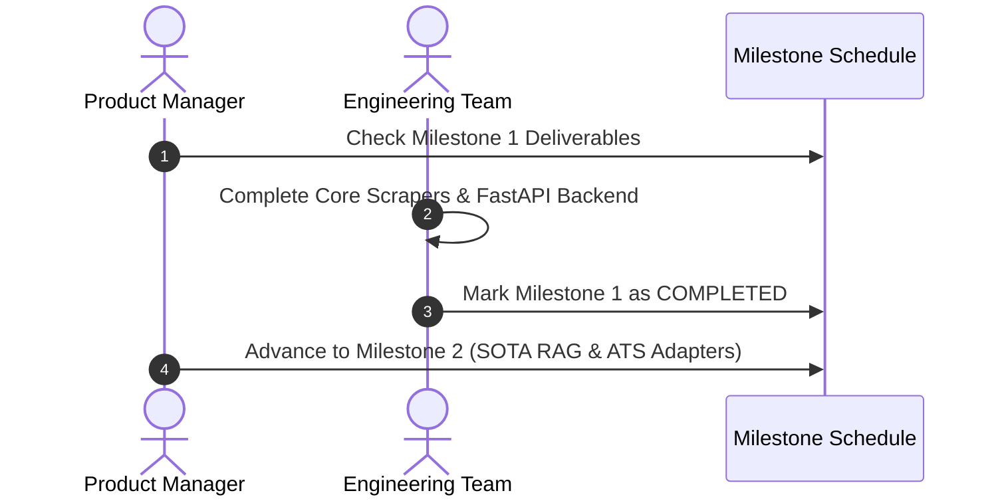
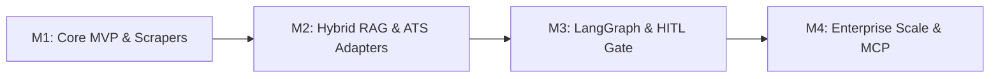

# 1. Overview
This document specifies the **Iterative Execution Roadmap, Release Milestones, and Feature Delivery Schedule** for the Automated Job Application Agent platform.

---

# 2. Why This Exists
Developing an enterprise-grade multi-agent autonomous system requires disciplined phase-by-phase execution. Establishing a clear milestone roadmap prevents scope creep and ensures early delivery of value.

---

# 3. Responsibilities
- Map out key project milestones from MVP baseline to global production scale.
- Assign delivery goals across Connectors, RAG Engine, Multi-Agent Planner, Browser Automation, and Observability.

---

# 4. Inputs
- Core feature list across all 26 documentation phases.

---

# 5. Outputs
- Scheduled delivery milestone chart detailing feature scope per release.

---

# 6. Components
- **Milestone 1: Core Foundation & MVP**: FastAPI API, SQLite/PostgreSQL support, Basic Resume Parser, Initial Scrapers (LinkedIn, Greenhouse).
- **Milestone 2: SOTA Matching & ATS Handlers**: BGE-M3 Hybrid Search, Qdrant Integration, Lever/Workday/Ashby ATS Handlers, Resume Tailoring Engine.
- **Milestone 3: LangGraph Agent & HITL**: Multi-agent state graph, Reflection Engine, Human-in-the-loop interrupts, Playwright Stealth Automation.
- **Milestone 4: Enterprise Production & MCP**: Redis Queues, Distributed Workers, OpenTelemetry/Langfuse Observability, MCP Tool Exposition, Kubernetes Helm Deployment.

---

# 7. Folder Structure
```text
docs/Phase-00-Foundation/
└── Project-Roadmap.md
```

---

# 8. Data Models
```python
from pydantic import BaseModel, Field
from typing import List, Optional
from datetime import date

class MilestoneSpec(BaseModel):
    version: str
    name: str
    target_completion_date: date
    key_features: List[str]
    is_completed: bool = False
```

---

# 9. API Contracts
N/A (Roadmap Specification).

---

# 10. Sequence Diagram


---

# 11. Flow Diagram


---

# 12. Internal Working
Progress is tracked iteratively against the 26 documentation phase blueprints.

---

# 13. Configuration
- Roadmap Target Release Tag: `v1.0.0-PROD`

---

# 14. Error Handling
- Milestone delays trigger scope prioritization review meetings.

---

# 15. Retry Strategy
- N/A.

---

# 16. Security
- Security audits and vulnerability scans are executed at every milestone boundary.

---

# 17. Logging
- Release tags log commit milestones into changelog files (`CHANGELOG.md`).

---

# 18. Metrics
- Milestone On-Time Delivery Rate (Target: >90%).

---

# 19. Testing Strategy
- Every milestone release requires passing end-to-end regression test suites before tagging.

---

# 20. Performance Considerations
- Early milestones focus on functional correctness; later milestones focus on throughput optimization.

---

# 21. Best Practices
- Never advance to a subsequent milestone until unit and integration test coverage thresholds (>85%) are satisfied.

---

# 22. Production Improvements
- Automate release tag creation and Docker image publishing via GitHub Actions workflows.

---

# 23. Common Failure Scenarios
- **Scenario**: Scope creep delays ATS handler delivery.
  - **Resolution**: Strict prioritization of top 5 ATS platforms (Greenhouse, Lever, Ashby, Workday, SmartRecruiters).

---

# 24. Future Enhancements
- Post-release roadmap: Add multi-lingual job scraping and local language resume tailoring support.

---

# 25. References
- Modern Software Engineering Project Management Benchmarks.
