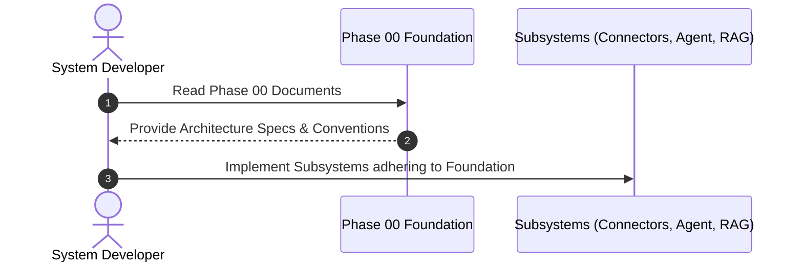
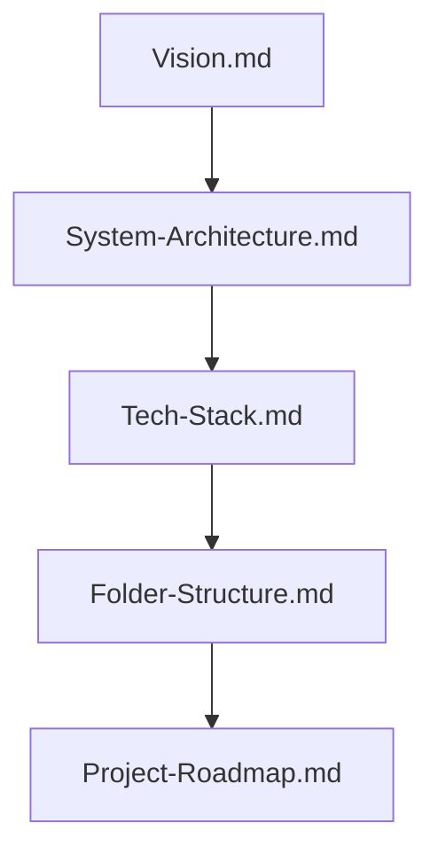

# 1. Overview
**Phase 00: Foundation** defines the core vision, architectural blueprint, technology choices, codebase organization, and strategic roadmap for the **Automated Job Application Agent**.

---

# 2. Why This Exists
Building a production-grade autonomous agent system requires a clear foundation. Phase 00 aligns engineering decisions before diving into individual connector plugins, RAG retrieval models, multi-agent state graphs, or browser automation pipelines.

---

# 3. Responsibilities
- Establish overall platform product vision and architectural principles.
- Define technology stack constraints (FastAPI, LangGraph, Playwright, PostgreSQL, Redis, Qdrant).
- Detail folder structure and repository conventions.
- Map out execution roadmap from MVP to multi-tenant production scale.

---

# 4. Inputs
- Product vision requirements and target candidate workflows.
- Technical constraints (Python 3.11+, Playwright async API, vector search specs).

---

# 5. Outputs
- Complete Phase 00 documentation suite (`README.md`, `Vision.md`, `System-Architecture.md`, `Tech-Stack.md`, `Folder-Structure.md`, `Project-Roadmap.md`).

---

# 6. Components
- **Vision Subsystem**: Core goals and user value proposition.
- **System Architecture Subsystem**: End-to-end component topology map.
- **Tech Stack Subsystem**: Framework, storage, and model selection.
- **Folder Structure Subsystem**: Directory layout and module conventions.
- **Roadmap Subsystem**: Iterative milestone schedule.

---

# 7. Folder Structure
```text
docs/Phase-00-Foundation/
├── README.md
├── Vision.md
├── System-Architecture.md
├── Tech-Stack.md
├── Folder-Structure.md
└── Project-Roadmap.md
```

---

# 8. Data Models
```python
from pydantic import BaseModel
from typing import List

class FoundationPhaseSpec(BaseModel):
    phase_id: str = "Phase-00-Foundation"
    documents_count: int = 6
    status: str = "Complete"
    target_components: List[str] = [
        "Vision", "System Architecture", "Tech Stack", "Folder Structure", "Roadmap"
    ]
```

---

# 9. API Contracts
N/A (Foundation Overview).

---

# 10. Sequence Diagram


---

# 11. Flow Diagram


---

# 12. Internal Working
Phase 00 acts as the parent document set for all subsequent phases. Every architectural contract, database schema, and agent state graph in later phases traces its design back to Phase 00 specifications.

---

# 13. Configuration
- Platform Project Name: "Automated Job Agent API"
- Target Python Version: 3.11+

---

# 14. Error Handling
- N/A.

---

# 15. Retry Strategy
- N/A.

---

# 16. Security
- System architectural principles mandate end-to-end encryption for candidate credentials and session tokens across all environments.

---

# 17. Logging
- Standardized logging format enforced project-wide (`[YYYY-MM-DD HH:MM:SS] [MODULE] [LEVEL] Message`).

---

# 18. Metrics
- Foundation Documentation Completeness: 100%.

---

# 19. Testing Strategy
- Verify Markdown formatting and link integrity across all Phase 00 files using documentation validation scripts.

---

# 20. Performance Considerations
- Early architectural alignment prevents costly refactoring during later development phases.

---

# 21. Best Practices
- Review Phase 00 documents before introducing new top-level directory dependencies or architectural layers.

---

# 22. Production Improvements
- Auto-generate architectural diagrams directly from codebase models.

---

# 23. Common Failure Scenarios
- **Scenario**: Adding redundant utility modules outside designated folder structures.
  - **Resolution**: Consult `Folder-Structure.md` and place code in standard directories (`backend/app/services/` or `backend/app/automation/`).

---

# 24. Future Enhancements
- Expand vision documentation to include international recruitment market compliance standards.

---

# 25. References
- [System Architecture Best Practices](https://c4model.com/)
