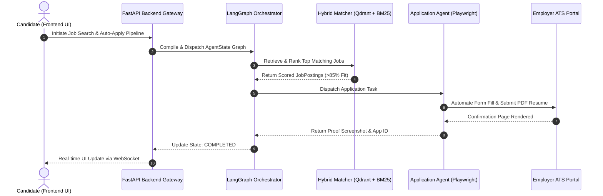
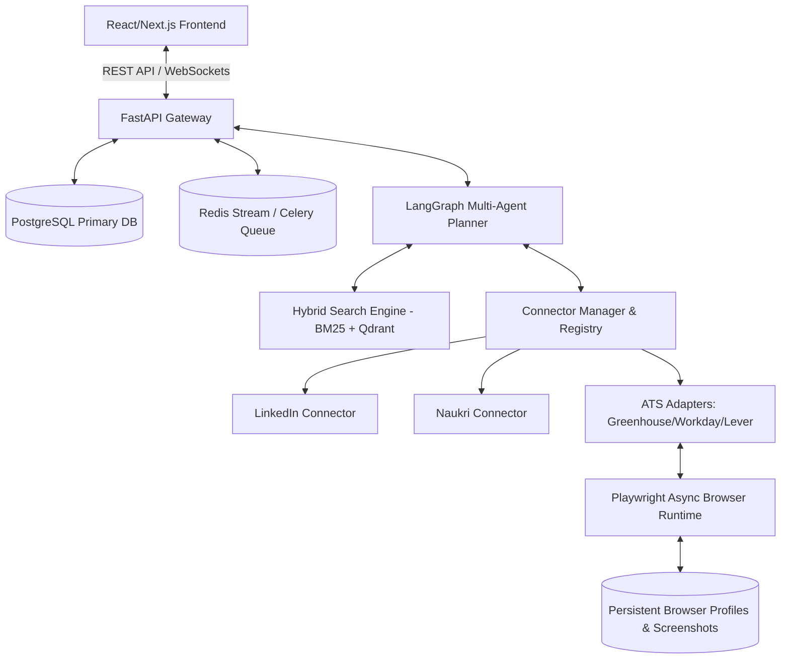

# 1. Overview
This document outlines the **End-to-End System Architecture Topology** of the Automated Job Application Agent, detailing how the Frontend UI, FastAPI Backend, LangGraph Planner, Connector System, Hybrid Vector Retrieval Engine, Browser Automation Runtime, and Persistence Layer interact.

---

# 2. Why This Exists
An enterprise multi-agent application requires clear subsystem boundaries, explicit data flow contracts, and well-defined component responsibilities. Documenting the complete architectural topology ensures seamless integration across frontend UI components, backend services, vector databases, background task queues, and Playwright execution workers.

---

# 3. Responsibilities
- Map out the end-to-end multi-agent subsystem layout.
- Detail component communications across REST HTTP, WebSockets, Redis Streams, and JSON-RPC (MCP).
- Establish data flow contracts between components.

---

# 4. Inputs
- HTTP Requests from React/Next.js frontend.
- Scheduled discovery triggers from background task workers.
- Portal HTML DOM structures from job boards and ATS platforms.

---

# 5. Outputs
- Processed job matches, tailored candidate resumes, form application submissions, status updates, and proof screenshots.

---

# 6. Components
- **User Interface Layer**: React 18 + Vite / Next.js Dashboard with real-time WebSocket progress updates.
- **API Gateway & Middleware Layer**: FastAPI async application handling authentication, CORS, rate limiting, and route dispatches.
- **Orchestration Layer**: LangGraph State Graph multi-agent workflow engine (Planner, Discovery, Retriever, Matcher, Resume, Application, Verifier, Reflection, Memory agents).
- **Connector & Plugin Registry Layer**: Modular platform connectors (LinkedIn, Naukri, Indeed, Wellfound) and ATS handlers (Greenhouse, Lever, Ashby, Workday, SmartRecruiters).
- **Hybrid Search & Vector RAG Layer**: BAAI/bge-m3 dense embeddings + BM25 keyword matching + Cross-Encoder reranker backed by Qdrant vector store.
- **Browser Automation Runtime**: Asynchronous Playwright browser context controller with persistent profile vault.
- **Persistence & Queue Layer**: PostgreSQL relational database + Redis Streams message broker + Celery worker pool.

---

# 7. Folder Structure
```text
docs/Phase-00-Foundation/
└── System-Architecture.md
```

---

# 8. Data Models
```python
from pydantic import BaseModel, Field
from typing import Dict, Any, List, Optional

class SystemTopologyNode(BaseModel):
    name: str
    layer: str = Field(..., description="Frontend, API, Agent, Service, Storage")
    protocol: str = Field(..., description="HTTP, WS, gRPC, Redis, IPC")
    dependencies: List[str]
```

---

# 9. API Contracts
Overall System Subsystem Mapping API Contract:
```json
{
  "system": "Automated Job Agent Topology",
  "version": "1.0.0",
  "subsystems": [
    {"name": "Frontend", "status": "Active"},
    {"name": "FastAPI Core", "status": "Active"},
    {"name": "LangGraph Orchestrator", "status": "Active"},
    {"name": "Playwright Automation", "status": "Active"},
    {"name": "PostgreSQL & Qdrant", "status": "Active"}
  ]
}
```

---

# 10. Sequence Diagram


---

# 11. Flow Diagram


---

# 12. Internal Working
When a user triggers an application batch, FastAPI registers the request, creates a tracking record in PostgreSQL, and pushes execution tasks to Redis Streams. Celery workers pick up the task and execute the LangGraph state graph. The graph queries Qdrant for semantic matching, calls the appropriate connector via `ConnectorRegistry`, invokes `PlaywrightManager` to submit the form, saves the confirmation screenshot into `storage/screenshots/`, and pushes real-time WebSocket progress updates to the frontend UI.

---

# 13. Configuration
- Configured via [backend/app/config.py](file:///d:/Personal%20Imp/Projects/Automated-job-Agent/backend/app/config.py).
- Environment options loaded dynamically from `.env`.

---

# 14. Error Handling
- Component failure isolation: If the Playwright browser worker encounters an error, the worker process catches the exception, updates the application state in PostgreSQL to `FAILED`, saves the diagnostic screenshot, and frees worker resources without crashing the FastAPI API server or other background task workers.

---

# 15. Retry Strategy
- Background task retries utilize exponential backoff (5s, 15s, 45s) managed by Celery / Redis Streams.

---

# 16. Security
- Secrets management: Credentials, JWT tokens, and API keys are fetched from environment variables and encrypted at rest using AES-256-GCM.

---

# 17. Logging
- Unified JSON logging across all subsystem components using correlation IDs (`x-request-id`) passed across thread and queue boundaries.

---

# 18. Metrics
- End-to-End Application Throughput (jobs/hour).
- Subsystem Latency Breakdown (API: <50ms, Matching: <300ms, Playwright Fill: <15s).

---

# 19. Testing Strategy
- End-to-End Integration Testing: Run test suite validating complete flow from API payload submission to database state verification and mock DOM application completion.

---

# 20. Performance Considerations
- Asynchronous non-blocking architecture allows a single worker node to process multiple Playwright browser contexts concurrently.

---

# 21. Best Practices
- Never bypass the `ConnectorRegistry` or `VectorStoreService` abstraction layers.

---

# 22. Production Improvements
- Implement Kubernetes pod autoscaling driven by Redis queue depth metrics.

---

# 23. Common Failure Scenarios
- **Scenario**: Qdrant vector database unreachable during match execution.
  - **Resolution**: System fails gracefully to PostgreSQL SQL text match fallback.

---

# 24. Future Enhancements
- Support multi-region agent execution pools to reduce portal navigation latency.

---

# 25. References
- Architectural patterns from OpenAI Operator and OpenHands platform specs.
