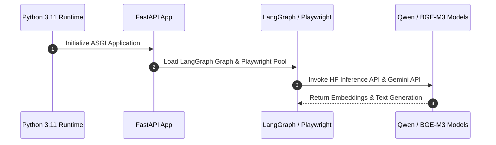
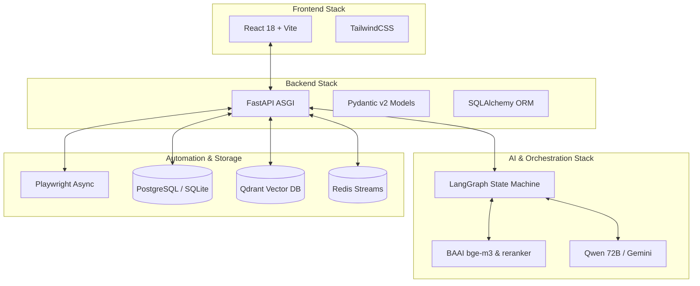

# 1. Overview
This document specifies the complete **Technology Stack, Programming Languages, Frameworks, Storage Engines, AI Models, and Infrastructure Tooling** chosen for the Automated Job Application Agent platform.

---

# 2. Why This Exists
Standardizing technology choices avoids dependency fragmentation, simplifies developer onboarding, and guarantees compatibility across backend API services, vector stores, multi-agent frameworks, browser automation, and frontend interfaces.

---

# 3. Responsibilities
- Detail every framework, library, database, and LLM model utilized in the platform.
- Explain technical rationale and version constraints for key dependencies.

---

# 4. Inputs
- Platform functional requirements across scraping, semantic retrieval, resume tailoring, and execution.

---

# 5. Outputs
- Definitive dependency specification documented in [backend/requirements.txt](file:///d:/Personal%20Imp/Projects/Automated-job-Agent/backend/requirements.txt) and package manifests.

---

# 6. Components
- **Core Language & Runtime**: Python 3.11+ (Backend), Node.js 18+ / TypeScript (Frontend).
- **Backend API Framework**: FastAPI + Uvicorn ASGI Server + Pydantic v2.
- **Agentic Orchestration Framework**: LangGraph + LangChain Core.
- **Web Automation Engine**: Playwright Python Async API (`playwright`).
- **Primary Relational Store**: PostgreSQL 16 (Production) / SQLite 3 (Local Fallback).
- **Vector Database**: Qdrant (Cloud / Docker) + Local Disk Client (`qdrant_db/`).
- **Message Broker & Queue**: Redis Streams + Celery / Arq Distributed Task Queue.
- **Embedding & ML Models**: `BAAI/bge-m3` (Embeddings), `BAAI/bge-reranker-large` (Reranking), `Qwen/Qwen2.5-72B-Instruct` / `Google Gemini 1.5 Pro` (LLMs).
- **Frontend UI Framework**: React 18 + Vite / TailwindCSS / Lucide Icons.

---

# 7. Folder Structure
```text
docs/Phase-00-Foundation/
└── Tech-Stack.md
```

---

# 8. Data Models
```python
from pydantic import BaseModel, Field

class TechStackDependency(BaseModel):
    category: str = Field(..., description="API, Database, Agent, ML, Automation")
    name: str
    version_spec: str
    rationale: str
```

---

# 9. API Contracts
Tech Stack Health Check Endpoint Payload:
```json
{
  "python_version": "3.11.8",
  "fastapi_version": "0.110.0",
  "playwright_version": "1.42.0",
  "qdrant_status": "Connected",
  "database_engine": "PostgreSQL 16"
}
```

---

# 10. Sequence Diagram


---

# 11. Flow Diagram


---

# 12. Internal Working
Dependencies are managed via virtual environments (`.venv/`) and pinned in [backend/requirements.txt](file:///d:/Personal%20Imp/Projects/Automated-job-Agent/backend/requirements.txt). The backend uses Pydantic Settings ([backend/app/config.py](file:///d:/Personal%20Imp/Projects/Automated-job-Agent/backend/app/config.py)) to parse runtime configurations seamlessly from `.env`.

---

# 13. Configuration
- Specified in `.env` and `config.py`.

---

# 14. Error Handling
- Missing third-party packages raise an explicit `ImportError` on backend startup with clear installation instructions.

---

# 15. Retry Strategy
- API calls to external ML models (Hugging Face / Gemini) utilize exponential backoff retry via HTTP clients.

---

# 16. Security
- Dependencies are audited using `pip-audit` and Snyk in CI build pipelines to prevent vulnerable library exploitation.

---

# 17. Logging
- Library loggers (`uvicorn`, `playwright`, `httpx`, `sqlalchemy`) are configured under unified Python `logging` handlers.

---

# 18. Metrics
- Dependency Initialization Time (<1.5s total server startup time).

---

# 19. Testing Strategy
- Automated CI pipeline runs dependency vulnerability scans on every pull request.

---

# 20. Performance Considerations
- Async ecosystem (`asyncio`, `httpx`, `asyncpg`, Playwright async) prevents thread blocking and maximizes hardware CPU/RAM utilization.

---

# 21. Best Practices
- Never use unpinned wildcard versions in production requirements.

---

# 22. Production Improvements
- Containerize application into minimal multi-stage Docker images based on `python:3.11-slim`.

---

# 23. Common Failure Scenarios
- **Scenario**: Missing system dependencies for Chromium headless rendering in Linux Docker containers.
  - **Resolution**: Run `playwright install-deps` in Dockerfile build step.

---

# 24. Future Enhancements
- Migrate Python package management to `uv` for 10x faster installation speed.

---

# 25. References
- [FastAPI Ecosystem Guide](https://fastapi.tiangolo.com/)
- [Playwright Python Documentation](https://playwright.dev/python/)
