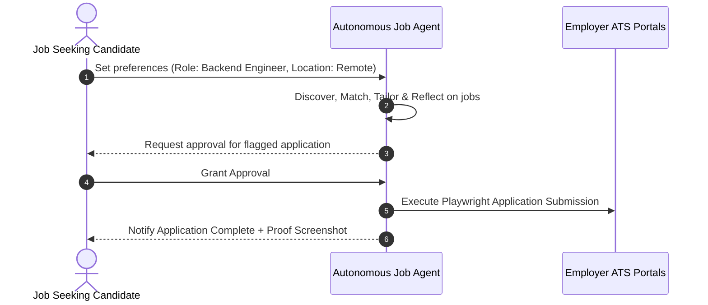
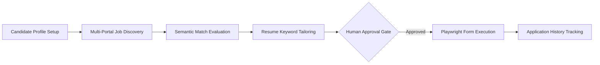

# 1. Overview
This document defines the high-level **Product Vision, Core Objectives, and Strategic Value Proposition** for the Automated Job Application Agent.

---

# 2. Why This Exists
Job searching is traditionally tedious, manual, and repetitive. Candidates spend hundreds of hours searching across fragmented portals (LinkedIn, Naukri, Indeed, Wellfound), parsing complex job descriptions, tailoring resumes manually, and filling repetitive dynamic application forms on enterprise ATS portals (Workday, Greenhouse, Lever). The Automated Job Agent transforms this experience into a hyper-automated, intelligent, candidate-first agentic workflow.

---

# 3. Responsibilities
- Define core mission: Maximize high-quality job matches while minimizing candidate effort.
- Establish product pillars: Autonomous Discovery, Hybrid Match Precision, Dynamic Resume Tailoring, Deterministic Form Execution, and Human Control.

---

# 4. Inputs
- Candidate career profiles, resumes, skill graphs, and job preference settings.

---

# 5. Outputs
- Autonomous discovery, evaluation, tailoring, approval triggering, and submission execution pipeline.

---

# 6. Components
- **Pillar 1: Multi-Portal Discovery**: Continuous background crawling across major job boards and ATS platforms.
- **Pillar 2: Deep Semantic Matching**: SOTA hybrid RAG evaluating true candidate fit beyond simple keyword matches.
- **Pillar 3: Adaptive Resume Tailoring**: Instant contextual resume bullet customization matching job keywords.
- **Pillar 4: Reliable Playwright Automation**: Robust form filling handling dynamic inputs, multi-page forms, and file uploads.
- **Pillar 5: Candidate Control (HITL)**: Transparent reflection checks and human approval gates for critical questions.

---

# 7. Folder Structure
```text
docs/Phase-00-Foundation/
└── Vision.md
```

---

# 8. Data Models
```python
from pydantic import BaseModel, Field
from typing import List

class ProductVisionMetrics(BaseModel):
    target_match_accuracy: float = Field(default=0.90, description="Minimum semantic match threshold")
    target_submission_success_rate: float = Field(default=0.95, description="Playwright application success target")
    time_saved_per_candidate_hours: float = Field(default=40.0, description="Monthly hours saved per candidate")
```

---

# 9. API Contracts
N/A (Vision Specification).

---

# 10. Sequence Diagram


---

# 11. Flow Diagram


---

# 12. Internal Working
The platform operates autonomously in background worker queues while maintaining transparent state visibility for the user via a modern React/Next.js dashboard and WebSocket notifications.

---

# 13. Configuration
- Platform Mission Identifier: `AUTONOMOUS_JOB_AGENT_V1`

---

# 14. Error Handling
- N/A.

---

# 15. Retry Strategy
- N/A.

---

# 16. Security
- Full candidate privacy protection: User profile data is isolated per candidate; data is never shared across user tenants or utilized for public model training without explicit consent.

---

# 17. Logging
- Mission accomplishment metrics logged to platform analytics dashboard.

---

# 18. Metrics
- Monthly Applications Successfully Submitted.
- Interview Conversion Rate Increase (% improvement over generic mass applications).

---

# 19. Testing Strategy
- Measure user satisfaction and candidate match accuracy against golden manual evaluation datasets.

---

# 20. Performance Considerations
- Agent parallelization allows scaling from single candidate execution to enterprise bulk processing.

---

# 21. Best Practices
- Never compromise quality for volume; prioritize high-scoring match precision over generic spam submissions.

---

# 22. Production Improvements
- Introduce AI career advisory feedback reports for candidates based on market job gap analysis.

---

# 23. Common Failure Scenarios
- **Scenario**: Candidate profile lacks sufficient detail for complex questions.
  - **Resolution**: System triggers human-in-the-loop prompt to capture missing answer into semantic memory.

---

# 24. Future Enhancements
- Automated interview preparation flashcard generation tailored to submitted job applications.

---

# 25. References
- Candidate Recruitment Trends and AI Automation Benchmarks 2026.
