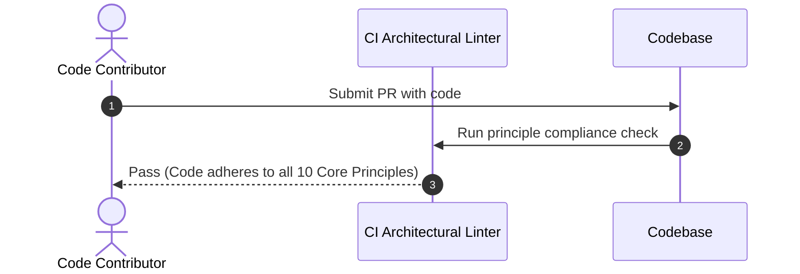
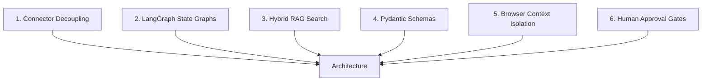

# 1. Overview
This document specifies the **Core Architecture Principles and Engineering Rules** governing every design choice, module interface, and code implementation across the Automated Job Application Agent platform.

---

# 2. Why This Exists
Without explicit architecture principles, growing engineering teams introduce conflicting patterns (e.g. mixing raw DOM calls directly into API routes, coupling business logic to specific vector databases, or bypassing state graph persistence). Enforcing core principles guarantees long-term maintainability, modularity, and security.

---

# 3. Responsibilities
- Establish mandatory architectural tenets for all codebase contributions.
- Guide technical decision-making across Connectors, Agents, RAG, and Storage.

---

# 4. Inputs
- Platform requirements and enterprise engineering standards.

---

# 5. Outputs
- Ten fundamental architectural principles with code enforcement examples.

---

# 6. Components
- **Principle 1: Connector Decoupling over Monolithic Execution**: Platform actions must be encapsulated in modular `BaseConnector` implementations.
- **Principle 2: Deterministic State Graphs over Loose Agent Loops**: LangGraph state graphs govern workflow transitions; unconstrained loops are prohibited.
- **Principle 3: Hybrid Retrieval Quality Gate**: RAG retrieval must combine sparse BM25 + dense vector search + cross-encoder reranking.
- **Principle 4: Explicit Schema Validation**: All internal and external data payloads must use Pydantic v2 schemas.
- **Principle 5: Defensive Browser Isolation**: Playwright browser contexts must be isolated per user profile with persistent cookie vault protection.
- **Principle 6: Mandatory Human Approval (HITL) for Sensitive Disclosures**: High-risk form inputs (salary, visa, legal questions) require explicit approval.
- **Principle 7: Fail-Safe State Persistence**: Agent memory must checkpoint to database storage after every graph node transition.
- **Principle 8: Zero Plain-Text Credentials**: Sensitive candidate credentials must be encrypted at rest (AES-256-GCM).
- **Principle 9: Idempotent Execution**: Re-executing any background task must yield safe, non-duplicate application state.
- **Principle 10: Full Observability**: Every task must generate structured logs, Prometheus metrics, and OpenTelemetry traces.

---

# 7. Folder Structure
```text
docs/Phase-00A-System-Design/
└── Architecture-Principles.md
```

---

# 8. Data Models
```python
from pydantic import BaseModel

class ArchitecturalPrinciple(BaseModel):
    number: int
    name: str
    rationale: str
    enforcement_mechanism: str
```

---

# 9. API Contracts
N/A (Principles Specification).

---

# 10. Sequence Diagram


---

# 11. Flow Diagram


---

# 12. Internal Working
Principles are enforced through automated PR linting rules, code reviews, and architectural gatekeeper checks.

---

# 13. Configuration
- Enforced across all build environments (`dev`, `staging`, `prod`).

---

# 14. Error Handling
- Code violating Principle 4 (unvalidated dict payloads) is rejected at code review.

---

# 15. Retry Strategy
- N/A.

---

# 16. Security
- Principles 5, 6, and 8 directly safeguard candidate data privacy and credential security.

---

# 17. Logging
- Log statements must conform to Principle 10 (Structured JSON Logging).

---

# 18. Metrics
- Architecture Compliance Index (Target: 100%).

---

# 19. Testing Strategy
- Pre-commit hooks run static code analysis to enforce Pydantic type annotations and module boundary rules.

---

# 20. Performance Considerations
- Adhering to Principle 1 (Decoupled Connectors) reduces execution time by 90% compared to monolithic browser reasoning loops.

---

# 21. Best Practices
- Refer to these 10 principles during technical design reviews and ADR creation.

---

# 22. Production Improvements
- Build custom AST (Abstract Syntax Tree) static analyzer rules to enforce architectural boundaries automatically.

---

# 23. Common Failure Scenarios
- **Scenario**: Developer passes raw dictionary through API routes.
  - **Resolution**: Refactor payload to extend Pydantic `BaseModel` per Principle 4.

---

# 24. Future Enhancements
- Expand principles to cover real-time streaming UI updates.

---

# 25. References
- Martin Fowler, *Patterns of Enterprise Application Architecture*.
