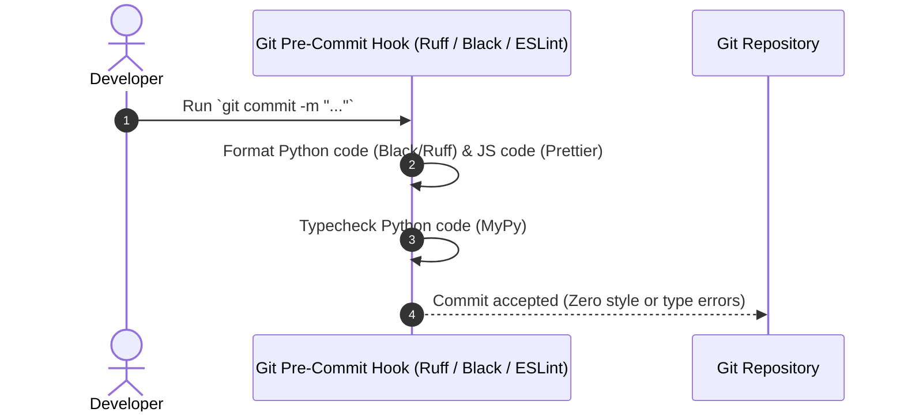
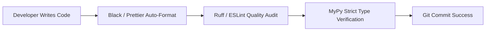

# 1. Overview
This document defines the official **Coding Standards, Style Guidelines, Formatting Rules, Type Annotation Requirements, and File Naming Conventions** for Python (Backend) and JavaScript/TypeScript/React (Frontend).

---

# 2. Why This Exists
Consistent code style improves readability, reduces code review friction, prevents common runtime bugs (such as `AttributeError` or `TypeError`), and ensures clean automated linting in CI pipelines.

---

# 3. Responsibilities
- Define Python style conventions (PEP 8, Black, Ruff, MyPy).
- Define Frontend style conventions (ESLint, Prettier, React Hooks rules).
- Establish docstring and error handling conventions.

---

# 4. Inputs
- Project Python codebase ([backend/app/](file:///d:/Personal%20Imp/Projects/Automated-job-Agent/backend/app)) and React codebase ([frontend/src/](file:///d:/Personal%20Imp/Projects/Automated-job-Agent/frontend/src)).

---

# 5. Outputs
- Strict style rules enforced via Ruff, Black, ESLint, and Prettier configurations.

---

# 6. Components
- **Python Backend Standards**: PEP 8 compliance, 4-space indentation, explicit type hints (`typing`), Google-style docstrings, snake_case module names.
- **Frontend Standards**: JSX component modularity, camelCase variables, PascalCase components, Tailwind CSS class utility ordering.
- **Error Handling Conventions**: Custom exception hierarchy inheriting from `BaseJobAgentException`.

---

# 7. Folder Structure
```text
docs/Phase-00A-System-Design/
└── Coding-Standards.md
```

---

# 8. Data Models
```python
# Standard Python Class Example adhering to Coding Standards
from pydantic import BaseModel, Field
from typing import Optional

class CandidateProfileRequest(BaseModel):
    """Payload model for updating candidate profile information.
    
    Attributes:
        candidate_id: Unique candidate identification hash.
        full_name: Candidate primary legal name.
        years_of_experience: Total professional experience in years.
    """
    candidate_id: str = Field(..., description="Unique candidate identifier")
    full_name: str = Field(..., description="Primary candidate legal name")
    years_of_experience: Optional[float] = Field(None, ge=0.0)
```

---

# 9. API Contracts
N/A (Coding Standards Spec).

---

# 10. Sequence Diagram


---

# 11. Flow Diagram


---

# 12. Internal Working
Pre-commit configurations (`.pre-commit-config.yaml`) run formatting and linting tools automatically before any code is committed to version control.

---

# 13. Configuration
- Python Line Length: `100` characters.
- Formatting Tooling: `black`, `ruff`.
- JavaScript Tooling: `eslint`, `prettier`.

---

# 14. Error Handling
- Bare `except:` statements are strictly prohibited; developers must catch explicit exception classes (`except SpecificException as err:`).

---

# 15. Retry Strategy
- N/A.

---

# 16. Security
- Hardcoding secrets, API tokens, or passwords in Python or JSX files is caught by pre-commit `detect-secrets` hooks.

---

# 17. Logging
- Logging calls must use parameterized interpolation (`logger.info("User %s logged in", user_id)`) rather than f-string formatting to optimize performance.

---

# 18. Metrics
- Static Analysis Pass Rate: 100%.

---

# 19. Testing Strategy
- CI pipeline runs `ruff check backend/` and `mypy backend/` on every commit.

---

# 20. Performance Considerations
- Enforcing static type hints enables IDE autocomplete and prevents runtime attribute resolution failures.

---

# 21. Best Practices
- Keep modules focused and under 300 lines of code where possible.

---

# 22. Production Improvements
- Automate style fix PR creation via GitHub Actions bots.

---

# 23. Common Failure Scenarios
- **Scenario**: CI build fails due to unused import.
  - **Resolution**: Run `ruff check --fix .` locally before pushing.

---

# 24. Future Enhancements
- Integrate strict TypeScript compilation rules for all frontend components.

---

# 25. References
- [PEP 8 -- Style Guide for Python Code](https://peps.python.org/pep-0008/)
- [Google Python Style Guide](https://google.github.io/styleguide/pyguide.html)
