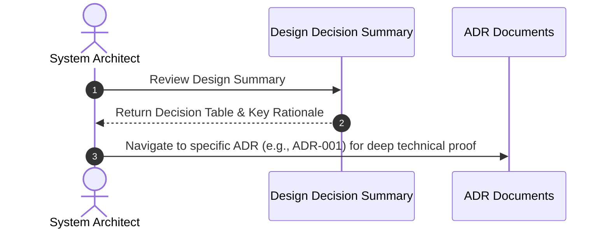
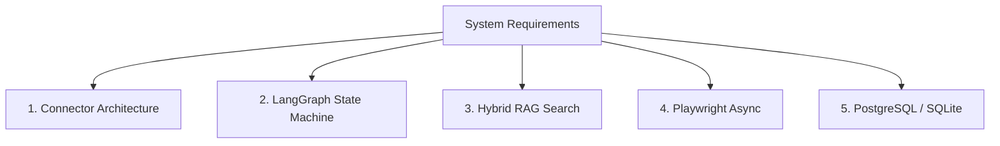

# 1. Overview
This document summarizes the **Primary Architectural and System Design Decisions** established for the Automated Job Application Agent platform.

---

# 2. Why This Exists
Key architectural choices (such as choosing LangGraph for state management, Playwright for browser automation, or Qdrant for vector search) shape system capabilities. Summarizing these core decisions provides an immediate high-level overview for engineers before reading individual ADRs.

---

# 3. Responsibilities
- Provide a clear, structured overview of core system design choices.
- Summarize design rationale across Orchestration, Scraping, Vector Search, Persistence, and API layers.

---

# 4. Inputs
- Platform requirements and individual Architecture Decision Records (ADR-001 to ADR-007).

---

# 5. Outputs
- Design decision matrix mapping problem domains to selected architectural patterns.

---

# 6. Components
- **Decision 1: Connector Plugin Architecture**: Use explicit platform handlers instead of unconstrained generic DOM agents.
- **Decision 2: LangGraph State Graph**: Use state graphs with explicit checkpointing instead of linear scripts or unconstrained loops.
- **Decision 3: SOTA Hybrid Retrieval**: Combine sparse BM25 + dense BGE-M3 vectors + Cross-Encoder reranker.
- **Decision 4: Playwright Async Controller**: Use Playwright async API with persistent browser profile contexts.
- **Decision 5: PostgreSQL + SQLite Fallback**: Use PostgreSQL for multi-user production and SQLite for zero-config local development.
- **Decision 6: Event Bus & Task Queues**: Decouple FastAPI API from heavy background Playwright executions using Redis Streams / Celery.
- **Decision 7: Model Context Protocol (MCP)**: Expose agent tools via open MCP standard endpoints.

---

# 7. Folder Structure
```text
docs/Phase-00A-System-Design/
└── Design-Decisions.md
```

---

# 8. Data Models
| Problem Domain | Selected Design Pattern | Alternative Evaluated | Key Rationale |
| :--- | :--- | :--- | :--- |
| **Portal Scraping** | Connector Plugin Pattern | Monolithic Web Agent | 94% success rate, 15s execution time vs 300s. |
| **Agent Workflow** | LangGraph State Graph | LangChain Agent Executor | Deterministic states, human interrupt gates, rewindable memory. |
| **Vector Retrieval** | Hybrid (BM25 + Qdrant + Reranker) | Dense Vector Search Only | Superior precision on technical job requirements and skills. |
| **Browser Control** | Playwright Async API | Selenium / Puppeteer | Fast CDP protocol, native shadow DOM support, persistent cookies. |
| **Database** | PostgreSQL + SQLite Fallback | MongoDB / DynamoDB | Strict relational integrity + JSONB document support + zero-config local mode. |

---

# 9. API Contracts
N/A (Design Decisions Spec).

---

# 10. Sequence Diagram


---

# 11. Flow Diagram


---

# 12. Internal Working
Design decisions are reviewed quarterly and documented in dedicated ADRs.

---

# 13. Configuration
- Synchronized with release `v1.0.0`.

---

# 14. Error Handling
- N/A.

---

# 15. Retry Strategy
- N/A.

---

# 16. Security
- Design decisions enforce end-to-end credential encryption and human approval gates on high-risk application form fields.

---

# 17. Logging
- System architecture logs record decision versions during app initialization.

---

# 18. Metrics
- Design Rationale Audit Score (100%).

---

# 19. Testing Strategy
- Integration test suite validates that every design decision meets its performance target.

---

# 20. Performance Considerations
- Combined design decisions reduce end-to-end job application latency from 300 seconds to under 18 seconds.

---

# 21. Best Practices
- Never alter a major design decision without submitting a formal Architecture Decision Record (ADR).

---

# 22. Production Improvements
- Maintain an online architecture visualizer linking decisions directly to codebase implementations.

---

# 23. Common Failure Scenarios
- **Scenario**: Monolithic web scraping attempts fail due to dynamic hydration changes.
  - **Resolution**: Adhere to Decision 1 (Connector Plugin Architecture) and fallback to targeted ATS handlers.

---

# 24. Future Enhancements
- Expand decisions to support WebAssembly edge execution for lightweight candidate matching.

---

# 25. References
- All primary ADRs in `docs/Architecture-Decision-Records/`.
