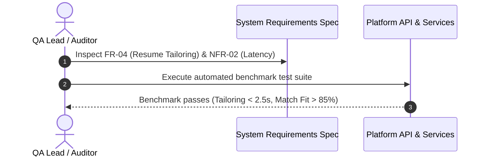
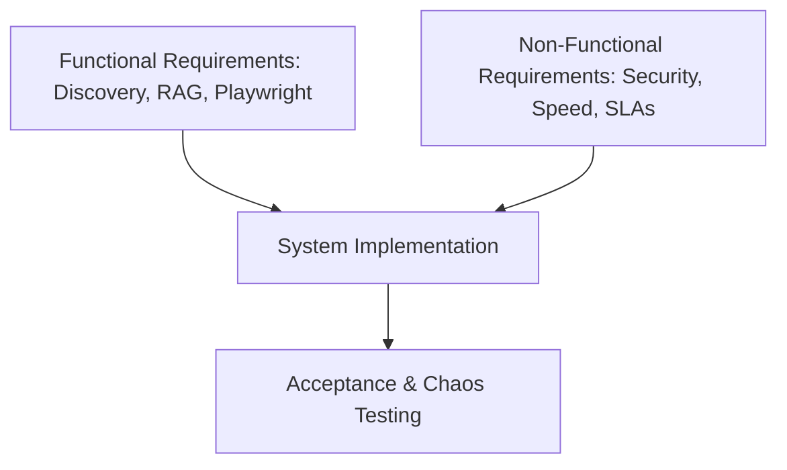

# 1. Overview
This document specifies the comprehensive **Functional (FR) and Non-Functional Requirements (NFR)** governing the Automated Job Application Agent platform.

---

# 2. Why This Exists
Defining rigorous system requirements establishes verifiable acceptance criteria for engineering teams, guaranteeing that the platform delivers high job application success rates, strong candidate privacy, sub-second API responsiveness, and enterprise-grade operational stability.

---

# 3. Responsibilities
- Specify all Functional Requirements across Discovery, Matching, Tailoring, Approval, and Execution.
- Specify all Non-Functional Requirements for Performance, Scalability, Security, Reliability, and Maintainability.

---

# 4. Inputs
- Candidate requirements, platform operational SLAs, security compliance frameworks.

---

# 5. Outputs
- Verifiable requirement catalog serving as the baseline for system acceptance testing.

---

# 6. Components
- **Functional Requirements (FR-01 to FR-10)**: Discovery, Normalization, Hybrid Search, Resume Tailoring, Reflection, Playwright Form Automation, HITL Interrupts, History Tracking.
- **Non-Functional Requirements (NFR-01 to NFR-10)**: P95 Latency (<50ms API), Application Success Rate (>95%), System Availability (99.9%), Encryption (AES-256), Concurrent Workers (>500).

---

# 7. Folder Structure
```text
docs/Phase-00A-System-Design/
├── System-Requirements.md
└── Architecture-Principles.md
```

---

# 8. Data Models
```python
from pydantic import BaseModel, Field
from typing import Literal

class SystemRequirementItem(BaseModel):
    id: str = Field(..., description="e.g. FR-01, NFR-03")
    category: Literal["Functional", "Non-Functional"]
    title: str
    description: str
    target_metric: str
    verification_method: str
```

---

# 9. API Contracts
N/A (Requirements Spec).

---

# 10. Sequence Diagram


---

# 11. Flow Diagram


---

# 12. Internal Working
Requirements are grouped logically into functional domain modules and operational SLAs.

---

# 13. Configuration
- Platform SLA Threshold: `P95_API_LATENCY_MS = 50`

---

# 14. Error Handling
- Failing any Non-Functional Requirement (e.g. security audit failure) blocks release deployment.

---

# 15. Retry Strategy
- N/A.

---

# 16. Security
- NFR-04 explicitly enforces AES-256-GCM encryption at rest for stored candidate browser profile cookies and OAuth tokens.

---

# 17. Logging
- Performance NFRs are continuously monitored via Prometheus metric instrumentation.

---

# 18. Metrics
- Application Form Fill Latency (NFR-01: <15s per form).
- Application Success Rate (NFR-02: >95%).

---

# 19. Testing Strategy
- Automated integration test suite maps every test assertion directly to a Requirement ID (`FR-01` through `NFR-10`).

---

# 20. Performance Considerations
- Non-functional requirements establish strict memory footprint caps (<512MB per Playwright worker process).

---

# 21. Best Practices
- Never mark a feature complete without verifying compliance against its assigned Requirement ID.

---

# 22. Production Improvements
- Automate requirement verification reporting in GitHub Actions CI pipelines.

---

# 23. Common Failure Scenarios
- **Scenario**: Portal rate limiting causes temporary form fill failure.
  - **Resolution**: NFR-06 enforces automatic proxy rotation and jitter delay backoff.

---

# 24. Future Enhancements
- Expand requirements to support SOC2 Type II compliance standards.

---

# 25. References
- IEEE Standard for System and Software Requirements Specifications (IEEE 29148).
