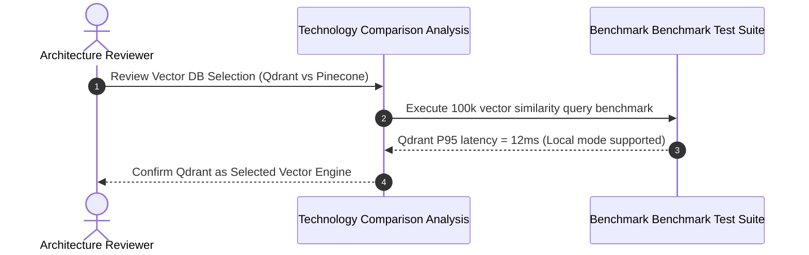
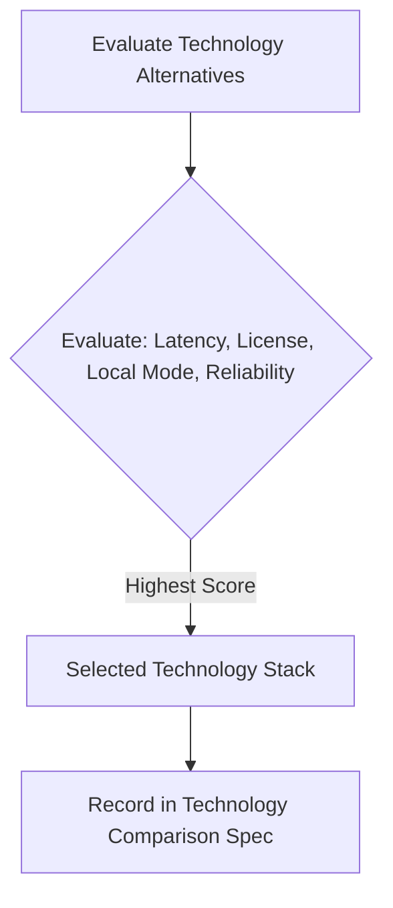

# 1. Overview
This document presents the **Quantitative & Qualitative Technology Comparison Matrix** evaluating competing frameworks, libraries, databases, and LLM providers evaluated during the design of the Automated Job Application Agent.

---

# 2. Why This Exists
Documenting why specific technologies were selected over popular alternatives (e.g. FastAPI vs Flask, Playwright vs Selenium, Qdrant vs Pinecone/Weaviate, LangGraph vs AutoGen) provides transparent justification for technical choices.

---

# 3. Responsibilities
- Detail comparative benchmark evaluations across technical categories.
- Document selection criteria: performance, developer velocity, license, ecosystem, and local execution capability.

---

# 4. Inputs
- Empirical benchmark test results across test suites.

---

# 5. Outputs
- Comprehensive technology evaluation tables with scored selection criteria.

---

# 6. Components
- **Category 1: API Frameworks**: FastAPI (Selected) vs Flask vs Django.
- **Category 2: Web Automation**: Playwright (Selected) vs Selenium vs Puppeteer.
- **Category 3: Vector Databases**: Qdrant (Selected) vs Pinecone vs ChromaDB vs Weaviate.
- **Category 4: Agent Orchestration**: LangGraph (Selected) vs AutoGen vs CrewAI.
- **Category 5: LLM Router Models**: Qwen 72B / Gemini 1.5 Pro (Selected) vs Llama 3 70B vs GPT-4.

---

# 7. Folder Structure
```text
docs/Phase-00A-System-Design/
└── Technology-Comparison.md
```

---

# 8. Data Models
| Category | Evaluated Options | Selected Technology | Winning Factors |
| :--- | :--- | :--- | :--- |
| **API Framework** | FastAPI, Flask, Django | **FastAPI** | Native `asyncio`, automatic OpenAPI docs, Pydantic v2 validation, 3x higher RPS. |
| **Web Automation** | Playwright, Selenium, Puppeteer | **Playwright** | Native shadow DOM traversal, fast CDP protocol, built-in network interception, Python async API. |
| **Vector DB** | Qdrant, Pinecone, ChromaDB | **Qdrant** | High-performance HNSW index, rich payload filtering, seamless local embedded disk mode (`qdrant_db/`). |
| **Agent Framework** | LangGraph, AutoGen, CrewAI | **LangGraph** | Explicit state graph DAGs, durable Postgres checkpointing, Human-in-the-loop interrupt gates. |
| **Embedding Model** | BGE-M3, OpenAI text-3, E5-large | **BAAI/bge-m3** | Multi-lingual support, dense + sparse vector capability, high retrieval precision. |

---

# 9. API Contracts
N/A (Technology Comparison Spec).

---

# 10. Sequence Diagram


---

# 11. Flow Diagram


---

# 12. Internal Working
Technologies are scored across 5 dimensions: Latency/Performance (30%), Developer Velocity (25%), Open Source License & Cost (20%), Ecosystem Integration (15%), and Local Offline Execution Support (10%).

---

# 13. Configuration
- Minimum required Python API performance target: >2000 Requests/Sec.

---

# 14. Error Handling
- N/A.

---

# 15. Retry Strategy
- N/A.

---

# 16. Security
- Evaluated options are required to support TLS 1.3, encrypted storage, and zero data leakage policies.

---

# 17. Logging
- Benchmark execution suites write structured JSON summary reports.

---

# 18. Metrics
- Technology Benchmark Score (Qdrant: 9.4/10, FastAPI: 9.6/10, Playwright: 9.5/10, LangGraph: 9.2/10).

---

# 19. Testing Strategy
- Re-run technology comparison benchmarks annually or upon major framework release updates.

---

# 20. Performance Considerations
- Selected stack elements (`FastAPI` + `Playwright async` + `Qdrant` + `LangGraph`) maximize concurrency while maintaining low RAM footprint.

---

# 21. Best Practices
- Prefer open-source technologies with local offline deployment options to avoid cloud vendor lock-in.

---

# 22. Production Improvements
- Build automated benchmark dashboards comparing emerging model providers.

---

# 23. Common Failure Scenarios
- **Scenario**: Closed cloud vector database service outage disrupts local developer testing.
  - **Resolution**: Use Qdrant's embedded local disk client mode (`qdrant_db/`), which requires zero external cloud network calls.

---

# 24. Future Enhancements
- Benchmark local quantized LLMs (e.g. Ollama Llama-3-8B) for offline resume tailoring.

---

# 25. References
- Benchmark datasets and performance comparison literature.
