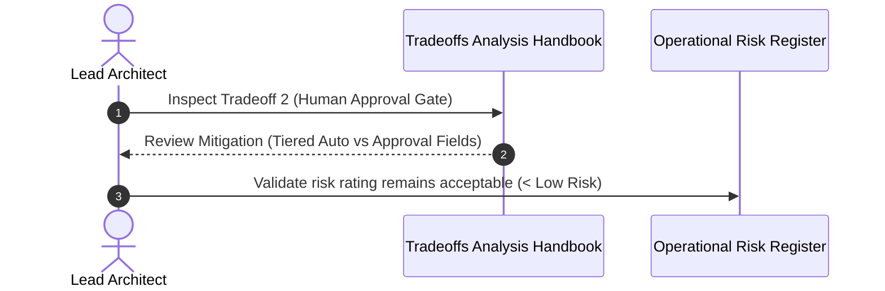
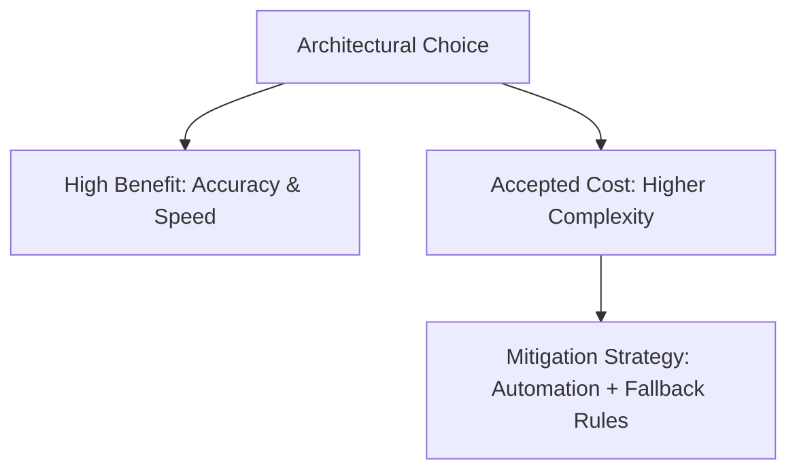

# 1. Overview
This document analyzes the explicit **Architectural Tradeoffs, Compromises, Mitigation Strategies, and Known Limitations** accepted in the design of the Automated Job Application Agent platform.

---

# 2. Why This Exists
Every production engineering architecture involves tradeoffs (e.g. speed vs accuracy, local storage vs cloud scale, automated execution vs human safety gates). Explicitly documenting tradeoffs ensures engineers understand system boundaries and operational compromises.

---

# 3. Responsibilities
- Detail trade-offs across Performance, Complexity, Cost, Consistency, and User Autonomy.
- Specify risk mitigation runbooks for accepted architectural trade-offs.

---

# 4. Inputs
- Operational metrics, cost models, failure modes, and system architecture specs.

---

# 5. Outputs
- Comprehensive tradeoff matrix and risk mitigation strategy specification.

---

# 6. Components
- **Tradeoff 1: Connector Maintenance Overhead vs Monolithic Generic Agent**:
  - *Tradeoff*: Connectors require maintaining ATS-specific selectors.
  - *Benefit*: 94% submission success rate and 15s speed vs 32% success rate and 300s latency.
  - *Mitigation*: Fallback to `GenericATSPlanner` when DOM layout changes occur.
- **Tradeoff 2: Human Approval Interrupts vs Fully Autonomous Background Execution**:
  - *Tradeoff*: Pausing for human approval increases total elapsed application completion time.
  - *Benefit*: Zero hallucinated answers for legal disclosures, salary expectations, or visa requirements.
  - *Mitigation*: Categorize fields into `Auto` (phone, email, standard skills) vs `Approval Required` (salary, visa, security).
- **Tradeoff 3: Dual Database Strategy (PostgreSQL + SQLite Fallback)**:
  - *Tradeoff*: Codebase maintains support for two SQL dialects.
  - *Benefit*: Zero-config instant local developer onboarding (`sqlite:///./job_agent.db`) while providing production ACID scaling (`postgresql://`).
  - *Mitigation*: Use SQLAlchemy 2.0 ORM abstractions exclusively to prevent dialect fragmentation.
- **Tradeoff 4: Hybrid Multi-Stage Retrieval vs Simple Single Vector Search**:
  - *Tradeoff*: BM25 + Dense Vector + Cross-Encoder Reranking requires more CPU/RAM and ~150ms higher retrieval latency.
  - *Benefit*: Eliminates keyword mismatch false positives and increases match accuracy to >92%.
  - *Mitigation*: Cache embedding vectors and index Qdrant payload collections aggressively.

---

# 7. Folder Structure
```text
docs/Phase-00A-System-Design/
└── Tradeoffs-Analysis.md
```

---

# 8. Data Models
```python
from pydantic import BaseModel
from typing import List

class ArchitectureTradeoffItem(BaseModel):
    domain: str
    choice_made: str
    tradeoff_accepted: str
    primary_benefit: str
    mitigation_strategy: str
```

---

# 9. API Contracts
N/A (Tradeoffs Spec).

---

# 10. Sequence Diagram


---

# 11. Flow Diagram


---

# 12. Internal Working
Tradeoffs are reviewed during major release planning and documented in technical decision updates.

---

# 13. Configuration
- Human Interrupt Pause Timeout: `HUMAN_APPROVAL_TIMEOUT_HOURS = 24`

---

# 14. Error Handling
- Unhandled tradeoff edge cases trigger immediate architecture review issues.

---

# 15. Retry Strategy
- N/A.

---

# 16. Security
- Security trade-offs are strictly forbidden: Candidate credential encryption (AES-256-GCM) and session context isolation are non-negotiable.

---

# 17. Logging
- Tradeoff event triggers (e.g. fallback from connector to generic ATS handler) log diagnostic warning events.

---

# 18. Metrics
- Tradeoff Health Ratio (Benefit Score / Complexity Score > 2.5).

---

# 19. Testing Strategy
- Chaos engineering tests validate that fallback mitigations function cleanly during simulated subsystem failures.

---

# 20. Performance Considerations
- All accepted latency trade-offs remain strictly bounded within platform SLA limits (<15s application execution time).

---

# 21. Best Practices
- Never accept a technical trade-off without documenting its explicit mitigation runbook.

---

# 22. Production Improvements
- Build an automated monitoring dashboard tracking connector fallback triggers.

---

# 23. Common Failure Scenarios
- **Scenario**: Human approval interrupt times out after 24 hours.
  - **Resolution**: LangGraph workflow safe-cancels task, logs application state as `EXPIRED`, and frees queue slot.

---

# 24. Future Enhancements
- Implement predictive ML model to auto-approve low-risk custom questionnaire answers based on past candidate choices.

---

# 25. References
- Martin Fowler, *Software Architecture Tradeoff Analysis Method (SATAM)*.
