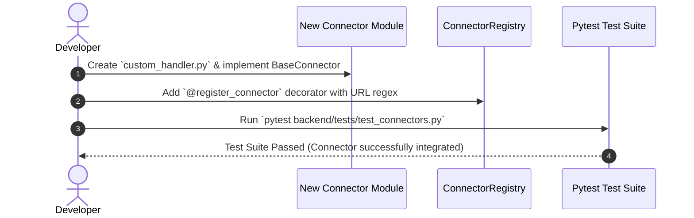
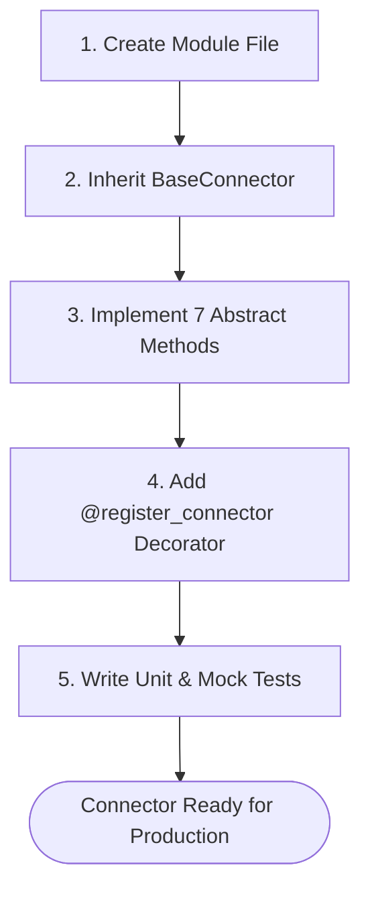

# 1. Overview
This developer guide provides a step-by-step walkthrough for **Creating, Implementing, Testing, and Registering a New Job Board Connector or ATS Handler** in the Automated Job Application Agent codebase.

---

# 2. Why This Exists
As new job portals and enterprise ATS engines emerge, developers must be able to add new connectors seamlessly without modifying core agent planning logic or breaking existing pipeline components.

---

# 3. Responsibilities
- Provide a standardized 5-step checklist for building new connectors.
- Document class template code, regex URL registration, and test coverage requirements.

---

# 4. Inputs
- Target platform job URL structure, HTML form selectors, and application workflow details.

---

# 5. Outputs
- Fully implemented, tested, and registered `BaseConnector` class added to `backend/app/automation/ats/handlers/` or `portal_plugins/`.

---

# 6. Components
- **Step 1: Define Connector Class**: Subclass `BaseConnector` in a new module.
- **Step 2: Implement Interface Methods**: Fill in required async methods (`authenticate`, `search`, `get_job`, `prepare_application`, `apply`, `verify_submission`, `track_status`).
- **Step 3: Register in ConnectorRegistry**: Attach `@register_connector` decorator with target URL regexes.
- **Step 4: Implement Unit Tests**: Create mock HTML test fixture and add pytest cases.
- **Step 5: Verify Integration**: Test against live staging URL.

---

# 7. Folder Structure
```text
docs/Phase-01-Connector-System/
└── Adding-New-Connector.md
```

---

# 8. Data Models
```python
# Boilerplate Code Template for New Connector Implementation
from typing import Dict, Any, List, Optional
from backend.app.automation.ats.base_ats import BaseConnector, ApplicationResult
from backend.app.automation.portal_plugins.registry import register_connector

@register_connector(
    platform_id="custom_ats",
    name="Custom Enterprise ATS Handler",
    url_patterns=[r"^https://careers\.custom-ats\.com/.*"]
)
class CustomATSHandler(BaseConnector):
    """Handler for Custom Enterprise ATS job applications."""
    
    async def authenticate(self, session_context: Dict[str, Any]) -> bool:
        return True

    async def search(self, query: str, location: str, limit: int = 20) -> List[Any]:
        return []

    async def get_job(self, job_id_or_url: str) -> Any:
        # Implementation logic to fetch and normalize job metadata
        pass

    async def prepare_application(self, job_posting: Any, candidate_profile: Any) -> Dict[str, Any]:
        return {"fields": {}}

    async def apply(self, job_posting: Any, candidate_profile: Any, form_map: Dict[str, Any]) -> ApplicationResult:
        # Playwright form automation execution logic
        return ApplicationResult(
            success=True,
            platform="CustomATS",
            job_id=getattr(job_posting, "id", "custom_123"),
            screenshot_path="storage/screenshots/custom_proof.png"
        )

    async def verify_submission(self, page_context: Any) -> bool:
        return True

    async def track_status(self, application_id: str) -> str:
        return "Applied"
```

---

# 9. API Contracts
N/A (Developer Guide).

---

# 10. Sequence Diagram


---

# 11. Flow Diagram


---

# 12. Internal Working
When the backend boots up, `@register_connector` decorators execute, adding the new class and regex patterns to `ConnectorRegistry.REGISTRY`. Subsequent job application requests matching the URL regex are automatically routed to the new connector.

---

# 13. Configuration
- Module placement: `backend/app/automation/ats/handlers/` (for ATS handlers) or `backend/app/automation/portal_plugins/` (for Job Board plugins).

---

# 14. Error Handling
- Failing to implement any abstract method from `BaseConnector` causes Python to raise a `TypeError` during unit test loading, enforcing complete implementation.

---

# 15. Retry Strategy
- Use the `@retry` decorator on internal Playwright element locator interactions to handle DOM rendering delays.

---

# 16. Security
- Connectors must fetch candidate credentials from `SessionVault` and never log sensitive passwords or tokens.

---

# 17. Logging
- Use standard backend logger: `logger = get_logger(__name__)`.

---

# 18. Metrics
- Target test coverage for new connectors: >90%.

---

# 19. Testing Strategy
- Add mock HTML fixture file in `backend/tests/fixtures/` and create test case verifying form fill inputs.

---

# 20. Performance Considerations
- Use async Playwright locators to prevent thread blocking during web interactions.

---

# 21. Best Practices
- Keep URL regex patterns precise to avoid catching unrelated job board domains.

---

# 22. Production Improvements
- Add automated CI smoke test verifying new connector against a live staging URL.

---

# 23. Common Failure Scenarios
- **Scenario**: Connector regex matches intended domain but captures wrong URL subpath.
  - **Resolution**: Refine regex pattern (e.g., use `r"^https://boards\.greenhouse\.io/[^/]+/jobs/\d+"`).

---

# 24. Future Enhancements
- Build CLI generator command (`python -m app.cli.create_connector --name MyATS`) to scaffold connector boilerplate automatically.

---

# 25. References
- `BaseConnector` Abstract Specification ([Connector-Interface.md](Connector-Interface.md)).
