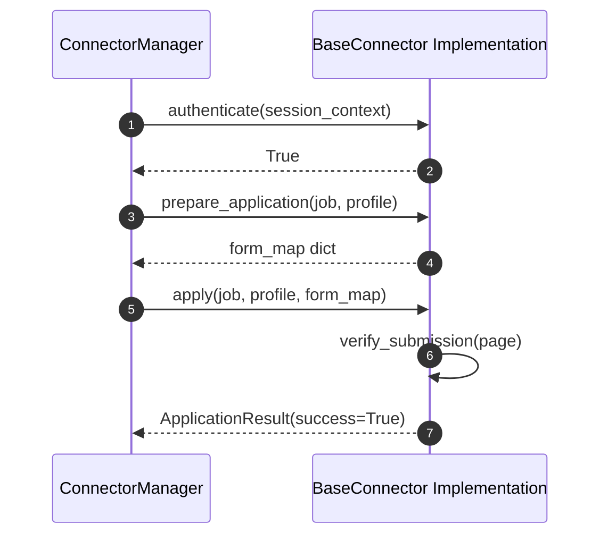
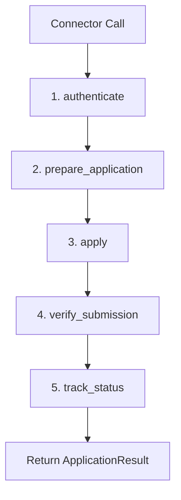

# 1. Overview
This document specifies the authoritative **Abstract Class Interface & Method Contract (`BaseConnector`)** required for all job portal plugins and Applicant Tracking System (ATS) handlers.

---

# 2. Why This Exists
Without a strict interface contract, platform connectors implement inconsistent method signatures, making it impossible for the `ConnectorManager` or LangGraph Planner agents to invoke discovery, parsing, form filling, and verification actions uniformly.

---

# 3. Responsibilities
- Enforce standard method signatures across all connectors (`authenticate`, `search`, `get_job`, `prepare_application`, `apply`, `verify_submission`, `track_status`).
- Guarantee strong Pydantic input and output typing for all connector implementations.

---

# 4. Inputs
- Candidate credentials, session contexts, search queries, `JobPosting` objects, and candidate profiles.

---

# 5. Outputs
- Standardized `JobPosting` search lists, detailed job descriptions, `ApplicationResult` status payloads, and proof screenshots.

---

# 6. Components
- **BaseConnector**: Python `ABC` abstract class defining mandatory async methods ([base_ats.py](file:///d:/Personal%20Imp/Projects/Automated-job-Agent/backend/app/automation/ats/base_ats.py)).
- **ApplicationResult**: Standard Pydantic model returning execution status, application ID, screenshot path, and log traces.

---

# 7. Folder Structure
```text
docs/Phase-01-Connector-System/
└── Connector-Interface.md
```

---

# 8. Data Models
```python
from abc import ABC, abstractmethod
from pydantic import BaseModel, Field
from typing import List, Dict, Any, Optional

class ApplicationResult(BaseModel):
    success: bool
    platform: str
    job_id: str
    application_id: Optional[str] = None
    screenshot_path: Optional[str] = None
    confirmation_proof_url: Optional[str] = None
    logs: List[str] = Field(default_factory=list)
    error_message: Optional[str] = None

class BaseConnector(ABC):
    @abstractmethod
    async def authenticate(self, session_context: Dict[str, Any]) -> bool:
        """Authenticate browser session or API client with target platform."""
        pass

    @abstractmethod
    async def search(self, query: str, location: str, limit: int = 20) -> List[Any]:
        """Search job postings matching query and location."""
        pass

    @abstractmethod
    async def get_job(self, job_id_or_url: str) -> Any:
        """Fetch raw and normalized JobPosting payload."""
        pass

    @abstractmethod
    async def prepare_application(self, job_posting: Any, candidate_profile: Any) -> Dict[str, Any]:
        """Inspect form fields, perform gap analysis, and return pre-fill form map."""
        pass

    @abstractmethod
    async def apply(self, job_posting: Any, candidate_profile: Any, form_map: Dict[str, Any]) -> ApplicationResult:
        """Execute form fill automation and submit application."""
        pass

    @abstractmethod
    async def verify_submission(self, page_context: Any) -> bool:
        """Verify post-submission confirmation modal or receipt page."""
        pass

    @abstractmethod
    async def track_status(self, application_id: str) -> str:
        """Fetch updated application status (Applied, Viewed, Interview, Rejected)."""
        pass
```

---

# 9. API Contracts
Standard Connector API Result Payload:
```json
{
  "success": true,
  "platform": "Greenhouse",
  "job_id": "gh_98412",
  "application_id": "APP-2026-98412",
  "screenshot_path": "storage/screenshots/gh_98412_proof.png",
  "logs": [
    "Navigated to Greenhouse form",
    "Uploaded Resume PDF",
    "Submitted form successfully"
  ]
}
```

---

# 10. Sequence Diagram


---

# 11. Flow Diagram


---

# 12. Internal Working
Every connector subclass inherits from `BaseConnector`. Method implementations must be fully non-blocking (`async def`).

---

# 13. Configuration
- Enforced via Python Abstract Base Class (`abc.ABC`).

---

# 14. Error Handling
Missing abstract method implementations raise an explicit `TypeError: Can't instantiate abstract class` at application startup.

---

# 15. Retry Strategy
- Internal method retries are managed using `@retry` decorators with exponential backoff on network failures.

---

# 16. Security
- Session contexts passed to `authenticate()` strictly use temporary vault references.

---

# 17. Logging
- Every interface invocation logs method entry, arguments, execution duration, and exit status.

---

# 18. Metrics
- Method Execution Latency breakdown (Preparation: <2s, Form Fill: <10s, Verification: <3s).

---

# 19. Testing Strategy
- Unit test suite verifies that every registered connector implements all 7 `BaseConnector` methods cleanly.

---

# 20. Performance Considerations
- Async interface methods enable non-blocking parallel execution across hundreds of background job application workers.

---

# 21. Best Practices
- Never bypass the `BaseConnector` abstract class when adding new job board handlers.

---

# 22. Production Improvements
- Add dynamic runtime interface validation using Pydantic contract decorators.

---

# 23. Common Failure Scenarios
- **Scenario**: Developer omits `verify_submission` method in new connector.
  - **Resolution**: Python ABC raises `TypeError` on module load, preventing deployment of incomplete connector.

---

# 24. Future Enhancements
- Extend contract to support WebSocket real-time DOM action streaming.

---

# 25. References
- Python `abc` Module Documentation.
