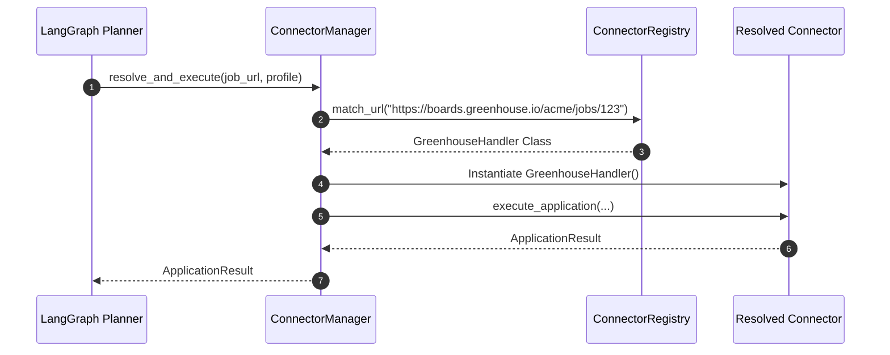
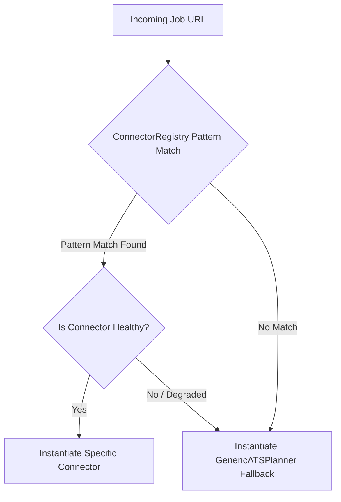

# 1. Overview
This document specifies the **Connector Registry and Connector Manager Subsystem**, responsible for dynamically discovering, routing, instantiating, and monitoring platform connectors across all job boards and ATS engines.

---

# 2. Why This Exists
High-level agent planners (such as the LangGraph Planner) must remain platform-agnostic. They should never directly import or instantiate platform connectors (`LinkedInConnector`, `GreenhouseHandler`, `WorkdayHandler`). The `ConnectorManager` acts as the central router, inspecting job target URLs and returning the correct registered connector instance automatically.

---

# 3. Responsibilities
- Maintain the global `ConnectorRegistry` mapping URL regex patterns to connector classes ([registry.py](file:///d:/Personal%20Imp/Projects/Automated-job-Agent/backend/app/automation/portal_plugins/registry.py)).
- Provide `ConnectorManager` routing interface for agent planners.
- Monitor connector health and route traffic to generic ATS fallbacks if a connector degrades.

---

# 4. Inputs
- Target job URLs or platform identifiers.

---

# 5. Outputs
- Resolved `BaseConnector` instance ready for async execution.

---

# 6. Components
- **ConnectorRegistry**: Global dictionary storing registered connector metadata and URL matching regexes.
- **ConnectorManager**: Lifecycle and routing manager instantiated by the backend API and LangGraph agents.
- **Health Monitor**: Tracks success rates per connector and manages graceful fallbacks.

---

# 7. Folder Structure
```text
docs/Phase-01-Connector-System/
└── Connector-Manager.md
```

---

# 8. Data Models
```python
from pydantic import BaseModel, Field
from typing import Type, Dict, Optional
from backend.app.automation.ats.base_ats import BaseConnector

class ConnectorRegistration(BaseModel):
    platform_id: str
    name: str
    url_patterns: list[str]
    connector_class_name: str
    is_active: bool = True
    success_rate_24h: float = Field(default=1.0)
```

---

# 9. API Contracts
Connector Registry Status API Endpoint:
```json
{
  "total_connectors": 10,
  "active_connectors": [
    {"platform": "LinkedIn", "status": "Healthy", "success_rate": 0.96},
    {"platform": "Greenhouse", "status": "Healthy", "success_rate": 0.98},
    {"platform": "Workday", "status": "Healthy", "success_rate": 0.92}
  ]
}
```

---

# 10. Sequence Diagram


---

# 11. Flow Diagram


---

# 12. Internal Working
The registry initializes at server startup using decorator registrations (`@register_connector`). `ConnectorManager.resolve()` uses Python regex evaluation to match URLs in O(1) average time complexity.

---

# 13. Configuration
- Specified in [backend/app/automation/portal_plugins/registry.py](file:///d:/Personal%20Imp/Projects/Automated-job-Agent/backend/app/automation/portal_plugins/registry.py).

---

# 14. Error Handling
Unregistered domain URLs return the default `GenericATSPlanner` connector without raising uncaught exceptions.

---

# 15. Retry Strategy
- If a resolved connector fails on startup, `ConnectorManager` retries instantiation twice before falling back to generic mode.

---

# 16. Security
- Connector registration strictly requires valid module imports; dynamic raw string execution (`eval`) is prohibited.

---

# 17. Logging
- Connector routing actions log `job_url`, `matched_connector_id`, and `resolution_time_ms`.

---

# 18. Metrics
- Connector Resolution Latency (P95 < 2ms).

---

# 19. Testing Strategy
- Pytest suite tests URL pattern resolution against a matrix of 100+ sample job URLs.

---

# 20. Performance Considerations
- Pre-compiling URL regex patterns ensures instant connector resolution.

---

# 21. Best Practices
- Always register new platform connectors with explicit, non-overlapping URL regex patterns.

---

# 22. Production Improvements
- Build a dynamic connector feature-flag system to toggle degraded connectors off without requiring server restarts.

---

# 23. Common Failure Scenarios
- **Scenario**: Overlapping URL regexes cause wrong connector selection.
  - **Resolution**: Enforce strict pattern priority ordering in `ConnectorRegistry`.

---

# 24. Future Enhancements
- Support remote connector registration via Model Context Protocol (MCP) server endpoints.

---

# 25. References
- Plugin Pattern Architectures in Python.
