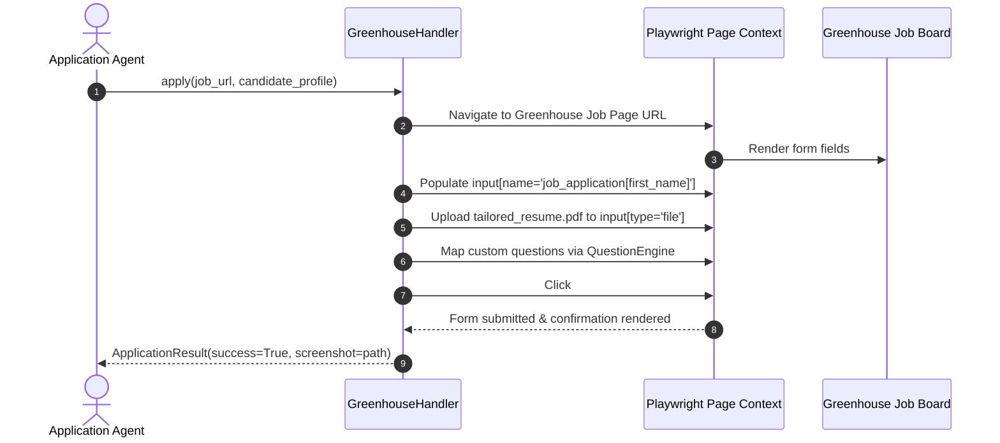
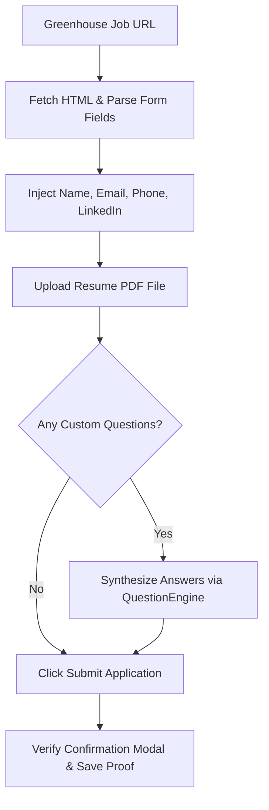

# 1. Overview
This document specifies the **Greenhouse ATS Handler Subsystem**, detailing direct HTML form inspection, field extraction, dynamic question mapping, resume PDF upload, and application submission on Greenhouse boards (`boards.greenhouse.io`).

---

# 2. Why This Exists
Greenhouse is one of the most widely used Applicant Tracking Systems for tech companies. Greenhouse application forms feature dynamic custom text inputs, file upload inputs (`input[type='file']`), dropdown select boxes, and custom demographic disclosures.

---

# 3. Responsibilities
- Implement `BaseConnector` handler contract for Greenhouse ([greenhouse_handler.py](file:///d:/Personal%20Imp/Projects/Automated-job-Agent/backend/app/automation/ats/handlers/greenhouse_handler.py)).
- Parse Greenhouse job board HTML and extract job description metadata.
- Automate form fill inputs, attach tailored resume PDF, and submit application.

---

# 4. Inputs
- Greenhouse job posting URL (`https://boards.greenhouse.io/<company>/jobs/<id>`), candidate profile, tailored resume PDF path.

---

# 5. Outputs
- `ApplicationResult` status payload, Greenhouse application confirmation ID, and proof screenshot.

---

# 6. Components
- **GreenhouseScraper**: Fetches job posting metadata via Greenhouse Public API or HTML parsing.
- **GreenhouseFormAutomator**: Playwright engine controlling field input injection.
- **DemographicFormHandler**: Handles standard EEOC / demographic survey selections safely.

---

# 7. Folder Structure
```text
docs/Phase-01-Connector-System/
└── Greenhouse-Connector.md
```

---

# 8. Data Models
```python
from pydantic import BaseModel, Field
from typing import Dict, Any, Optional

class GreenhouseFormPayload(BaseModel):
    first_name: str
    last_name: str
    email: str
    phone: str
    resume_path: str
    linkedin_url: Optional[str] = None
    github_url: Optional[str] = None
    custom_fields: Dict[str, Any] = Field(default_factory=dict)
```

---

# 9. API Contracts
N/A (Greenhouse ATS Specification).

---

# 10. Sequence Diagram


---

# 11. Flow Diagram


---

# 12. Internal Working
Greenhouse forms use standardized DOM ID conventions (`#first_name`, `#last_name`, `#email`, `#phone`, `#resume_file`). Custom inputs are identified via labels and mapped through `QuestionEngine` using semantic embedding matching against candidate profile data.

---

# 13. Configuration
- Specified in [backend/app/automation/ats/handlers/greenhouse_handler.py](file:///d:/Personal%20Imp/Projects/Automated-job-Agent/backend/app/automation/ats/handlers/greenhouse_handler.py).

---

# 14. Error Handling
If a required custom question cannot be mapped with confidence (>85%), the handler pauses execution and triggers a human-in-the-loop (HITL) interrupt.

---

# 15. Retry Strategy
- Element input actions retry up to 3 times with exponential backoff on page re-hydration delays.

---

# 16. Security
- Demographic survey options (race, gender, veteran status) are answered according to candidate explicit preference flags or set to "Decline to Self-Identify".

---

# 17. Logging
- Form fill logs record `greenhouse_job_id`, `fields_populated`, `custom_questions_count`, `execution_time_ms`.

---

# 18. Metrics
- Greenhouse Submission Success Rate (>98%).
- Form Execution Latency (<8 seconds).

---

# 19. Testing Strategy
- Unit test against mock Greenhouse HTML form structures.

---

# 20. Performance Considerations
- Direct Playwright locator fill (`page.locator('#first_name').fill(...)`) avoids slow key-by-key typing overhead.

---

# 21. Best Practices
- Always check for captcha iframe elements before triggering final submit click.

---

# 22. Production Improvements
- Build instant Greenhouse API integration for companies exposing direct application APIs.

---

# 23. Common Failure Scenarios
- **Scenario**: Greenhouse iframe embedded inside custom company career page domain.
  - **Resolution**: Playwright `page.frame_locator(...)` automatically detects and switches context into the Greenhouse iframe.

---

# 24. Future Enhancements
- Automated tracking of Greenhouse email confirmation webhooks.

---

# 25. References
- Greenhouse Public API & DOM Architecture Guidelines.
