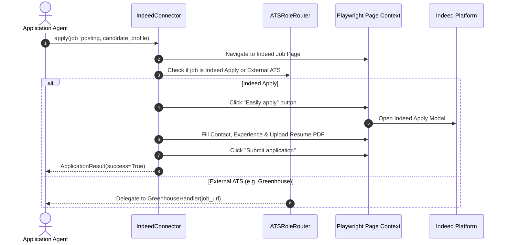
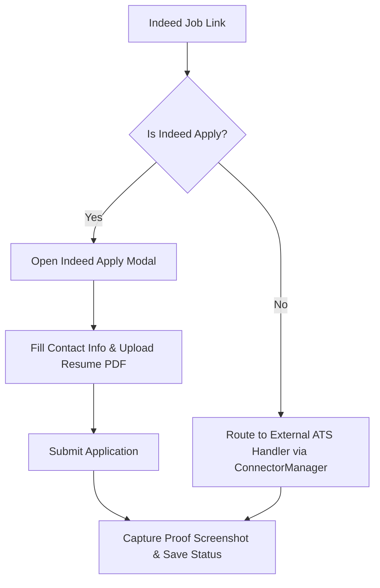

# 1. Overview
This document specifies the **Indeed Connector Subsystem**, covering global job search discovery, job description normalization, Indeed Apply modal execution, and external employer ATS link handling.

---

# 2. Why This Exists
Indeed is one of the world's largest job search aggregators. Automating Indeed requires handling Cloudflare anti-bot checks, dynamic job listing feeds, Indeed Apply modal forms, and external employer ATS redirection.

---

# 3. Responsibilities
- Implement `BaseConnector` contract for Indeed ([indeed.py](file:///d:/Personal%20Imp/Projects/Automated-job-Agent/backend/app/services/scraper/portals/indeed.py)).
- Perform job search discovery by keyword, salary, remote filter, and geographic location.
- Automate Indeed Apply modal applications and route external jobs to specific ATS handlers.

---

# 4. Inputs
- Candidate profile, Indeed session cookies, search parameters (query, location, radius, salary min).

---

# 5. Outputs
- Normalized `JobPosting` objects, Indeed Apply submission proofs, and external ATS routing triggers.

---

# 6. Components
- **IndeedScraper**: Extracts job postings from Indeed HTML feeds.
- **IndeedApplyHandler**: Manages Playwright page navigation inside Indeed Apply modal windows.
- **ATSRoleRouter**: Detects when an Indeed job link points to an external ATS (Greenhouse, Workday, Lever) and delegates execution to `ConnectorManager`.

---

# 7. Folder Structure
```text
docs/Phase-01-Connector-System/
└── Indeed-Connector.md
```

---

# 8. Data Models
```python
from pydantic import BaseModel, Field
from typing import Optional

class IndeedJobQuery(BaseModel):
    query: str
    location: Optional[str] = "Remote"
    radius_miles: int = 25
    is_indeed_apply_only: bool = True
    limit: int = 20
```

---

# 9. API Contracts
N/A (Indeed Connector Specification).

---

# 10. Sequence Diagram


---

# 11. Flow Diagram


---

# 12. Internal Working
The connector inspects the job action container (`#indeedApplyButton`). If present, `IndeedApplyHandler` executes the multi-page modal form. If absent, the link is resolved and handed off to `ConnectorManager` to invoke the matching external ATS handler.

---

# 13. Configuration
- Specified in [backend/app/config.py](file:///d:/Personal%20Imp/Projects/Automated-job-Agent/backend/app/config.py).

---

# 14. Error Handling
If Cloudflare anti-bot challenge is encountered, the connector logs a warning and triggers an automated proxy rotation or human-in-the-loop (HITL) prompt.

---

# 15. Retry Strategy
- Page element interactions retry up to 3 times with exponential backoff.

---

# 16. Security
- Session cookies are isolated inside `storage/browser_profiles/indeed/`.

---

# 17. Logging
- Logs record `indeed_job_key`, `is_indeed_apply`, `execution_time_ms`, `status`.

---

# 18. Metrics
- Indeed Apply Success Rate (>93%).
- Search Retrieval Latency (<350ms per job card).

---

# 19. Testing Strategy
- Unit test against mock Indeed job listing HTML fixtures.

---

# 20. Performance Considerations
- Early URL redirection resolution prevents unnecessary browser context launches for external ATS jobs.

---

# 21. Best Practices
- Always verify whether a job is "Indeed Apply" before attempting modal click triggers.

---

# 22. Production Improvements
- Integrate premium residential proxy pool rotation for high-volume Indeed crawling.

---

# 23. Common Failure Scenarios
- **Scenario**: Indeed requires custom screening question ("How many years of Python experience do you have?").
  - **Resolution**: Connector queries `QuestionEngine`, extracts years of experience from `candidate_profile`, and populates input.

---

# 24. Future Enhancements
- Salary estimation filter optimizer for unlisted job packages.

---

# 25. References
- Indeed DOM Selector Specifications & Portal Integration Patterns.
