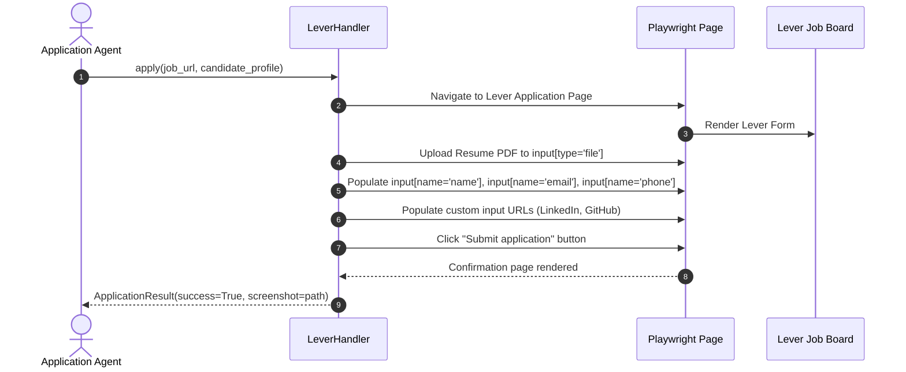
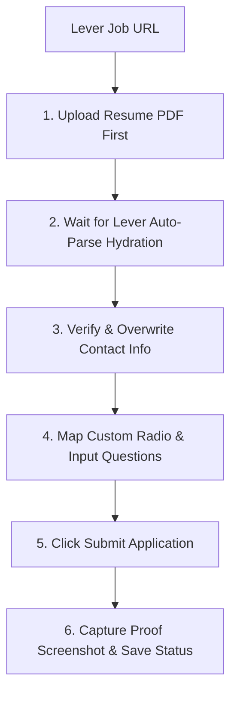

# 1. Overview
This document specifies the **Lever ATS Handler Subsystem**, covering job description extraction, form field mapping, resume auto-parsing, and application submission on Lever job boards (`jobs.lever.co`).

---

# 2. Why This Exists
Lever is a major Applicant Tracking System used by technology startups and enterprise scale-ups. Lever application forms feature single-page application layouts with resume auto-parsing triggers, custom radio buttons, dynamic inputs, and URL attachments.

---

# 3. Responsibilities
- Implement `BaseConnector` handler contract for Lever ([lever_handler.py](file:///d:/Personal%20Imp/Projects/Automated-job-Agent/backend/app/automation/ats/handlers/lever_handler.py)).
- Parse Lever posting metadata and requirements.
- Automate form fill inputs, upload resume PDF, and submit application.

---

# 4. Inputs
- Lever job URL (`https://jobs.lever.co/<company>/<job_id>`), candidate profile, tailored resume PDF.

---

# 5. Outputs
- `ApplicationResult` status payload, proof screenshot, and submission confirmation.

---

# 6. Components
- **LeverScraper**: Fetches job posting data from Lever REST endpoints (`https://api.lever.co/v0/postings/<company>/<job_id>`).
- **LeverFormAutomator**: Manages Playwright page navigation and input filling.
- **ResumeAutoParseHandler**: Monitors Lever's automatic resume PDF parser to avoid field overwrites.

---

# 7. Folder Structure
```text
docs/Phase-01-Connector-System/
└── Lever-Connector.md
```

---

# 8. Data Models
```python
from pydantic import BaseModel, Field
from typing import Dict, Any, Optional

class LeverFormPayload(BaseModel):
    name: str
    email: str
    phone: str
    org: Optional[str] = None
    urls: Dict[str, str] = Field(default_factory=dict, description="LinkedIn, GitHub, Portfolio URLs")
    comments: Optional[str] = None
```

---

# 9. API Contracts
Lever Posting REST API Query Endpoint:
```json
{
  "platform": "Lever",
  "endpoint": "https://api.lever.co/v0/postings/acme/98412-acc-11",
  "status": "Active"
}
```

---

# 10. Sequence Diagram


---

# 11. Flow Diagram


---

# 12. Internal Working
Lever application forms automatically trigger a background resume parser when a file is uploaded to `input[name='resume']`. The handler uploads the resume PDF first, waits 1.5 seconds for Lever's auto-parse script to finish, and then explicitly populates name, email, phone, and social URL fields to guarantee 100% accuracy.

---

# 13. Configuration
- Specified in [backend/app/automation/ats/handlers/lever_handler.py](file:///d:/Personal%20Imp/Projects/Automated-job-Agent/backend/app/automation/ats/handlers/lever_handler.py).

---

# 14. Error Handling
If Lever auto-parsing corrupts the candidate name field, `LeverFormAutomator` overwrites the field value with the clean `candidate_profile.full_name`.

---

# 15. Retry Strategy
- Form input actions retry up to 3 times on page DOM mutation events.

---

# 16. Security
- Session credentials are zero-persisted; Lever application forms require no user login account creation.

---

# 17. Logging
- Form fill logs record `lever_posting_id`, `auto_parse_duration_ms`, `fields_populated`, `execution_status`.

---

# 18. Metrics
- Lever Submission Success Rate (>97%).
- Form Execution Latency (<7 seconds).

---

# 19. Testing Strategy
- Unit test against mock Lever HTML form fixtures.

---

# 20. Performance Considerations
- Leveraging Lever's public API (`api.lever.co/v0/postings/...`) for job description extraction avoids unnecessary headless browser rendering during match evaluation.

---

# 21. Best Practices
- Always upload the resume PDF before injecting text fields to prevent Lever's auto-parser from wiping custom input values.

---

# 22. Production Improvements
- Implement automated verification of Lever confirmation redirect URLs.

---

# 23. Common Failure Scenarios
- **Scenario**: Lever form includes custom required radio options ("Are you authorized to work in the US?").
  - **Resolution**: Handler inspects label text, queries `QuestionEngine`, and clicks the matching radio input locator (`input[type='radio'][value='Yes']`).

---

# 24. Future Enhancements
- Auto-fill custom Lever cover letter text area with synthesized cover letter.

---

# 25. References
- Lever Public API Specifications & DOM Standards.
