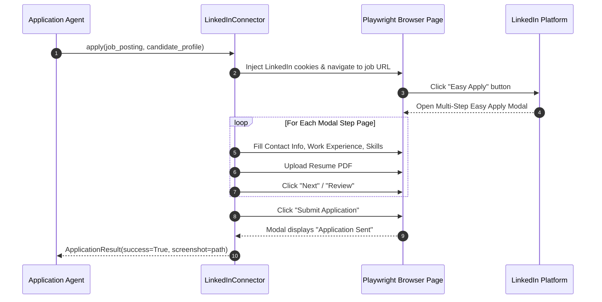
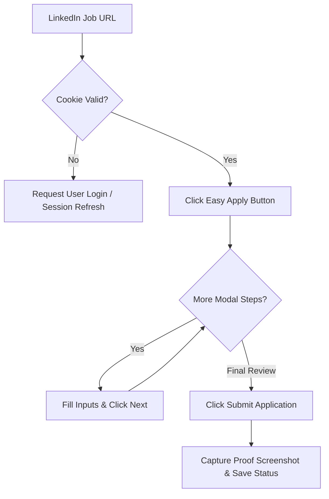

# 1. Overview
This document specifies the **LinkedIn Connector Subsystem**, covering job discovery, search filtering, job description normalization, and LinkedIn Easy Apply automation.

---

# 2. Why This Exists
LinkedIn is the largest professional recruitment network globally. Automating LinkedIn job search and Easy Apply submissions requires handling dynamic SPA DOM elements, anti-bot detection, multi-step application modal dialogs, radio selectors, and file attachment uploads.

---

# 3. Responsibilities
- Implement `BaseConnector` contract for LinkedIn ([linkedin_plugin.py](file:///d:/Personal%20Imp/Projects/Automated-job-Agent/backend/app/automation/portal_plugins/linkedin/linkedin_plugin.py)).
- Perform asynchronous job search filtering by keyword, location, remote status, and experience level.
- Execute LinkedIn Easy Apply multi-page modal forms using Playwright.

---

# 4. Inputs
- Candidate cookies/session context, search filters (e.g. `query="Backend Engineer"`, `location="Remote"`), candidate profile, resume PDF path.

---

# 5. Outputs
- List of normalized `JobPosting` objects, filled application responses, and submission proof screenshots.

---

# 6. Components
- **LinkedInScraper**: Discovers and extracts raw job postings.
- **LinkedInEasyApplyHandler**: Manages Playwright browser interaction inside LinkedIn application modal dialogs.
- **Cookie Vault Injector**: Restores authenticated user session context.

---

# 7. Folder Structure
```text
docs/Phase-01-Connector-System/
└── LinkedIn-Connector.md
```

---

# 8. Data Models
```python
from pydantic import BaseModel, Field
from typing import Optional, List

class LinkedInJobQuery(BaseModel):
    keywords: str
    location: Optional[str] = "Remote"
    f_AL: bool = Field(default=True, description="Filter for Easy Apply jobs only")
    experience_level: Optional[str] = None
    limit: int = 20
```

---

# 9. API Contracts
N/A (LinkedIn Connector Specification).

---

# 10. Sequence Diagram


---

# 11. Flow Diagram


---

# 12. Internal Working
The connector targets LinkedIn DOM selectors (`button.jobs-apply-button`, `input[id*='single-line-text']`, `button[aria-label='Submit application']`). If custom radio button or dropdown options appear, the connector queries the `QuestionEngine` to map candidate profile attributes to the option choices.

---

# 13. Configuration
- Specified in [backend/app/config.py](file:///d:/Personal%20Imp/Projects/Automated-job-Agent/backend/app/config.py).
- Easy Apply Modal Timeout: `EASY_APPLY_TIMEOUT_MS = 25000`

---

# 14. Error Handling
If an unhandled custom question modal step occurs, the connector triggers a human-in-the-loop (HITL) interrupt, saving a screenshot and pausing execution for user input.

---

# 15. Retry Strategy
- Selector interactions retry up to 3 times with 1-second delays.

---

# 16. Security
- Session cookies are stored in encrypted `storage/browser_profiles/linkedin/` and never written to logs.

---

# 17. Logging
- Logs record `easy_apply_step_count`, `form_fields_filled`, `errors_encountered`.

---

# 18. Metrics
- LinkedIn Easy Apply Success Rate (Target: >94%).
- Average Easy Apply Completion Latency (14 seconds).

---

# 19. Testing Strategy
- Test against mock LinkedIn Easy Apply HTML form fixtures.

---

# 20. Performance Considerations
- Reusing active browser page contexts across multiple LinkedIn job applications saves 3 seconds of navigation cold-start per application.

---

# 21. Best Practices
- Always verify the presence of the "Easy Apply" tag before invoking the Easy Apply handler pipeline.

---

# 22. Production Improvements
- Integrate `playwright-stealth` to evade aggressive LinkedIn anti-bot rate checks.

---

# 23. Common Failure Scenarios
- **Scenario**: LinkedIn displays CAPTCHA challenge during login.
  - **Resolution**: Trigger HITL interrupt notification to candidate frontend for manual verification completion.

---

# 24. Future Enhancements
- Auto-generate custom short essay responses for LinkedIn company-specific application questions.

---

# 25. References
- LinkedIn DOM Selector Architecture Specifications.
