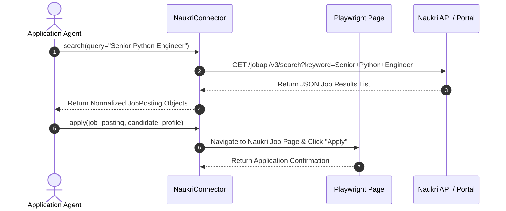
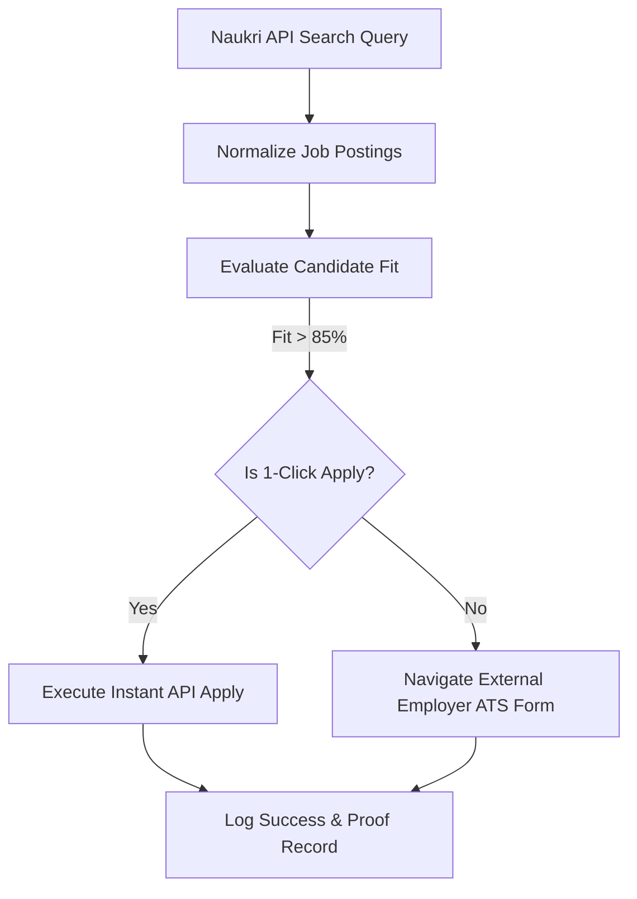

# 1. Overview
This document specifies the **Naukri Connector Subsystem**, covering job search discovery, API extraction, profile resume synchronization, and Naukri 1-Click Apply execution.

---

# 2. Why This Exists
Naukri.com is the largest employment job board in India and South Asia. Automating Naukri job discovery and applications requires handling custom JSON API endpoints, dynamic portal authentication tokens, resume file updates, and application form fill redirects.

---

# 3. Responsibilities
- Implement `BaseConnector` contract for Naukri ([naukri_plugin.py](file:///d:/Personal%20Imp/Projects/Automated-job-Agent/backend/app/automation/portal_plugins/naukri/naukri_plugin.py)).
- Perform REST API job search queries matching candidate preferences.
- Automate 1-Click Apply applications and external recruiter form redirects.

---

# 4. Inputs
- Naukri user credentials / session JWT token, search parameters (query, experience, salary, location), candidate profile.

---

# 5. Outputs
- List of normalized `JobPosting` objects, submission status records, and confirmation logs.

---

# 6. Components
- **NaukriAPIScraper**: Intercepts and parses Naukri JSON API responses.
- **NaukriApplyHandler**: Manages Playwright page navigation for 1-Click apply buttons and questionnaire forms.
- **Profile Synchronizer**: Updates candidate resume and key skills on Naukri portal automatically.

---

# 7. Folder Structure
```text
docs/Phase-01-Connector-System/
└── Naukri-Connector.md
```

---

# 8. Data Models
```python
from pydantic import BaseModel, Field
from typing import Optional, List

class NaukriJobQuery(BaseModel):
    keyword: str
    location: Optional[str] = "India"
    experience: Optional[int] = Field(default=3, description="Years of experience")
    salary_min: Optional[int] = None
    limit: int = 20
```

---

# 9. API Contracts
Naukri API Interaction Endpoint:
```json
{
  "platform": "Naukri",
  "endpoint": "https://www.naukri.com/jobapi/v3/search",
  "status": "Authenticated",
  "auth_header": "Bearer [SESSION_JWT]"
}
```

---

# 10. Sequence Diagram


---

# 11. Flow Diagram


---

# 12. Internal Working
The Naukri connector combines direct REST API endpoint calls for search/indexing with Playwright DOM automation for custom questionnaire application pages (`div.apply-button-container`).

---

# 13. Configuration
- Specified in [backend/app/config.py](file:///d:/Personal%20Imp/Projects/Automated-job-Agent/backend/app/config.py).

---

# 14. Error Handling
If Naukri requires profile update or resume re-upload prior to application, the connector invokes `ProfileSynchronizer` to upload the tailored resume PDF before retrying application submission.

---

# 15. Retry Strategy
- API calls retry 3 times with exponential backoff on HTTP 429 rate limit responses.

---

# 16. Security
- Session JWT tokens are stored securely in `storage/browser_profiles/naukri/` and refreshed automatically.

---

# 17. Logging
- Logs record `naukri_job_id`, `apply_type`, `api_status_code`, `latency_ms`.

---

# 18. Metrics
- Naukri Application Success Rate (>96%).
- API Retrieval Latency (<150ms).

---

# 19. Testing Strategy
- Unit test JSON payload parsing against saved Naukri API response mocks.

---

# 20. Performance Considerations
- Utilizing direct REST API endpoints for job search avoids expensive HTML rendering overhead.

---

# 21. Best Practices
- Keep profile key skills synchronized on Naukri to maximize recruiter search visibility score.

---

# 22. Production Improvements
- Build automatic Naukri recruiter message responder integration.

---

# 23. Common Failure Scenarios
- **Scenario**: Naukri session JWT token expires mid-execution.
  - **Resolution**: Connector triggers automatic headless re-login using saved encrypted user credentials.

---

# 24. Future Enhancements
- Support Naukri Premium recruiter chat automation.

---

# 25. References
- Naukri API Endpoint Documentation & Selector Specifications.
