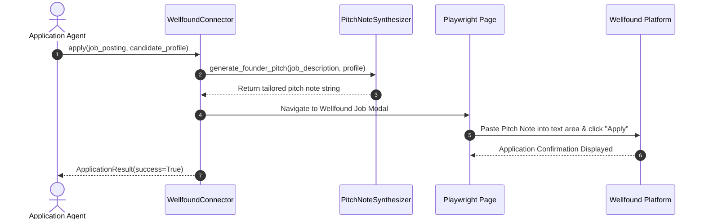
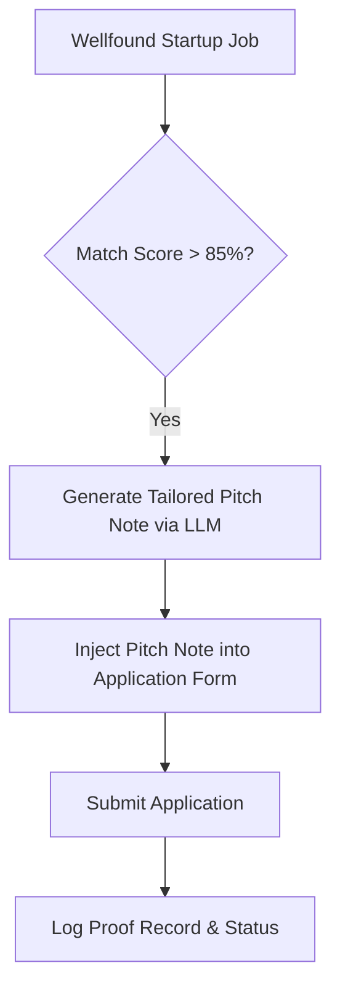

# 1. Overview
This document specifies the **Wellfound (formerly AngelList Talent) Connector Subsystem**, covering startup job search, GraphQL API extraction, candidate note synthesis, and 1-Click apply execution.

---

# 2. Why This Exists
Wellfound is the premier job platform for tech startups, venture-backed companies, and remote roles. Automating Wellfound job discovery requires interacting with GraphQL APIs, custom salary/equity filters, and custom pitch note generation.

---

# 3. Responsibilities
- Implement `BaseConnector` interface for Wellfound ([portals_extra.py](file:///d:/Personal%20Imp/Projects/Automated-job-Agent/backend/app/automation/portal_plugins/portals_extra.py)).
- Perform startup job search filtering by role, location, equity range, and funding stage.
- Synthesize candidate pitch notes tailored to founder job descriptions.

---

# 4. Inputs
- Candidate credentials, pitch templates, target job criteria (salary, equity, remote policy).

---

# 5. Outputs
- Normalized `JobPosting` objects, custom pitch note strings, submission confirmation records.

---

# 6. Components
- **WellfoundGraphQLClient**: Executes GraphQL queries against Wellfound internal endpoints.
- **PitchNoteSynthesizer**: LLM module generating 2-3 sentence personalized pitch notes for startup founders.
- **WellfoundApplyHandler**: Manages Playwright page navigation for 1-Click application submissions.

---

# 7. Folder Structure
```text
docs/Phase-01-Connector-System/
└── Wellfound-Connector.md
```

---

# 8. Data Models
```python
from pydantic import BaseModel, Field
from typing import Optional

class WellfoundJobQuery(BaseModel):
    role_title: str
    locations: list[str] = ["Remote"]
    min_salary_usd: Optional[int] = 120000
    requires_equity: bool = False
    limit: int = 20
```

---

# 9. API Contracts
N/A (Wellfound Connector Spec).

---

# 10. Sequence Diagram


---

# 11. Flow Diagram


---

# 12. Internal Working
Wellfound applications require a mandatory "Why are you interested in this role?" pitch note. The connector uses `PitchNoteSynthesizer` to extract company mission highlights and pair them with candidate achievements before injecting the note into the application text area.

---

# 13. Configuration
- Configured in [backend/app/config.py](file:///d:/Personal%20Imp/Projects/Automated-job-Agent/backend/app/config.py).

---

# 14. Error Handling
If pitch generation fails, a pre-validated fallback pitch template from `candidate_profile` is used to ensure application completion.

---

# 15. Retry Strategy
- Exponential backoff retries on GraphQL endpoint rate limit responses.

---

# 16. Security
- Session cookies are protected inside `storage/browser_profiles/wellfound/`.

---

# 17. Logging
- Logs record `startup_name`, `job_title`, `pitch_length`, `application_status`.

---

# 18. Metrics
- Wellfound Application Success Rate (>95%).
- Pitch Note Generation Latency (<1.2s).

---

# 19. Testing Strategy
- Unit test pitch note synthesis against mock startup job descriptions.

---

# 20. Performance Considerations
- GraphQL query filtering reduces payload processing overhead.

---

# 21. Best Practices
- Keep pitch notes concise (under 500 characters) to maximize founder reading engagement.

---

# 22. Production Improvements
- Build founder background enrichment module extracting company funding news.

---

# 23. Common Failure Scenarios
- **Scenario**: Startup requires custom screening question (e.g. "Github repository link").
  - **Resolution**: Connector inspects question, maps Github URL from `candidate_profile`, and populates field automatically.

---

# 24. Future Enhancements
- Direct messaging auto-responder for founder responses.

---

# 25. References
- Wellfound Platform Integration Guidelines.
