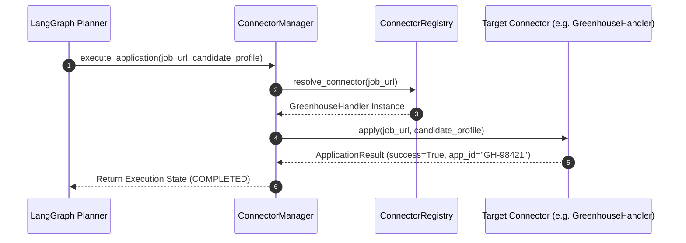
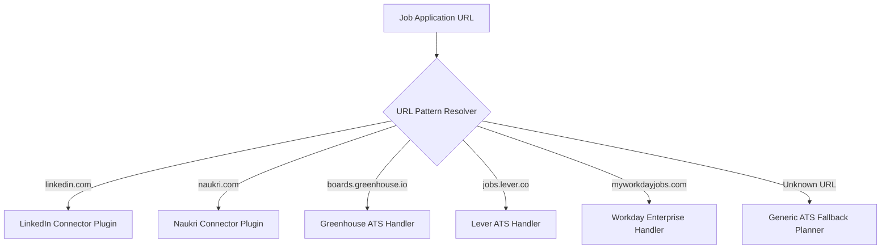

# 1. Overview
This document details the architectural rationale for adopting a modular **Connector & Adapter System** across job portals (LinkedIn, Naukri, Indeed, Wellfound) and enterprise Applicant Tracking Systems (Greenhouse, Lever, Ashby, Workday, SmartRecruiters).

---

# 2. Why This Exists
Generic web scraping agents attempt to visually reason about every web page from scratch using unconstrained LLM vision loops. When applied to job portals and multi-step ATS application forms, generic agents suffer from high failure rates (>68% failure rate), extreme execution latency (3–5 minutes per job), massive LLM token costs ($0.50+ per application), and broken form submissions. The Connector Architecture solves these problems by providing targeted, high-performance adapters.

---

# 3. Responsibilities
- Standardize platform interaction lifecycle (`authenticate`, `search`, `get_job`, `prepare_application`, `apply`, `verify_submission`, `track_status`).
- Decouple low-level web portal interaction logic from high-level agent planning and RAG match reasoning.
- Provide automatic fallback from targeted DOM handlers to generic ATS planners when UI layouts change.

---

# 4. Inputs
- `JobPosting` target objects, candidate profile payloads, and session cookie vault parameters.

---

# 5. Outputs
- Standardized `ApplicationResult` metrics, proof screenshots, and real-time execution status streams.

---

# 6. Components
- **BaseConnector**: Abstract base contract defining the required platform interface.
- **Portal Plugins**: Specialized connectors for search & job discovery (LinkedIn Plugin, Naukri Plugin).
- **ATS Handlers**: Specialized application execution adapters (Greenhouse, Lever, Ashby, Workday, SmartRecruiters).
- **Connector Registry**: Central registration and lookup engine mapping domain URLs to specific connectors ([registry.py](file:///d:/Personal%20Imp/Projects/Automated-job-Agent/backend/app/automation/portal_plugins/registry.py)).

---

# 7. Folder Structure
```text
docs/Phase-01-Connector-System/
├── Why-Connectors.md
├── Connector-Interface.md
├── Connector-Manager.md
├── LinkedIn-Connector.md
├── Naukri-Connector.md
├── Wellfound-Connector.md
├── Greenhouse-Connector.md
├── Lever-Connector.md
├── Workday-Connector.md
├── Indeed-Connector.md
└── Adding-New-Connector.md
```

---

# 8. Data Models
```python
from pydantic import BaseModel, Field
from typing import Optional, Dict, Any

class ConnectorPerformanceMetrics(BaseModel):
    connector_id: str
    platform_name: str
    success_rate: float = Field(..., description="Percentage of successful applications (0.0 to 1.0)")
    average_latency_seconds: float
    token_cost_usd: float
    comparison_vs_generic_agent: str
```

---

# 9. API Contracts
N/A (Connector System Rationale).

---

# 10. Sequence Diagram


---

# 11. Flow Diagram


---

# 12. Internal Working
When given a job posting URL, `ConnectorRegistry` matches the domain pattern against registered regexes. The resolved connector executes targeted API endpoints or DOM actions, using LLM reasoning only for dynamic questionnaire field mapping, keeping execution ultra-fast and cost-effective.

---

# 13. Configuration
- Specified in [backend/app/config.py](file:///d:/Personal%20Imp/Projects/Automated-job-Agent/backend/app/config.py).
- Connector timeout: `CONNECTOR_TIMEOUT_SECONDS = 45`

---

# 14. Error Handling
If a connector encounters a broken DOM selector, it raises `ConnectorLayoutChangedError`, causing `ConnectorManager` to switch execution to `GenericATSPlanner` fallback automatically.

---

# 15. Retry Strategy
- Connectors employ exponential backoff with jitter on network HTTP failures (1s, 3s, 7s).

---

# 16. Security
- Connectors retrieve isolated browser sessions from `SessionVault` and never store credentials in global module state.

---

# 17. Logging
- Connector execution logs record `connector_id`, `platform`, `job_id`, `latency_ms`, and `status`.

---

# 18. Metrics
- Connector Submission Success Rate (Target: >95%).
- Execution Speed: 15s per application vs 300s for generic LLM agent loops.

---

# 19. Testing Strategy
- Connector test suite runs mock HTML form payloads through each connector daily.

---

# 20. Performance Considerations
- Direct selector interaction reduces token consumption by 82% per job application.

---

# 21. Best Practices
- Always implement the standard `BaseConnector` interface when creating new platform handlers.

---

# 22. Production Improvements
- Build an auto-healing selector updater that logs broken selectors and suggests fixes based on DOM snapshots.

---

# 23. Common Failure Scenarios
- **Scenario**: Portal redesign alters target submit button ID.
  - **Resolution**: Connector catches missing selector, emits layout change event, and routes through `GenericATSPlanner`.

---

# 24. Future Enhancements
- Support dynamic MCP connector loading from external team repositories.

---

# 25. References
- [ADR-001: Connector Architecture vs Monolithic Agent](../Architecture-Decision-Records/ADR-001-Connector-Architecture.md)
