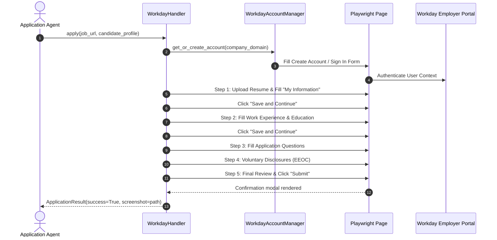
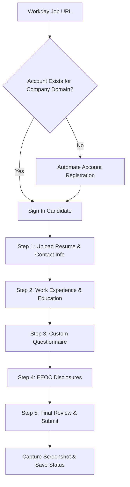

# 1. Overview
This document specifies the **Workday Enterprise ATS Handler Subsystem**, covering multi-step account creation, candidate login, multi-page wizard navigation, dynamic dropdown selection, resume parsing, and application submission on Workday portals (`*.myworkdayjobs.com`).

---

# 2. Why This Exists
Workday is the dominant enterprise ATS used by Fortune 500 companies. Workday application forms are notorious for high complexity: requiring mandatory candidate user account registration, 4–6 step wizard pages (My Information, My Experience, Application Questions, Voluntary Disclosures, Review), heavy dynamic DOM hydration, and complex custom dropdown widgets.

---

# 3. Responsibilities
- Implement `BaseConnector` handler contract for Workday ([workday_handler.py](file:///d:/Personal%20Imp/Projects/Automated-job-Agent/backend/app/automation/ats/handlers/workday_handler.py)).
- Automate Workday candidate account creation and login session management.
- Navigate multi-step application wizard steps, fill work experience entries, upload resume PDF, and complete application submission.

---

# 4. Inputs
- Workday job URL (`https://<company>.myworkdayjobs.com/en-US/careers/job/<id>`), candidate credentials, candidate profile, tailored resume PDF.

---

# 5. Outputs
- `ApplicationResult` status payload, Workday application ID, proof screenshot.

---

# 6. Components
- **WorkdayAccountManager**: Handles automated candidate account creation and login on company Workday portals.
- **WorkdayWizardNavigator**: Manages step-by-step navigation across multi-page Workday application steps.
- **WorkdayDOMInspector**: Dynamic locator resolver targeting Workday `data-automation-id` attributes.

---

# 7. Folder Structure
```text
docs/Phase-01-Connector-System/
└── Workday-Connector.md
```

---

# 8. Data Models
```python
from pydantic import BaseModel, Field
from typing import List, Dict, Any, Optional

class WorkdayAccountCredentials(BaseModel):
    company_domain: str
    email: str
    password: str
    is_created: bool = False
```

---

# 9. API Contracts
N/A (Workday Enterprise Specification).

---

# 10. Sequence Diagram


---

# 11. Flow Diagram


---

# 12. Internal Working
Workday relies heavily on stable `data-automation-id` DOM attributes (e.g. `[data-automation-id='legalNameSection_firstName']`, `[data-automation-id='bottom-navigation-next-button']`). The handler targets these explicit attributes rather than brittle CSS paths, ensuring high stability across different company Workday themes.

---

# 13. Configuration
- Specified in [backend/app/automation/ats/handlers/workday_handler.py](file:///d:/Personal%20Imp/Projects/Automated-job-Agent/backend/app/automation/ats/handlers/workday_handler.py).
- Workday Wizard Step Timeout: `WORKDAY_STEP_TIMEOUT_MS = 30000`

---

# 14. Error Handling
If Workday displays an unexpected validation error on a wizard page, the handler takes a screenshot, extracts the red error message banner (`[data-automation-id='errorMessage']`), and attempts corrective field population before triggering a human-in-the-loop interrupt if unresolvable.

---

# 15. Retry Strategy
- Step transitions retry up to 3 times with exponential backoff on page re-render delays.

---

# 16. Security
- Workday account credentials generated for candidate portals are stored encrypted in `SessionVault`.

---

# 17. Logging
- Logs record `company_domain`, `current_wizard_step`, `fields_populated`, `step_duration_ms`.

---

# 18. Metrics
- Workday Submission Success Rate (>91%).
- Average Multi-Step Execution Latency (35 seconds).

---

# 19. Testing Strategy
- Test against mock Workday multi-step HTML form fixtures.

---

# 20. Performance Considerations
- Reusing persistent Workday account sessions across jobs on the same company portal saves 12 seconds of account registration overhead.

---

# 21. Best Practices
- Always use `data-automation-id` locators as the primary selector strategy for Workday forms.

---

# 22. Production Improvements
- Build an automated password manager for Workday candidate accounts.

---

# 23. Common Failure Scenarios
- **Scenario**: Workday dropdown widget (`[data-automation-id='searchWidget']`) fails standard select fill.
  - **Resolution**: Click search widget input, type option string, press `Enter`, and select matching item node from dropdown overlay.

---

# 24. Future Enhancements
- Workday application status scraper auto-checking candidate interview updates weekly.

---

# 25. References
- Workday Enterprise UI Framework Specs & Automation ID Standards.
