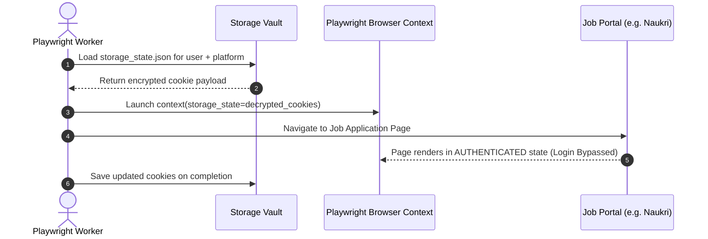
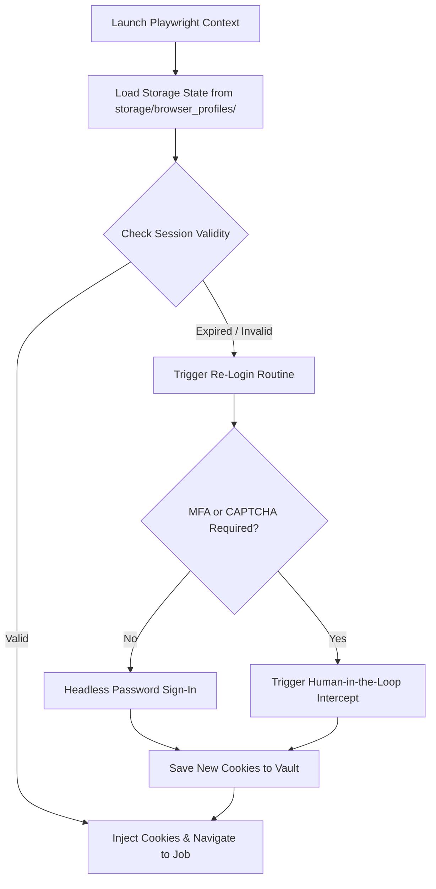

# 1. Overview
This document specifies the **Cookie Authentication & Browser Profile Storage Subsystem**, detailing cookie extraction, persistent session serialization, Playwright context injection, and automated session renewal across job portals (LinkedIn, Naukri, Indeed).

---

# 2. Why This Exists
Job portals frequently enforce multi-factor authentication (MFA) and CAPTCHAs during manual login. Re-authenticating from scratch on every automated job application attempt triggers security blocks. Storing and restoring authenticated browser cookie state (`storage/browser_profiles/`) allows Playwright workers to bypass repeated login forms safely.

---

# 3. Responsibilities
- Export, sanitize, encrypt, and store browser cookies and local storage tokens.
- Inject valid cookie contexts into Playwright browser instances prior to portal navigation ([session_manager.py](file:///d:/Personal%20Imp/Projects/Automated-job-Agent/backend/app/automation/session/session_manager.py)).
- Detect expired session cookies and trigger automatic headless re-login or HITL MFA alerts.

---

# 4. Inputs
- Playwright page contexts, raw JSON cookie arrays, candidate profile identifiers.

---

# 5. Outputs
- Persistent browser storage state JSON files saved in `storage/browser_profiles/<user_id>/<platform>.json`.

---

# 6. Components
- **CookieExtractor**: Exports cookies from active Playwright contexts (`context.cookies()`).
- **ProfileStorageVault**: Encrypts and saves storage state JSON files.
- **SessionHealthChecker**: Verifies session validity by navigating to portal profile endpoints.

---

# 7. Folder Structure
```text
docs/Phase-02-Authentication/
└── Cookie-Authentication.md
```

---

# 8. Data Models
```python
from pydantic import BaseModel, Field
from typing import List, Optional

class PlaywrightCookieItem(BaseModel):
    name: str
    value: str
    domain: str
    path: str = "/"
    expires: Optional[float] = None
    httpOnly: bool = False
    secure: bool = True
    sameSite: Optional[str] = "Lax"

class StorageStatePayload(BaseModel):
    cookies: List[PlaywrightCookieItem]
    origins: List[dict] = Field(default_factory=list)
```

---

# 9. API Contracts
Cookie Session Status Endpoint:
```json
{
  "user_id": "usr_98412",
  "platform": "LinkedIn",
  "cookies_count": 14,
  "is_session_valid": true,
  "expires_at": "2026-08-28T20:30:00Z"
}
```

---

# 10. Sequence Diagram


---

# 11. Flow Diagram


---

# 12. Internal Working
Playwright supports direct context state persistence via `context.storage_state(path=...)`. Files are encrypted using AES-256-GCM before writing to `storage/browser_profiles/` ([config.py](file:///d:/Personal%20Imp/Projects/Automated-job-Agent/backend/app/config.py#L13)).

---

# 13. Configuration
- Storage Path: `storage/browser_profiles/`
- Cookie Expiry Check Threshold: `COOKIE_REFRESH_MARGIN_HOURS = 12`

---

# 14. Error Handling
Corrupted storage state files raise `StorageStateCorruptedError`, causing the vault to archive the corrupted file and re-initialize a fresh session context.

---

# 15. Retry Strategy
- Session health checks retry up to 2 times on transient network timeouts.

---

# 16. Security
- Files inside `storage/browser_profiles/` are encrypted and strictly excluded from version control via `.gitignore`.

---

# 17. Logging
- Cookie events log `platform`, `cookie_count`, `session_health_status` (cookie values are masked).

---

# 18. Metrics
- Cookie Session Hit Rate (>92% applications bypass login).
- Session Hydration Latency (<30ms).

---

# 19. Testing Strategy
- Unit test cookie serialization and AES encryption/decryption routines.

---

# 20. Performance Considerations
- Injecting saved cookies avoids 10–15 seconds of login page navigation and DOM filling overhead per job.

---

# 21. Best Practices
- Periodically touch active portal pages in background worker jobs to keep session cookies alive.

---

# 22. Production Improvements
- Mount browser profile vault on encrypted cloud persistent volumes in Kubernetes deployments.

---

# 23. Common Failure Scenarios
- **Scenario**: Job portal invalidates session cookie due to IP address change.
  - **Resolution**: Session health check detects redirect to login page, flags cookie as expired, and triggers session renewal routine.

---

# 24. Future Enhancements
- Support proxy-bound cookie pinning to maintain continuous IP identity.

---

# 25. References
- Playwright Python Storage State Documentation.
