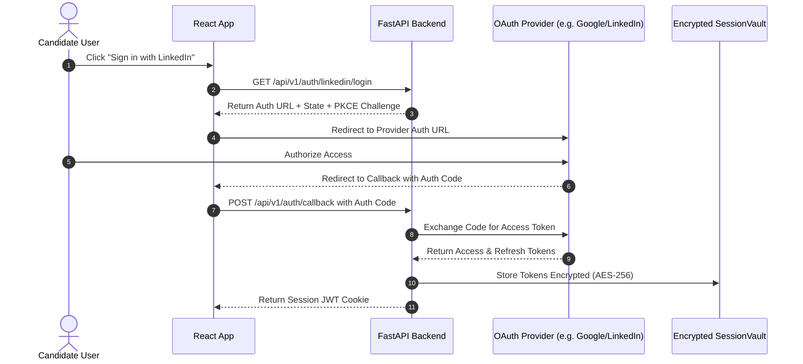
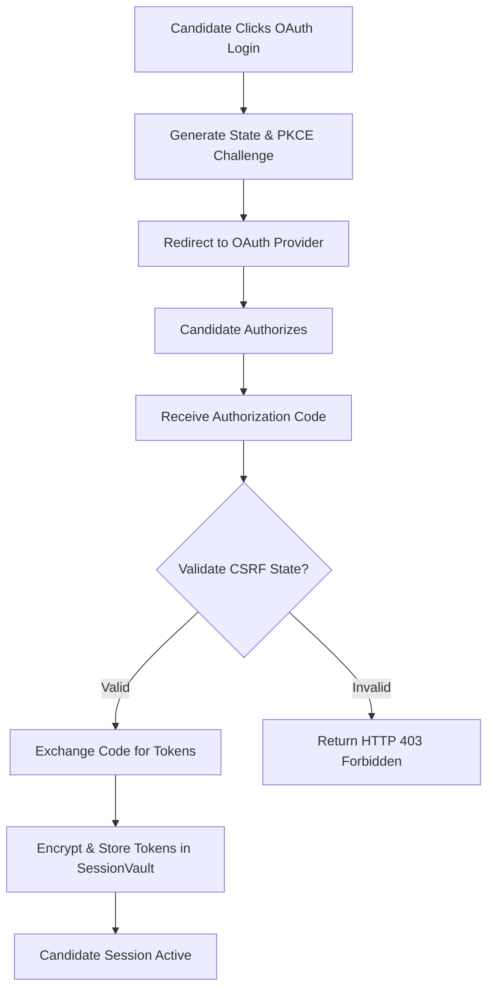

# 1. Overview
This document specifies the **OAuth 2.0 & Social Authentication Subsystem**, covering candidate authentication workflows across social identity providers (Google, LinkedIn, GitHub) and job portal OAuth endpoints.

---

# 2. Why This Exists
Modern job search platforms and candidate accounts use OAuth 2.0 / OpenID Connect (OIDC) protocols for secure user sign-in. Managing OAuth flows safely requires handling PKCE code exchanges, state parameter validation (CSRF protection), token refresh cycles, and secure token vault storage.

---

# 3. Responsibilities
- Implement OAuth 2.0 Authorization Code Flow with PKCE for candidate application sign-in.
- Manage access token and refresh token lifecycles.
- Decouple social authentication from underlying portal browser sessions.

---

# 4. Inputs
- OAuth client ID, client secret, authorization grant code, state token, redirect URI.

---

# 5. Outputs
- Encrypted candidate JWT session tokens, refresh tokens, and authenticated user session profiles.

---

# 6. Components
- **OAuthProviderService**: Handles authorization URL generation and token exchange ([credentials.py](file:///d:/Personal%20Imp/Projects/Automated-job-Agent/backend/app/routes/credentials.py)).
- **TokenVault**: Encrypts and persists refresh tokens using AES-256-GCM.
- **PKCEGenerator**: Generates cryptographically secure `code_verifier` and `code_challenge` tokens.

---

# 7. Folder Structure
```text
docs/Phase-02-Authentication/
├── OAuth.md
├── Cookie-Authentication.md
├── Session-Management.md
├── Secret-Management.md
└── Token-Encryption.md
```

---

# 8. Data Models
```python
from pydantic import BaseModel, Field
from typing import Optional
from datetime import datetime

class OAuthTokenResponse(BaseModel):
    access_token: str
    token_type: str = "Bearer"
    expires_in: int
    refresh_token: Optional[str] = None
    scope: Optional[str] = None
    created_at: datetime = Field(default_factory=datetime.utcnow)
```

---

# 9. API Contracts
OAuth Callback API Endpoint:
```json
{
  "endpoint": "/api/v1/auth/callback/linkedin",
  "method": "GET",
  "query_params": {
    "code": "AQTz98412...",
    "state": "csrf_state_hash"
  },
  "response": {
    "status": "Authenticated",
    "user_id": "usr_98412",
    "token_type": "Bearer"
  }
}
```

---

# 10. Sequence Diagram


---

# 11. Flow Diagram


---

# 12. Internal Working
The OAuth service generates cryptographically random `state` parameters saved in Redis with 10-minute expirations. Upon callback, the `state` is verified against Redis to defeat Cross-Site Request Forgery (CSRF) attacks.

---

# 13. Configuration
- Specified in `.env` and [backend/app/config.py](file:///d:/Personal%20Imp/Projects/Automated-job-Agent/backend/app/config.py).
- `OAUTH_CALLBACK_URL_BASE`: `http://localhost:8000/api/v1/auth/callback`

---

# 14. Error Handling
Invalid or expired authorization codes trigger HTTP 400 Bad Request responses with error detail `"Invalid or expired OAuth grant code"`.

---

# 15. Retry Strategy
- Token exchange calls retry up to 3 times with exponential backoff on HTTP 5xx provider errors.

---

# 16. Security
- OAuth authorization code flow strictly requires PKCE (`S256` challenge method) to prevent authorization code injection attacks.

---

# 17. Logging
- Logs record `provider_id`, `user_id`, `token_exchange_latency_ms`, `status` (access tokens are masked in log outputs).

---

# 18. Metrics
- OAuth Success Rate (>99.2%).
- Token Exchange Latency (<250ms).

---

# 19. Testing Strategy
- Unit test token exchange logic using `httpx` mock responses.

---

# 20. Performance Considerations
- Token refresh routines run asynchronously in background tasks prior to token expiration.

---

# 21. Best Practices
- Never log raw access or refresh token values under any circumstance.

---

# 22. Production Improvements
- Implement automatic OAuth token revocation upon candidate account deletion.

---

# 23. Common Failure Scenarios
- **Scenario**: Provider access token expires mid-session.
  - **Resolution**: `SessionManager` inspects token `expires_in`, executes refresh token grant, and updates `SessionVault` transparently.

---

# 24. Future Enhancements
- Add Passkey / FIDO2 WebAuthn authentication support.

---

# 25. References
- RFC 7636: Proof Key for Code Exchange (PKCE) by OAuth Public Clients.
