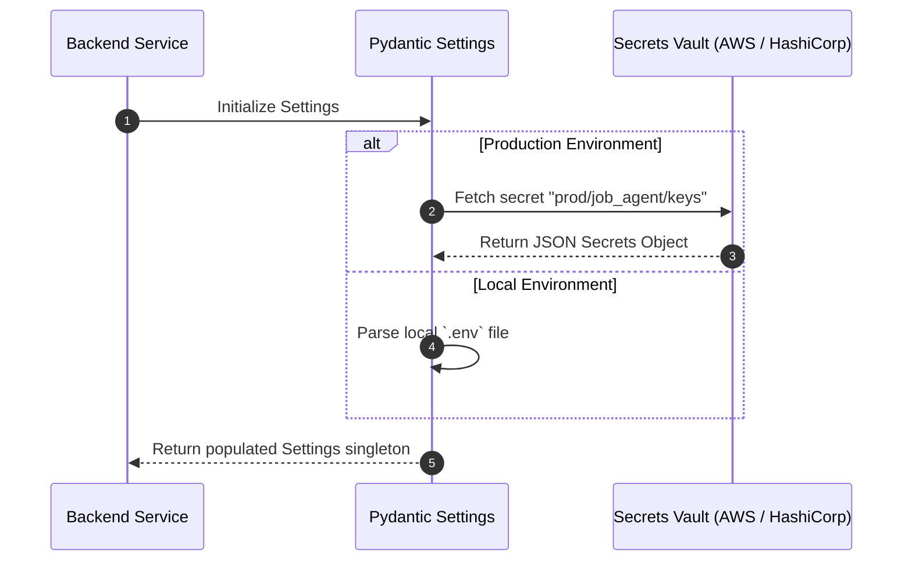
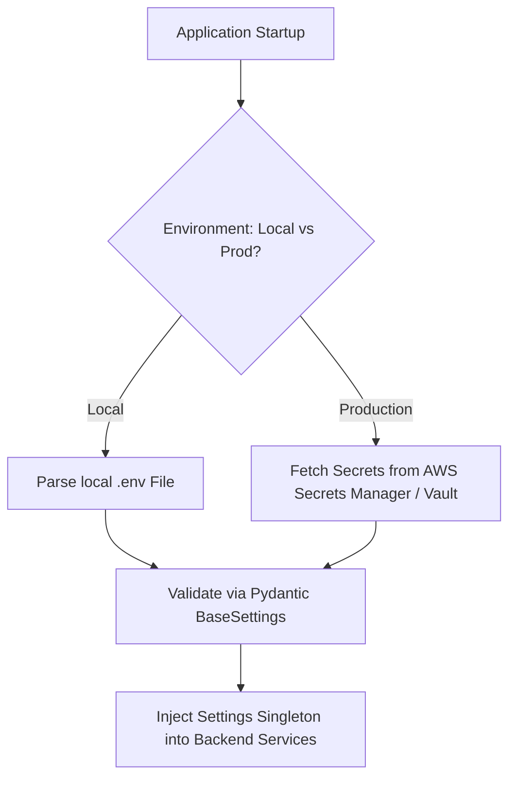

# 1. Overview
This document specifies the **Secrets Management Subsystem**, detailing secret loading, environment variable isolation, secret manager integration (AWS Secrets Manager, HashiCorp Vault), and zero-leakage protection.

---

# 2. Why This Exists
An automated AI agent system uses critical credentials: LLM API keys (Hugging Face, Gemini, OpenAI), database passwords, OAuth secrets, and portal user logins. Hardcoding secrets or logging secret variables creates severe security vulnerabilities.

---

# 3. Responsibilities
- Load system settings dynamically via Pydantic Settings ([config.py](file:///d:/Personal%20Imp/Projects/Automated-job-Agent/backend/app/config.py)).
- Integrate external secrets manager vaults in production environments.
- Mask sensitive secret values in system logs and error tracebacks.

---

# 4. Inputs
- Environment variable configuration files (`.env`), cloud secret manager secrets.

---

# 5. Outputs
- Sanitized runtime `Settings` instance accessible to backend services.

---

# 6. Components
- **SettingsProvider**: Pydantic BaseSettings parser enforcing type safety and defaults ([config.py](file:///d:/Personal%20Imp/Projects/Automated-job-Agent/backend/app/config.py#L20)).
- **SecretMasker**: Logger filter removing password and API key tokens from output logs.
- **VaultIntegrator**: Production adapter fetching dynamic secrets from HashiCorp Vault or AWS Secrets Manager.

---

# 7. Folder Structure
```text
docs/Phase-02-Authentication/
└── Secret-Management.md
```

---

# 8. Data Models
```python
from pydantic_settings import BaseSettings
from pydantic import Field

class EnvironmentSettings(BaseSettings):
    PROJECT_NAME: str = "Automated Job Agent API"
    DATABASE_URL: str = Field(..., description="PostgreSQL or SQLite connection string")
    HF_TOKEN: str = Field(default="", description="Hugging Face API Token")
    GEMINI_API_KEY: str = Field(default="", description="Google Gemini API Key")
    SECRET_KEY: str = Field(..., description="JWT Secret Signing Key")
    
    class Config:
        env_file = ".env"
        env_file_encoding = "utf-8"
```

---

# 9. API Contracts
N/A (Secrets Management Spec).

---

# 10. Sequence Diagram


---

# 11. Flow Diagram


---

# 12. Internal Working
The settings singleton `settings` is initialized at server startup. Pydantic parses values, verifies type constraints, and provides secret properties to services (`from backend.app.config import settings`).

---

# 13. Configuration
- Specified in [backend/app/config.py](file:///d:/Personal%20Imp/Projects/Automated-job-Agent/backend/app/config.py).

---

# 14. Error Handling
Missing mandatory secrets (e.g. unconfigured `SECRET_KEY` in production) raise `ValidationError` on server boot, preventing unsafe startup.

---

# 15. Retry Strategy
- Vault fetching retries up to 3 times with exponential backoff on cloud API network failures.

---

# 16. Security
- `.env` files are strictly listed in `.gitignore`.
- Pre-commit hooks (`detect-secrets`) scan code commits to prevent accidental API key leaks.

---

# 17. Logging
- Logger custom filter (`SecretMaskingFilter`) replaces detected API key patterns (`hf_*`, `AIzaSy*`) with `[REDACTED_SECRET]`.

---

# 18. Metrics
- Secrets Sanitization Success Score (100%).

---

# 19. Testing Strategy
- Unit test secret masking filter against strings containing mock API keys.

---

# 20. Performance Considerations
- Loading secrets into memory once at startup ensures zero runtime latency overhead during API execution.

---

# 21. Best Practices
- Never print `settings.__dict__` or dump environment objects directly into log files.

---

# 22. Production Improvements
- Implement automatic secret key rotation using HashiCorp Vault dynamic engine.

---

# 23. Common Failure Scenarios
- **Scenario**: Developer accidentally commits `.env` file containing HF token.
  - **Resolution**: `detect-secrets` pre-commit hook rejects commit; token is revoked immediately.

---

# 24. Future Enhancements
- Add hardware security module (HSM) integration for enterprise deployments.

---

# 25. References
- HashiCorp Vault Developer Documentation.
