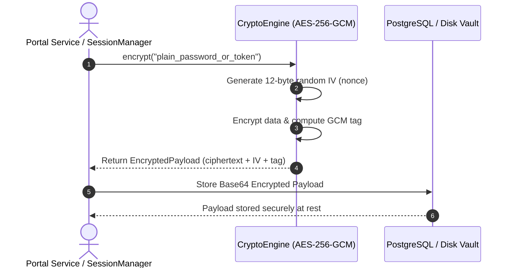
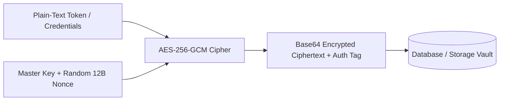

# 1. Overview
This document specifies the **AES-256-GCM Cryptographic Encryption Subsystem**, detailing encryption at rest for stored candidate job portal passwords, OAuth refresh tokens, and Playwright browser profile cookies.

---

# 2. Why This Exists
Storing raw candidate passwords or OAuth tokens in plain text inside database tables or disk files creates severe security vulnerabilities. Using authenticated symmetric encryption (AES-256-GCM) ensures confidentiality and data integrity verification.

---

# 3. Responsibilities
- Encrypt plain-text tokens, passwords, and JSON storage states prior to database or disk persistence.
- Decrypt encrypted ciphertexts in memory during automated application execution.
- Validate cryptographic authentication tags to detect data tampering attempts.

---

# 4. Inputs
- Plain-text bytes or string payloads, master encryption key (`ENCRYPTION_MASTER_KEY`).

---

# 5. Outputs
- Encrypted ciphertext payloads with 12-byte initialization vectors (IV) and 16-byte authentication tags.

---

# 6. Components
- **CryptoEngine**: Python cryptography wrapper using `cryptography.hazmat.primitives.ciphers.aead.AESGCM`.
- **KeyDerivationService**: Derives 256-bit encryption keys using PBKDF2 with SHA-256 and unique salt bytes.

---

# 7. Folder Structure
```text
docs/Phase-02-Authentication/
└── Token-Encryption.md
```

---

# 8. Data Models
```python
from pydantic import BaseModel, Field
from typing import str

class EncryptedPayload(BaseModel):
    ciphertext_b64: str = Field(..., description="Base64 encoded AES-256-GCM ciphertext")
    nonce_b64: str = Field(..., description="Base64 encoded 12-byte initialization vector")
    tag_b64: str = Field(..., description="Base64 encoded 16-byte authentication tag")
```

---

# 9. API Contracts
N/A (Crypto Spec).

---

# 10. Sequence Diagram


---

# 11. Flow Diagram


---

# 12. Internal Working
The cryptography engine uses `AESGCM(master_key)`. Every encryption operation generates a fresh cryptographically random 96-bit (12-byte) initialization vector (nonce) to prevent replay attacks and pattern analysis.

---

# 13. Configuration
- Master Key Length: 256 bits (32 bytes).
- Cipher Mode: Galois/Counter Mode (GCM).

---

# 14. Error Handling
If an encrypted payload has been tampered with or corrupted, `decrypt()` raises `InvalidTagException`, rejecting execution immediately.

---

# 15. Retry Strategy
- N/A.

---

# 16. Security
- AES-256-GCM provides both confidentiality and authenticated integrity protection.
- Master keys must be provided via environment settings and never committed to code repositories.

---

# 17. Logging
- Crypto operations log execution status without outputting plain text or key material.

---

# 18. Metrics
- Encryption / Decryption Execution Time (<1ms per payload).

---

# 19. Testing Strategy
- Unit test round-trip encryption/decryption and verify `InvalidTagException` on modified ciphertexts.

---

# 20. Performance Considerations
- AES-NI hardware acceleration in modern CPUs enables multi-gigabyte per second cryptographic throughput.

---

# 21. Best Practices
- Never reuse an initialization vector (nonce) with the same encryption key.

---

# 22. Production Improvements
- Integrate AWS KMS or HashiCorp Vault transit secrets engine for automated key rotation.

---

# 23. Common Failure Scenarios
- **Scenario**: Unconfigured master encryption key.
  - **Resolution**: Backend raises `CriticalCryptoConfigurationError` on startup, preventing unencrypted operation.

---

# 24. Future Enhancements
- Upgrade key derivation to Argon2id for increased resistance against offline brute-force attacks.

---

# 25. References
- NIST SP 800-38D: Recommendation for Block Cipher Modes of Operation: Galois/Counter Mode (GCM).
