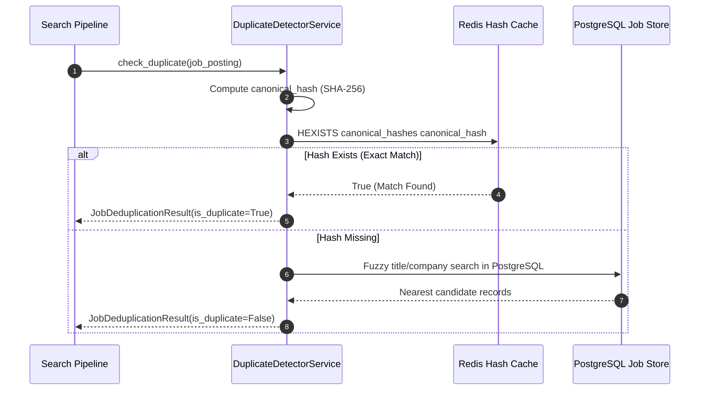
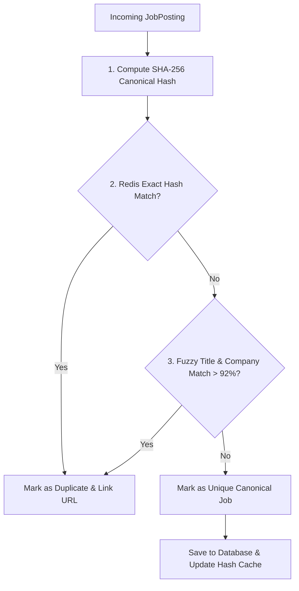

# 1. Overview
This document specifies the **Cross-Portal Duplicate Job Detection Engine**, detailing exact hash matching, fuzzy title/company similarity deduplication, and vector similarity clustering algorithms.

---

# 2. Why This Exists
Employers frequently post the exact same job opening across multiple job boards simultaneously (e.g. posting on LinkedIn, Indeed, and Greenhouse). Without duplicate detection, candidates waste time evaluating and applying to the same job opening multiple times across different portals.

---

# 3. Responsibilities
- Compute deterministic deduplication hashes (`canonical_job_hash`) for incoming job postings.
- Perform fuzzy string comparison (Levenshtein distance) on company and title combinations.
- Identify cross-portal duplicates and cluster them into a single canonical `JobPosting` record.

---

# 4. Inputs
- Newly normalized `JobPosting` objects.

---

# 5. Outputs
- Deduplicated canonical job stream with cross-posted portal URL links attached.

---

# 6. Components
- **DuplicateDetectorService**: Core deduplication service.
- **HashGenerator**: Computes SHA-256 canonical fingerprints from normalized `(company_slug + title_slug + location_slug)`.
- **FuzzyMatcher**: Performs RapidFuzz string similarity comparisons on near-duplicate postings.

---

# 7. Folder Structure
```text
docs/Phase-03-Job-Discovery/
└── Duplicate-Detection.md
```

---

# 8. Data Models
```python
from pydantic import BaseModel, Field
from typing import List, Optional

class JobDeduplicationResult(BaseModel):
    is_duplicate: bool
    canonical_job_id: str
    duplicate_of_id: Optional[str] = None
    similarity_score: float = Field(..., description="0.0 to 1.0 similarity score")
    matched_by: str = Field(..., description="ExactHash, FuzzyMatch, VectorCluster")
```

---

# 9. API Contracts
N/A (Engine Spec).

---

# 10. Sequence Diagram


---

# 11. Flow Diagram


---

# 12. Internal Working
The exact hash algorithm normalizes strings (`acme-corp|senior-python-engineer|remote`), computes SHA-256, and checks a Redis `Set`. If exact hash fails, fuzzy matching compares title/company similarity using RapidFuzz ratio algorithms.

---

# 13. Configuration
- Fuzzy Similarity Threshold: `FUZZY_MATCH_THRESHOLD = 0.92`

---

# 14. Error Handling
- Redis cache misses fall back to indexed PostgreSQL database query checks without disrupting discovery execution.

---

# 15. Retry Strategy
- N/A.

---

# 16. Security
- Hashes contain zero personal candidate data.

---

# 17. Logging
- Deduplication logs record `job_id`, `canonical_id`, `match_type`, `similarity_score`.

---

# 18. Metrics
- Duplicate Detection Precision (>99%).
- Exact Hash Lookup Latency (<0.5ms via Redis).

---

# 19. Testing Strategy
- Unit test exact and fuzzy deduplication using a dataset of known cross-posted job pairs.

---

# 20. Performance Considerations
- Redis in-memory hash set verification handles over 100,000 lookups per second.

---

# 21. Best Practices
- Always link secondary portal URLs to the canonical job record so candidates can view all application options.

---

# 22. Production Improvements
- Add vector embedding clustering for detecting cross-posted jobs with completely rewritten titles.

---

# 23. Common Failure Scenarios
- **Scenario**: Company uses slight name variations ("Acme Inc" vs "Acme Corporation").
  - **Resolution**: `CompanyNormalizer` strips generic corporate suffixes (`Inc`, `LLC`, `Corp`, `Ltd`) prior to hash generation.

---

# 24. Future Enhancements
- Automated tracking of expired cross-posted listings.

---

# 25. References
- RapidFuzz Library Specifications & SHA-256 Hash Standards.
