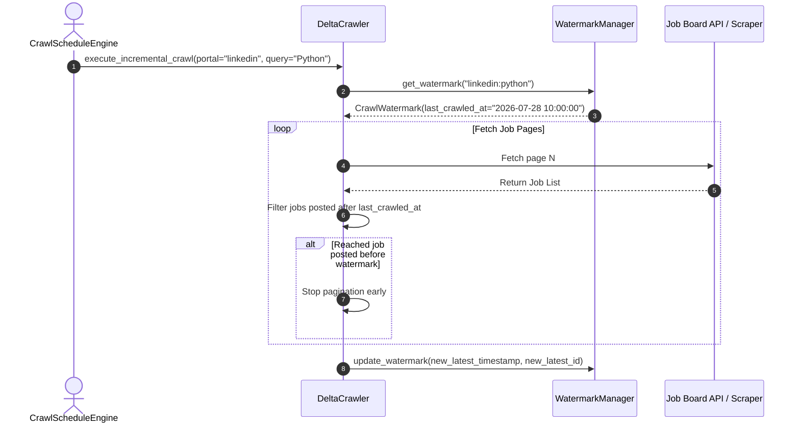
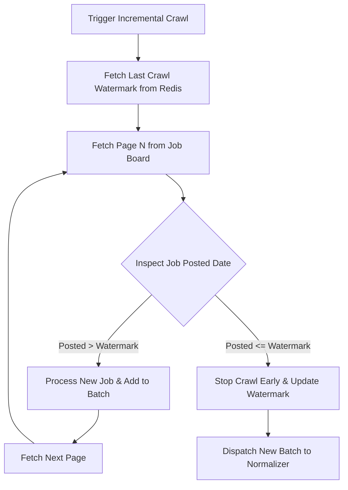

# 1. Overview
This document specifies the **Incremental Crawling & Stateful Discovery Architecture**, detailing watermark tracking, cursor-based pagination, delta extraction, and scheduled background crawling.

---

# 2. Why This Exists
Re-crawling entire job boards from scratch on every run consumes excessive network bandwidth, triggers portal rate limits, wastes LLM token quota, and degrades system performance. Incremental crawling tracks historical state and fetches only newly posted or updated job listings.

---

# 3. Responsibilities
- Maintain watermark timestamps (`last_crawled_at`) and high-watermark job IDs per portal search query.
- Support cursor-based and offset-based delta pagination.
- Skip previously indexed jobs and stop crawling early when historical watermarks are reached.

---

# 4. Inputs
- Crawl target criteria (portal, query, location), watermark state records from Redis/PostgreSQL.

---

# 5. Outputs
- Incremental job posting stream containing only new job listings.

---

# 6. Components
- **WatermarkManager**: Reads and updates search query timestamp state in Redis/PostgreSQL.
- **DeltaCrawler**: Executes page pagination until hitting previously seen posting timestamps.
- **CrawlScheduleEngine**: Schedules background cron discovery tasks using Celery / Redis.

---

# 7. Folder Structure
```text
docs/Phase-03-Job-Discovery/
└── Incremental-Crawling.md
```

---

# 8. Data Models
```python
from pydantic import BaseModel, Field
from datetime import datetime
from typing import Optional

class CrawlWatermark(BaseModel):
    query_key: str = Field(..., description="Unique key for query e.g. linkedin:python:remote")
    last_crawled_at: datetime
    latest_job_id: str
    total_jobs_indexed: int
    updated_at: datetime = Field(default_factory=datetime.utcnow)
```

---

# 9. API Contracts
N/A (Crawling Architecture Spec).

---

# 10. Sequence Diagram


---

# 11. Flow Diagram


---

# 12. Internal Working
The `WatermarkManager` stores state keys in Redis (`watermark:<query_key>`). During pagination, `DeltaCrawler` evaluates job posting dates against `last_crawled_at`. Once a job older than the watermark is encountered, pagination terminates early, saving up to 90% of requests.

---

# 13. Configuration
- Specified in [backend/app/config.py](file:///d:/Personal%20Imp/Projects/Automated-job-Agent/backend/app/config.py).
- Default Crawl Lookback Window: `DEFAULT_LOOKBACK_HOURS = 24`

---

# 14. Error Handling
If a portal does not provide explicit job post timestamps, `DeltaCrawler` relies on `latest_job_id` tracking and duplicate detection to determine early stopping boundaries.

---

# 15. Retry Strategy
- Failed watermark state updates retry up to 3 times before logging a state error.

---

# 16. Security
- Watermark keys contain no sensitive user tokens.

---

# 17. Logging
- Logs record `query_key`, `new_jobs_found`, `pages_scanned`, `early_stop_triggered`, `duration_ms`.

---

# 18. Metrics
- Request Reduction Efficiency Rate (Target: >85% bandwidth saved).
- Crawl Duration (<5 seconds for incremental runs).

---

# 19. Testing Strategy
- Unit test watermark early stopping against a mock list of dated job postings.

---

# 20. Performance Considerations
- Early stopping cuts discovery crawl durations from 60+ seconds down to under 5 seconds.

---

# 21. Best Practices
- Always update watermark state after completing a crawl to ensure consistent state recovery.

---

# 22. Production Improvements
- Implement adaptive crawl schedules that increase frequency during peak hiring hours (9 AM - 5 PM).

---

# 23. Common Failure Scenarios
- **Scenario**: Job portal resets job ID sequence.
  - **Resolution**: `WatermarkManager` falls back to timestamp comparison if job ID sequence checks fail.

---

# 24. Future Enhancements
- Predictive ML crawler prioritizing portals with historical high-matching job yields.

---

# 25. References
- Stateful Web Crawler Architecture Guidelines.
