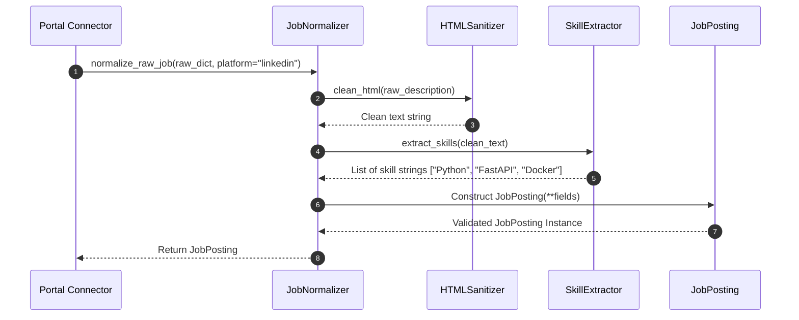
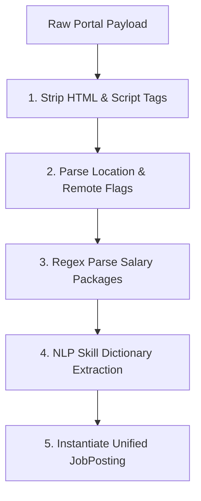

# 1. Overview
This document specifies the **Job Normalization Pipeline (`JobNormalizer`)**, detailing HTML sanitization, salary range extraction, skill tagging, and location standardization ([normalizer.py](file:///d:/Personal%20Imp/Projects/Automated-job-Agent/backend/app/services/matching/normalizer.py)).

---

# 2. Why This Exists
Raw job listings scraped from different websites contain messy HTML tags, irregular salary formats ("$120k-$150k" vs "12-15 LPA"), non-standard location strings ("SF Bay Area" vs "San Francisco, CA"), and unparsed text blocks. Normalization converts raw payloads into uniform, structured `JobPosting` objects.

---

# 3. Responsibilities
- Strip raw HTML formatting tags (`<script>`, `<style>`, `<div>`, `<span>`) using BeautifulSoup.
- Parse salary strings into standardized `SalaryRange` objects.
- Standardize location strings and set `is_remote` / `is_hybrid` flags.
- Extract required key skills using NLP / regex skill dictionaries.

---

# 4. Inputs
- Unprocessed raw job payloads from connectors.

---

# 5. Outputs
- Instantiated, validated `JobPosting` Pydantic models.

---

# 6. Components
- **JobNormalizer**: Main pipeline service ([normalizer.py](file:///d:/Personal%20Imp/Projects/Automated-job-Agent/backend/app/services/matching/normalizer.py)).
- **HTMLSanitizer**: Removes dangerous script tags and strips unneeded HTML markup.
- **SalaryParser**: Uses regex patterns to convert currency/salary text into yearly min/max floats.
- **SkillExtractor**: Matches description text against a dictionary of 2,000+ technical skills.

---

# 7. Folder Structure
```text
docs/Phase-03-Job-Discovery/
└── Job-Normalization.md
```

---

# 8. Data Models
```python
from pydantic import BaseModel
from typing import List, Optional

class NormalizationMetrics(BaseModel):
    raw_payload_size_bytes: int
    cleaned_description_words: int
    skills_extracted_count: int
    salary_parsed: bool
    normalization_duration_ms: float
```

---

# 9. API Contracts
N/A (Pipeline Specification).

---

# 10. Sequence Diagram


---

# 11. Flow Diagram


---

# 12. Internal Working
The normalizer processes jobs sequentially or in parallel batches. Text cleaning removes non-breaking spaces (`&nbsp;`), fixes encodings, and normalizes whitespaces.

---

# 13. Configuration
- Specified in [backend/app/services/matching/normalizer.py](file:///d:/Personal%20Imp/Projects/Automated-job-Agent/backend/app/services/matching/normalizer.py).

---

# 14. Error Handling
Parsing failures on optional fields (e.g. unparseable salary string) log a warning and set the field to `None` without halting pipeline execution.

---

# 15. Retry Strategy
- N/A.

---

# 16. Security
- HTML sanitization prevents stored XSS vector injection when job descriptions are rendered in the React UI dashboard.

---

# 17. Logging
- Logs record `platform`, `job_id`, `extracted_skills_count`, `duration_ms`.

---

# 18. Metrics
- Normalization Latency (<10ms per job description).
- Skill Extraction Accuracy (>94%).

---

# 19. Testing Strategy
- Unit test against HTML description fixtures from LinkedIn, Naukri, Indeed, Greenhouse, and Workday.

---

# 20. Performance Considerations
- Pre-compiled regex patterns for salary parsing and skill extraction ensure ultra-fast processing speeds.

---

# 21. Best Practices
- Keep raw uncleaned payloads stored in `JobPosting.raw_payload` for audit debugging.

---

# 22. Production Improvements
- Use spaCy / Transformer Named Entity Recognition (NER) for complex skill extraction.

---

# 23. Common Failure Scenarios
- **Scenario**: Job description written in non-English language.
  - **Resolution**: Normalizer detects language tag; if non-English, flags record for translation service before skill extraction.

---

# 24. Future Enhancements
- Auto-extract manager seniority and team size indicators from text.

---

# 25. References
- BeautifulSoup4 Documentation & Regex Pattern Standards.
