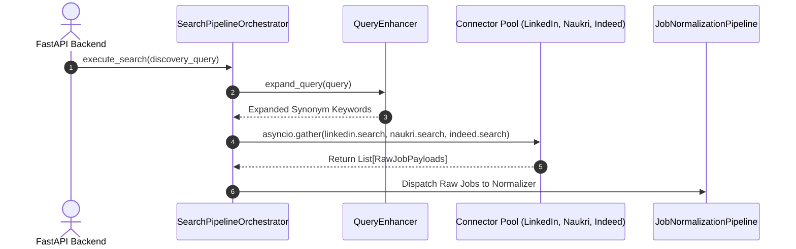
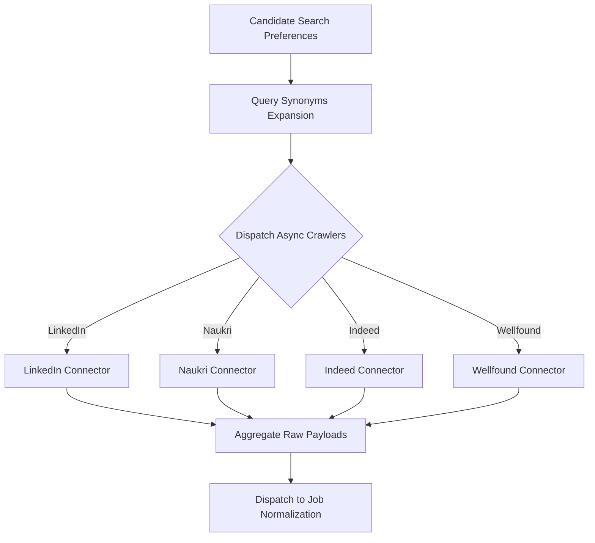

# 1. Overview
This document specifies the **Multi-Portal Job Search & Crawler Discovery Pipeline**, covering search dispatching across job portals (LinkedIn, Naukri, Indeed, Wellfound), API response extraction, and candidate job preference matching ([scraper.py](file:///d:/Personal%20Imp/Projects/Automated-job-Agent/backend/app/services/scraper.py)).

---

# 2. Why This Exists
Candidates need to aggregate job openings across multiple platforms simultaneously. The discovery pipeline distributes search tasks across portal scrapers and ATS feeds asynchronously, extracting raw job postings without blocking API threads.

---

# 3. Responsibilities
- Dispatch job search requests across registered connectors asynchronously (`asyncio.gather`).
- Handle portal rate limits, pagination, and search query expansion.
- Output raw job posting payloads to the normalization pipeline.

---

# 4. Inputs
- Candidate search preferences (target titles, skills, locations, remote options, min salary).

---

# 5. Outputs
- Raw job posting payloads dispatched to `JobNormalizationPipeline`.

---

# 6. Components
- **SearchPipelineOrchestrator**: Manages parallel crawler dispatches ([scraper.py](file:///d:/Personal%20Imp/Projects/Automated-job-Agent/backend/app/services/scraper.py)).
- **QueryEnhancer**: Expands candidate keywords into domain synonyms (e.g. "Backend" -> "Python Developer, API Engineer").
- **CrawlerRateLimiter**: Controls request throughput per portal domain.

---

# 7. Folder Structure
```text
docs/Phase-03-Job-Discovery/
├── Search-Pipeline.md
├── Unified-Job-Schema.md
├── Job-Normalization.md
├── Duplicate-Detection.md
└── Incremental-Crawling.md
```

---

# 8. Data Models
```python
from pydantic import BaseModel, Field
from typing import List, Optional

class JobDiscoveryQuery(BaseModel):
    user_id: str
    target_titles: List[str]
    locations: List[str] = Field(default_factory=lambda: ["Remote"])
    skills: List[str] = Field(default_factory=list)
    min_salary_usd: Optional[int] = None
    target_platforms: List[str] = Field(default_factory=lambda: ["linkedin", "naukri", "indeed", "wellfound"])
```

---

# 9. API Contracts
Search Pipeline REST API Payload:
```json
{
  "endpoint": "/api/v1/jobs/search",
  "method": "POST",
  "request": {
    "target_titles": ["Senior Python Engineer"],
    "locations": ["Remote"],
    "target_platforms": ["linkedin", "naukri"]
  },
  "response": {
    "status": "Dispatched",
    "search_task_id": "task_98412",
    "platforms_queued": 2
  }
}
```

---

# 10. Sequence Diagram


---

# 11. Flow Diagram


---

# 12. Internal Working
The pipeline uses `asyncio.gather` with `return_exceptions=True`. If one portal fails or times out, the pipeline logs the portal error and processes jobs retrieved from all healthy portals.

---

# 13. Configuration
- Specified in [backend/app/config.py](file:///d:/Personal%20Imp/Projects/Automated-job-Agent/backend/app/config.py).
- `SEARCH_CRAWLER_TIMEOUT_SECONDS`: `30`

---

# 14. Error Handling
Individual connector timeouts are caught, logged, and isolated without failing the broader discovery task.

---

# 15. Retry Strategy
- Failed portal crawlers retry up to 2 times with jittered delays.

---

# 16. Security
- Crawler user-agents are rotated from an approved browser agent pool.

---

# 17. Logging
- Pipeline logs record `search_task_id`, `platforms_queried`, `raw_jobs_found`, `duration_ms`.

---

# 18. Metrics
- Discovery Throughput (jobs found per second).
- Crawl Success Rate per Portal (>95%).

---

# 19. Testing Strategy
- Unit test query expansion and parallel dispatch using mock connectors.

---

# 20. Performance Considerations
- Asynchronous parallel crawling retrieves hundreds of jobs in under 4 seconds.

---

# 21. Best Practices
- Respect portal rate limits and `robots.txt` guidelines.

---

# 22. Production Improvements
- Implement distributed crawler workers via Celery / Redis Streams.

---

# 23. Common Failure Scenarios
- **Scenario**: Portal returns HTTP 429 Rate Limit error.
  - **Resolution**: `CrawlerRateLimiter` pauses worker traffic to affected portal for 60 seconds.

---

# 24. Future Enhancements
- Add AI search trend analyzer identifying emerging job keyword spikes.

---

# 25. References
- Python `asyncio` Parallel Execution Patterns.
