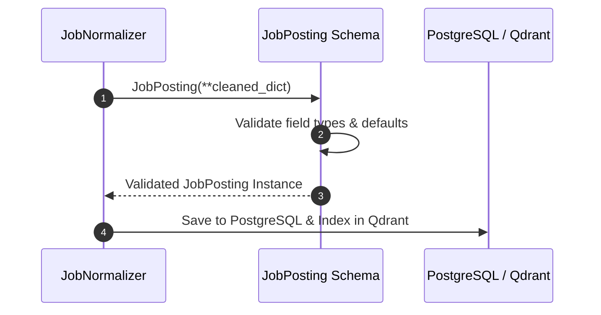
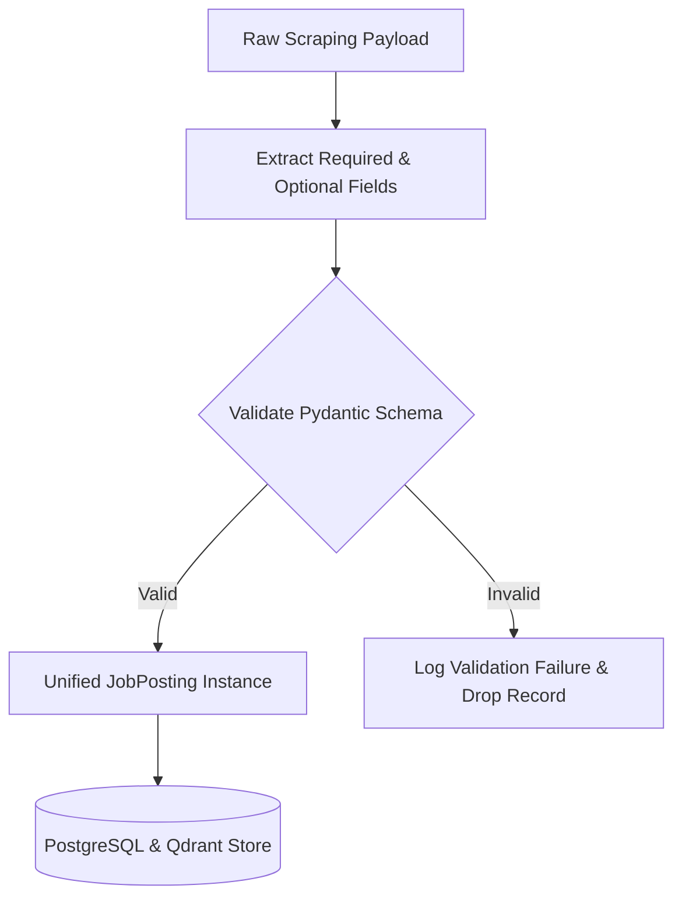

# 1. Overview
This document specifies the **Unified Job Schema (`JobPosting`)**, the standard Pydantic data contract representing job listings across all job boards and Applicant Tracking Systems.

---

# 2. Why This Exists
LinkedIn, Naukri, Indeed, and ATS platforms return raw job data in wildly different formats (e.g. LinkedIn uses `title`/`company`, Naukri uses `designation`/`organization`, Indeed uses `jobTitle`/`employer`). Without a single unified schema, downstream agents (Matcher, Resume Tailor, Application Agent) would require platform-specific code paths.

---

# 3. Responsibilities
- Define a single, comprehensive data model for normalized job postings ([models.py](file:///d:/Personal%20Imp/Projects/Automated-job-Agent/backend/app/models.py)).
- Provide strong type validation, default field fallbacks, and serialization interfaces.

---

# 4. Inputs
- Cleaned dictionary output from `JobNormalizer`.

---

# 5. Outputs
- Instantiated `JobPosting` Pydantic models used by vector stores, state graphs, and database tables.

---

# 6. Components
- **JobPosting**: Primary Pydantic schema model ([models.py](file:///d:/Personal%20Imp/Projects/Automated-job-Agent/backend/app/models.py)).
- **SalaryRange**: Sub-model for standardized compensation packages.
- **LocationDetail**: Sub-model for location, remote, and hybrid policy specs.

---

# 7. Folder Structure
```text
docs/Phase-03-Job-Discovery/
└── Unified-Job-Schema.md
```

---

# 8. Data Models
```python
from pydantic import BaseModel, Field, HttpUrl
from typing import List, Optional, Dict, Any
from datetime import datetime
from enum import Enum

class EmploymentType(str, Enum):
    FULL_TIME = "Full-Time"
    PART_TIME = "Part-Time"
    CONTRACT = "Contract"
    INTERNSHIP = "Internship"
    OTHER = "Other"

class SalaryRange(BaseModel):
    min_amount: Optional[float] = None
    max_amount: Optional[float] = None
    currency: str = "USD"
    period: str = "Yearly"  # Yearly, Monthly, Hourly

class JobPosting(BaseModel):
    id: str = Field(..., description="Unique platform-prefixed job hash e.g. li_98412")
    title: str = Field(..., description="Normalized job title")
    company: str = Field(..., description="Employer company name")
    location: str = Field(..., description="Primary job location e.g. San Francisco, CA")
    is_remote: bool = False
    is_hybrid: bool = False
    description: str = Field(..., description="Full cleaned job description text")
    skills_required: List[str] = Field(default_factory=list)
    salary: Optional[SalaryRange] = None
    employment_type: EmploymentType = EmploymentType.FULL_TIME
    experience_level: Optional[str] = None
    url: str = Field(..., description="Direct job application URL")
    platform: str = Field(..., description="Source platform e.g. linkedin, naukri, greenhouse")
    posted_date: Optional[datetime] = None
    created_at: datetime = Field(default_factory=datetime.utcnow)
    raw_payload: Dict[str, Any] = Field(default_factory=dict)
```

---

# 9. API Contracts
Unified Job Object JSON Output:
```json
{
  "id": "gh_98412",
  "title": "Senior Python Engineer",
  "company": "Acme Corp",
  "location": "Remote",
  "is_remote": true,
  "description": "We are seeking a Senior Python Engineer to build scalable microservices...",
  "skills_required": ["Python", "FastAPI", "PostgreSQL", "Docker"],
  "salary": {
    "min_amount": 140000,
    "max_amount": 180000,
    "currency": "USD",
    "period": "Yearly"
  },
  "employment_type": "Full-Time",
  "url": "https://boards.greenhouse.io/acme/jobs/98412",
  "platform": "greenhouse"
}
```

---

# 10. Sequence Diagram


---

# 11. Flow Diagram


---

# 12. Internal Working
Schema validation occurs automatically during instantiation. Missing non-critical fields (e.g. salary min/max) fallback cleanly to `None` without raising errors.

---

# 13. Configuration
- Enforced via Pydantic v2 `BaseModel`.

---

# 14. Error Handling
Missing mandatory fields (`title`, `company`, `description`, `url`) raise `ValidationError`, preventing incomplete records from entering downstream pipelines.

---

# 15. Retry Strategy
- N/A.

---

# 16. Security
- HTML markup inside job descriptions is sanitized to prevent XSS string injections.

---

# 17. Logging
- Schema validation errors log specific missing field names and raw payload identifiers.

---

# 18. Metrics
- Schema Compliance Rate (>99.5%).

---

# 19. Testing Strategy
- Unit test schema instantiation against raw JSON payloads from all 10 supported connectors.

---

# 20. Performance Considerations
- Pydantic v2 core compiled in Rust processes schema validation 5x faster than Pydantic v1.

---

# 21. Best Practices
- Always consume `JobPosting` objects in downstream services rather than raw dictionaries.

---

# 22. Production Improvements
- Add automated schema versioning for backward compatibility.

---

# 23. Common Failure Scenarios
- **Scenario**: Job posting lacks explicit salary details.
  - **Resolution**: `salary` attribute defaults to `None` while `description` text is indexed for LLM salary extraction.

---

# 24. Future Enhancements
- Add international currency converter module for uniform USD salary comparison.

---

# 25. References
- Pydantic v2 Schema Specification.
