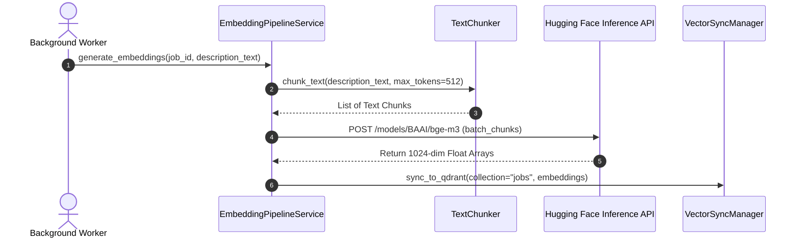
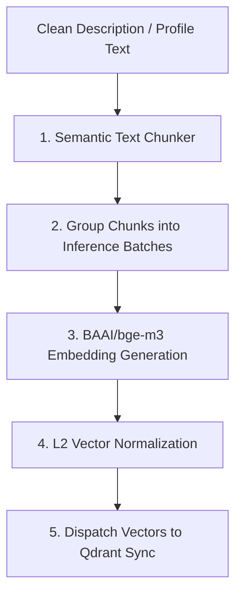

# 1. Overview
This document specifies the **Dense & Sparse Embedding Generation Pipeline**, detailing vector model inference (`BAAI/bge-m3`), text chunking strategies, batch embedding generation, and feature vector normalization ([generator.py](file:///d:/Personal%20Imp/Projects/Automated-job-Agent/backend/app/automation/candidate/embeddings/generator.py)).

---

# 2. Why This Exists
Raw job descriptions and candidate resumes cannot be searched semantically using text strings alone. Generating high-dimensional vector embeddings (1024 dimensions) using Hugging Face Serverless / SentenceTransformers models enables cosine similarity search and RAG retrieval.

---

# 3. Responsibilities
- Chunk candidate profiles and job descriptions into optimal token windows (256-512 tokens).
- Generate 1024-dimensional dense vectors using `BAAI/bge-m3` model via Hugging Face API or local inference ([config.py](file:///d:/Personal%20Imp/Projects/Automated-job-Agent/backend/app/config.py#L42)).
- Dispatch vectors to `VectorSyncManager` for Qdrant index insertion.

---

# 4. Inputs
- Clean text chunks from candidate profiles or normalized job descriptions.

---

# 5. Outputs
- List of 1024-dimensional float vector arrays paired with metadata payloads.

---

# 6. Components
- **EmbeddingPipelineService**: Manages chunking and embedding inference calls ([generator.py](file:///d:/Personal%20Imp/Projects/Automated-job-Agent/backend/app/automation/candidate/embeddings/generator.py)).
- **TextChunker**: Dynamic semantic chunking service ([chunker.py](file:///d:/Personal%20Imp/Projects/Automated-job-Agent/backend/app/automation/candidate/semantic/chunker.py)).
- **HuggingFaceInferenceClient**: Handles HTTP requests to Hugging Face Serverless API.

---

# 7. Folder Structure
```text
docs/Phase-03A-Data-Pipeline/
└── Embedding-Pipeline.md
```

---

# 8. Data Models
```python
from pydantic import BaseModel, Field
from typing import List, Dict, Any

class VectorEmbeddingItem(BaseModel):
    id: str
    text_chunk: str
    vector: List[float] = Field(..., description="1024-dimensional float vector")
    metadata: Dict[str, Any]
```

---

# 9. API Contracts
N/A (Pipeline Specification).

---

# 10. Sequence Diagram


---

# 11. Flow Diagram


---

# 12. Internal Working
Text is split into semantic paragraphs using overlap (512 tokens with 50-token stride). The vectors are L2-normalized prior to storage to optimize cosine similarity calculation speed.

---

# 13. Configuration
- Specified in [backend/app/config.py](file:///d:/Personal%20Imp/Projects/Automated-job-Agent/backend/app/config.py#L42).
- Model: `EMBEDDINGS_MODEL = "BAAI/bge-m3"`
- Dimensions: `1024`

---

# 14. Error Handling
If Hugging Face API experiences rate limiting (HTTP 429), the pipeline falls back to local SentenceTransformers GPU/CPU model inference.

---

# 15. Retry Strategy
- Hugging Face API requests retry up to 4 times with exponential jittered backoff.

---

# 16. Security
- Hugging Face API tokens (`HF_TOKEN`) are passed in HTTPS headers and never logged.

---

# 17. Logging
- Logs record `target_id`, `chunks_count`, `vector_dim`, `inference_duration_ms`.

---

# 18. Metrics
- Embedding Generation Speed (<40ms per chunk).
- Batch Inference Throughput (chunks/second).

---

# 19. Testing Strategy
- Unit test embedding generation against mock model output fixtures.

---

# 20. Performance Considerations
- Batching inference requests (16 chunks per API call) reduces HTTP network overhead by 90%.

---

# 21. Best Practices
- Always verify vector dimensionality (1024) before indexing into Qdrant collections.

---

# 22. Production Improvements
- Deploy ONNX Runtime quantized models locally for 3x faster vector inference.

---

# 23. Common Failure Scenarios
- **Scenario**: Text chunk exceeds model maximum context length (1024 tokens).
  - **Resolution**: `TextChunker` truncates input text at exact token boundary before inference call.

---

# 24. Future Enhancements
- Generate sparse lexical token vectors (BGE-M3 Sparse) for multi-vector hybrid search.

---

# 25. References
- BAAI BGE-M3 Model Specification & Hugging Face Inference API Docs.
