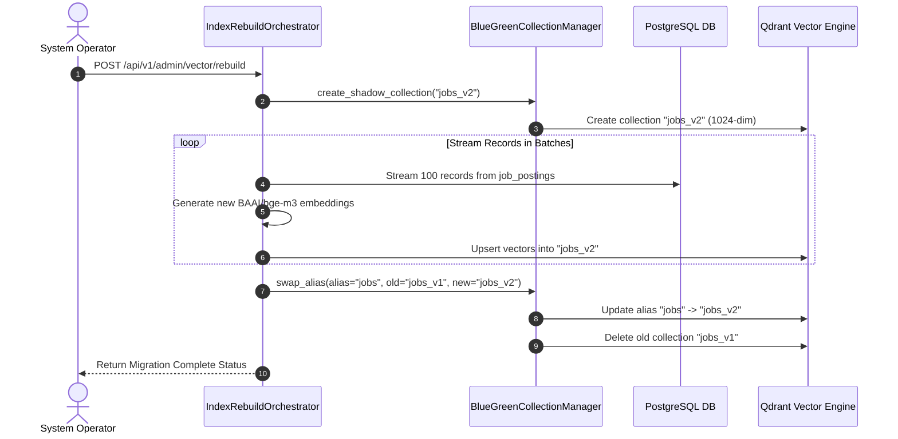
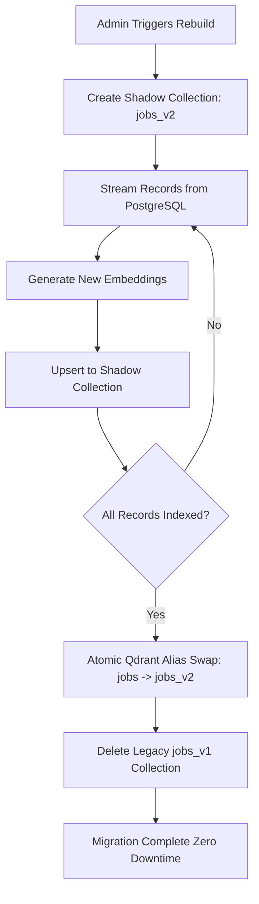

# 1. Overview
This document specifies the **Vector Index Rebuild & Migration Subsystem**, covering full collection re-indexing, embedding model upgrades, zero-downtime blue-green collection switching, and index maintenance.

---

# 2. Why This Exists
When upgrading embedding models (e.g. migrating from `bge-small` to `BAAI/bge-m3` 1024-dim vectors) or repairing corrupted vector collections, the entire vector database index must be rebuilt from primary PostgreSQL records without taking production matching services offline.

---

# 3. Responsibilities
- Execute zero-downtime blue-green collection migrations (`jobs_v1` -> `jobs_v2`).
- Re-embed all primary database records (`job_postings` and candidate profiles) from PostgreSQL.
- Swap aliases atomically in Qdrant once re-indexing reaches 100% completion.

---

# 4. Inputs
- Target model name, new collection version tag, batch size parameter.

---

# 5. Outputs
- Rebuilt vector collection with atomic alias swap confirmation.

---

# 6. Components
- **IndexRebuildOrchestrator**: Manages background re-indexing pipeline workers.
- **BlueGreenCollectionManager**: Creates shadow collections and executes atomic alias swaps.
- **DBStreamReader**: Streams PostgreSQL records efficiently using cursor pagination.

---

# 7. Folder Structure
```text
docs/Phase-03A-Data-Pipeline/
└── Index-Rebuild.md
```

---

# 8. Data Models
```python
from pydantic import BaseModel, Field
from datetime import datetime

class IndexRebuildStatus(BaseModel):
    source_collection: str
    target_collection: str
    total_records: int
    reindexed_records: int
    progress_percentage: float
    status: str = Field(..., description="IN_PROGRESS, COMPLETED, FAILED")
    started_at: datetime
    completed_at: Optional[datetime] = None
```

---

# 9. API Contracts
Index Rebuild Trigger REST API Endpoint:
```json
{
  "endpoint": "/api/v1/admin/vector/rebuild",
  "method": "POST",
  "request": {
    "collection": "jobs",
    "new_model": "BAAI/bge-m3",
    "batch_size": 100
  },
  "response": {
    "status": "Accepted",
    "migration_id": "mig_98412",
    "target_collection": "jobs_v2"
  }
}
```

---

# 10. Sequence Diagram


---

# 11. Flow Diagram


---

# 12. Internal Working
Qdrant aliases (`client.update_collection_aliases(...)`) allow instant switching of collection pointers without restarting backend services or interrupting live search traffic.

---

# 13. Configuration
- Specified in [backend/app/config.py](file:///d:/Personal%20Imp/Projects/Automated-job-Agent/backend/app/config.py).
- Migration Batch Size: `INDEX_REBUILD_BATCH_SIZE = 100`

---

# 14. Error Handling
If an error occurs mid-migration, the shadow collection is deleted and the production alias continues pointing safely to the legacy collection.

---

# 15. Retry Strategy
- Failed batch embeddings retry up to 3 times before recording specific failed DB IDs.

---

# 16. Security
- Index rebuild endpoints require Admin role authorization (`RBAC: ADMIN`).

---

# 17. Logging
- Migration events log `migration_id`, `progress_percentage`, `processed_count`, `elapsed_seconds`.

---

# 18. Metrics
- Re-indexing Speed (records/second).
- Migration Zero-Downtime Guarantee (0 dropped API requests during alias swap).

---

# 19. Testing Strategy
- Unit test shadow collection creation and alias swap routines against test Qdrant cluster.

---

# 20. Performance Considerations
- Streaming database records with cursor pagination keeps memory usage constant regardless of table size.

---

# 21. Best Practices
- Always execute index rebuilds in background tasks during off-peak hours to minimize LLM API rate competition.

---

# 22. Production Improvements
- Build real-time progress bar UI component in Admin Dashboard.

---

# 23. Common Failure Scenarios
- **Scenario**: Network interruption drops connection during alias swap.
  - **Resolution**: Alias update operation is atomic in Qdrant; state remains unaffected until successfully acknowledged.

---

# 24. Future Enhancements
- Automated monthly vector index drift detection and auto-reindexing scheduler.

---

# 25. References
- Qdrant Collection Alias Migration Guide.
