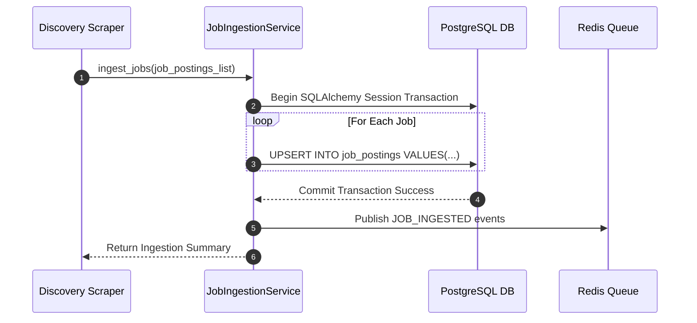
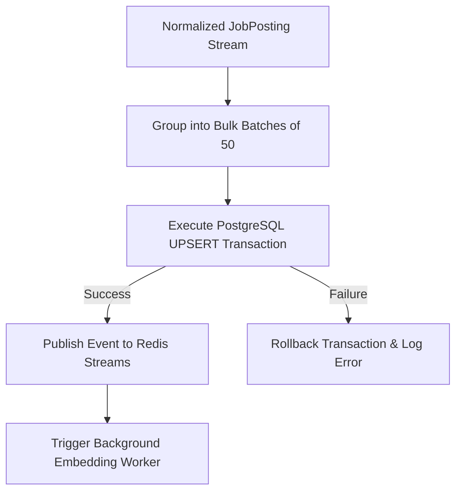

# 1. Overview
This document specifies the **Job Posting Ingestion & Persistence Pipeline**, detailing database persistence, transaction management, deduplication verification, and relational mapping into PostgreSQL.

---

# 2. Why This Exists
Normalized `JobPosting` objects produced by the discovery crawlers must be transactionally saved into primary database storage (PostgreSQL/SQLite) and scheduled for vector index generation without blocking scraper processes.

---

# 3. Responsibilities
- Persist normalized `JobPosting` records into PostgreSQL `job_postings` table ([models.py](file:///d:/Personal%20Imp/Projects/Automated-job-Agent/backend/app/models.py)).
- Maintain transactional consistency and handle duplicate key conflicts.
- Push newly ingested job IDs to `EmbeddingPipeline` background queue.

---

# 4. Inputs
- Validated `JobPosting` Pydantic models.

---

# 5. Outputs
- Database record creation confirmation and vector sync job triggers.

---

# 6. Components
- **JobIngestionService**: Manages database ORM transactions ([routes/jobs.py](file:///d:/Personal%20Imp/Projects/Automated-job-Agent/backend/app/routes/jobs.py)).
- **JobRepository**: Data access layer mapping ORM models ([models.py](file:///d:/Personal%20Imp/Projects/Automated-job-Agent/backend/app/models.py)).
- **IngestionEventQueue**: Dispatches ingested job IDs to Redis Streams.

---

# 7. Folder Structure
```text
docs/Phase-03A-Data-Pipeline/
└── Job-Ingestion.md
```

---

# 8. Data Models
```python
from pydantic import BaseModel
from datetime import datetime
from typing import Optional

class JobIngestionStatus(BaseModel):
    job_id: str
    is_created: bool
    db_record_id: str
    queued_for_vector_sync: bool
    timestamp: datetime = Field(default_factory=datetime.utcnow)
```

---

# 9. API Contracts
N/A (Data Pipeline Spec).

---

# 10. Sequence Diagram


---

# 11. Flow Diagram


---

# 12. Internal Working
The ingestion pipeline processes jobs in batches of 50 using `SQLAlchemy` ORM bulk insert/upsert operations to maximize database throughput.

---

# 13. Configuration
- Specified in [backend/app/config.py](file:///d:/Personal%20Imp/Projects/Automated-job-Agent/backend/app/config.py).
- Ingestion Batch Size: `JOB_INGESTION_BATCH_SIZE = 50`

---

# 14. Error Handling
Database unique constraint violations (`IntegrityError`) trigger automatic `ON CONFLICT DO UPDATE` handling to refresh existing job records without raising exceptions.

---

# 15. Retry Strategy
- Database transaction failures retry up to 3 times with 500ms backoff delays.

---

# 16. Security
- Database SQL parameters use strict ORM parameterization to eliminate SQL injection risks.

---

# 17. Logging
- Logs record `batch_size`, `jobs_created`, `jobs_updated`, `transaction_duration_ms`.

---

# 18. Metrics
- Ingestion Throughput (jobs/second inserted to DB).
- Transaction Commit Latency (<15ms for 50 records).

---

# 19. Testing Strategy
- Unit test bulk ingestion and upsert handling against PostgreSQL container test instance.

---

# 20. Performance Considerations
- Batching inserts reduces DB round-trip latency by over 80%.

---

# 21. Best Practices
- Always execute job database writes inside explicit transaction context blocks (`with SessionLocal() as db:`).

---

# 22. Production Improvements
- Implement database table partitioning by `posted_date` for multi-million row scaling.

---

# 23. Common Failure Scenarios
- **Scenario**: Database connection pool exhausted during heavy crawling.
  - **Resolution**: Ingestion service pauses worker thread, waits 1 second for pool connection return, and retries.

---

# 24. Future Enhancements
- Real-time job ingestion analytics stream dashboard.

---

# 25. References
- SQLAlchemy 2.0 Bulk Operations Documentation.
