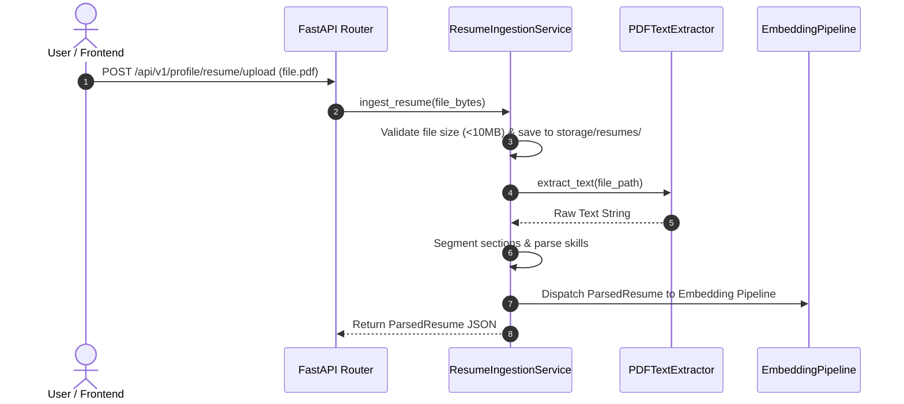
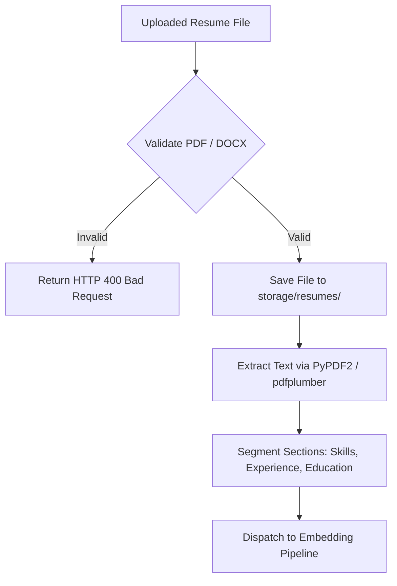

# 1. Overview
This document specifies the **Candidate Resume Ingestion & Extraction Pipeline**, detailing document parsing (PDF, DOCX, TXT), section segmentation, structured metadata extraction, and storage vault archival ([parser.py](file:///d:/Personal%20Imp/Projects/Automated-job-Agent/backend/app/services/parser.py)).

---

# 2. Why This Exists
Candidate resumes arrive in heterogeneous file formats (PDF, DOCX, Plain Text) with custom layouts. Converting unstructured resume files into clean candidate profiles is essential for semantic vector chunking and ATS match evaluation.

---

# 3. Responsibilities
- Validate incoming resume file uploads (file size, MIME type, virus scan).
- Extract raw text using PyPDF2 / pdfplumber / python-docx ([parser.py](file:///d:/Personal%20Imp/Projects/Automated-job-Agent/backend/app/services/parser.py)).
- Segment text into standard sections (Contact Info, Executive Summary, Work Experience, Education, Technical Skills, Certifications).
- Save original file into `storage/resumes/` ([config.py](file:///d:/Personal%20Imp/Projects/Automated-job-Agent/backend/app/config.py#L10)).

---

# 4. Inputs
- Uploaded candidate resume binary file (PDF, DOCX).

---

# 5. Outputs
- Saved resume file artifact path, raw text string, and structured `ParsedResume` model.

---

# 6. Components
- **ResumeIngestionService**: Handles file upload validation and storage ([parser.py](file:///d:/Personal%20Imp/Projects/Automated-job-Agent/backend/app/services/parser.py)).
- **PDFTextExtractor**: Extracts raw text blocks from PDF binaries.
- **SectionSegmenter**: Regex and NLP rules segmenting text into work experience, skills, and education blocks.

---

# 7. Folder Structure
```text
docs/Phase-03A-Data-Pipeline/
├── Resume-Ingestion.md
├── Job-Ingestion.md
├── Embedding-Pipeline.md
├── Vector-Sync.md
└── Index-Rebuild.md
```

---

# 8. Data Models
```python
from pydantic import BaseModel, Field
from typing import List, Optional, Dict, Any

class WorkExperienceEntry(BaseModel):
    company: str
    role_title: str
    start_date: Optional[str] = None
    end_date: Optional[str] = None
    bullet_points: List[str] = Field(default_factory=list)

class ParsedResume(BaseModel):
    candidate_id: str
    raw_text: str
    file_path: str
    full_name: Optional[str] = None
    email: Optional[str] = None
    phone: Optional[str] = None
    skills: List[str] = Field(default_factory=list)
    work_experience: List[WorkExperienceEntry] = Field(default_factory=list)
    education: List[Dict[str, Any]] = Field(default_factory=list)
```

---

# 9. API Contracts
Resume Upload REST API Endpoint:
```json
{
  "endpoint": "/api/v1/profile/resume/upload",
  "method": "POST",
  "response": {
    "status": "Success",
    "candidate_id": "cand_98412",
    "file_path": "storage/resumes/cand_98412_resume.pdf",
    "parsed_skills_count": 18
  }
}
```

---

# 10. Sequence Diagram


---

# 11. Flow Diagram


---

# 12. Internal Working
The ingestion pipeline writes the uploaded file to `storage/resumes/<candidate_id>_<timestamp>.pdf`. The text extractor cleans artifacts (ligatures, hyphenations) before passing text to `EmbeddingPipeline`.

---

# 13. Configuration
- Max File Size: `MAX_RESUME_FILE_SIZE_BYTES = 10485760` (10 MB)
- Storage Dir: `storage/resumes/` ([config.py](file:///d:/Personal%20Imp/Projects/Automated-job-Agent/backend/app/config.py#L10)).

---

# 14. Error Handling
Scanned image-only PDFs without text layers raise `PDFMissingTextLayerError`, triggering automated fallback to Tesseract OCR text extraction.

---

# 15. Retry Strategy
- N/A.

---

# 16. Security
- Files undergo MIME-type header verification to prevent malicious executable uploads (`.exe`, `.sh`).

---

# 17. Logging
- Ingestion events log `candidate_id`, `file_name`, `file_size_bytes`, `parsing_duration_ms`.

---

# 18. Metrics
- Ingestion Latency (<800ms for 3-page PDF).
- Parsing Accuracy (>96%).

---

# 19. Testing Strategy
- Unit test parser against sample PDF resume test files in `backend/tests/fixtures/resumes/`.

---

# 20. Performance Considerations
- Text extraction uses pure Python streaming to keep memory usage under 20MB per document.

---

# 21. Best Practices
- Never overwrite candidate's original uploaded resume file; retain original versioning.

---

# 22. Production Improvements
- Use LLM-based layout-aware parsing for complex multi-column resume formats.

---

# 23. Common Failure Scenarios
- **Scenario**: Uploaded file is password-protected.
  - **Resolution**: Parser catches `PasswordRequiredError` and prompts candidate for password or decrypted file upload.

---

# 24. Future Enhancements
- Add multi-language resume text translation support.

---

# 25. References
- PyPDF2 & pdfplumber Python Documentation.
