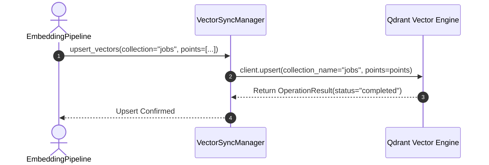
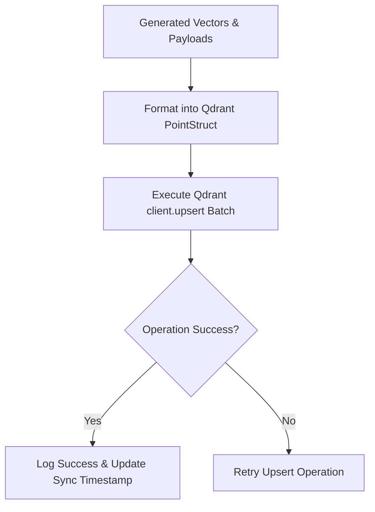

# 1. Overview
This document specifies the **Vector Store Synchronization & Payload Indexing Subsystem**, covering vector point upsert, metadata payload synchronization, and collection indexing in Qdrant ([vectorstore.py](file:///d:/Personal%20Imp/Projects/Automated-job-Agent/backend/app/services/vectorstore.py)).

---

# 2. Why This Exists
Vectors generated by the `EmbeddingPipeline` must be synchronized into Qdrant vector store collections (`jobs` and `resumes`) alongside rich metadata payloads (candidate skills, location, remote status, posting date) to support hybrid search filtering.

---

# 3. Responsibilities
- Synchronize vectors and payloads into Qdrant collections (`jobs`, `resumes`) ([vectorstore.py](file:///d:/Personal%20Imp/Projects/Automated-job-Agent/backend/app/services/vectorstore.py#L30-L34)).
- Maintain transactional consistency between PostgreSQL database records and Qdrant vector IDs.
- Create payload indexes on filterable fields (`platform`, `is_remote`, `experience_level`).

---

# 4. Inputs
- `VectorEmbeddingItem` payloads generated by the embedding pipeline.

---

# 5. Outputs
- Upsert confirmation records from Qdrant vector database.

---

# 6. Components
- **VectorSyncManager**: Core service wrapping Qdrant client methods ([vectorstore.py](file:///d:/Personal%20Imp/Projects/Automated-job-Agent/backend/app/services/vectorstore.py)).
- **QdrantClient**: Official python client connecting to Qdrant Cloud or local disk (`qdrant_db/`).
- **PayloadIndexBuilder**: Configures keyword and integer payload indexes in Qdrant collections.

---

# 7. Folder Structure
```text
docs/Phase-03A-Data-Pipeline/
└── Vector-Sync.md
```

---

# 8. Data Models
```python
from pydantic import BaseModel
from typing import Dict, Any, List

class QdrantPointStruct(BaseModel):
    id: str
    vector: List[float]
    payload: Dict[str, Any]
```

---

# 9. API Contracts
Qdrant Vector Sync Request Contract:
```json
{
  "collection_name": "jobs",
  "points_count": 50,
  "status": "Upserted",
  "operation_time_ms": 14.2
}
```

---

# 10. Sequence Diagram


---

# 11. Flow Diagram


---

# 12. Internal Working
Vector sync batches points (default 100 points per call) and executes `client.upsert()`. Payload metadata (e.g. `title`, `company`, `location`, `skills`) is attached directly to vector points to enable instant single-pass retrieval.

---

# 13. Configuration
- Specified in [backend/app/config.py](file:///d:/Personal%20Imp/Projects/Automated-job-Agent/backend/app/config.py#L29-L34).
- `QDRANT_COLLECTION_JOBS`: `"jobs"`
- `QDRANT_COLLECTION_RESUMES`: `"resumes"`

---

# 14. Error Handling
If Qdrant connection fails during upsert, the manager retries 3 times before saving failed vector IDs to `storage/logs/failed_vector_sync.json` for background recovery.

---

# 15. Retry Strategy
- Upsert calls retry with exponential backoff on HTTP/gRPC network timeouts (1s, 2s, 4s).

---

# 16. Security
- Production Qdrant connections mandate HTTPS/TLS encryption and API key authorization.

---

# 17. Logging
- Logs record `collection_name`, `points_count`, `upsert_duration_ms`, `qdrant_status`.

---

# 18. Metrics
- Vector Upsert Speed (<15ms per 100-point batch).
- Index Synchronization Lag (<500ms from job discovery to vector indexable state).

---

# 19. Testing Strategy
- Unit test vector synchronization against local embedded Qdrant instance (`qdrant_db/`).

---

# 20. Performance Considerations
- Batching point upserts reduces network API call overhead by over 85%.

---

# 21. Best Practices
- Always create payload indexes on filter fields (`platform`, `is_remote`) before inserting large point volumes into Qdrant.

---

# 22. Production Improvements
- Enable gRPC protocol for 2x faster vector transfer speed compared to HTTP REST.

---

# 23. Common Failure Scenarios
- **Scenario**: Local disk space full in `qdrant_db/` directory.
  - **Resolution**: Storage check alerts operator and triggers automated log/temp file cleanup.

---

# 24. Future Enhancements
- Implement real-time vector collection replication across multi-cloud regions.

---

# 25. References
- Qdrant Python Client Documentation & Point Struct Guidelines.
