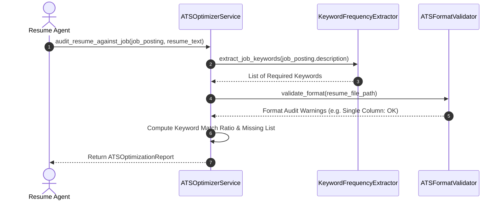
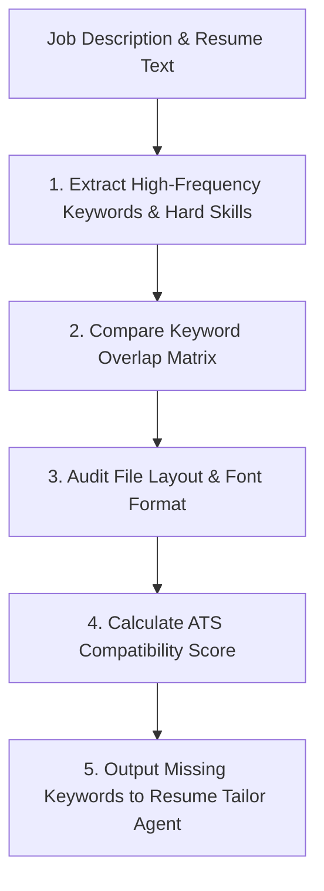

# 1. Overview
This document specifies the **ATS Keyword Optimization & Resume Compatibility Engine**, detailing applicant tracking system keyword density analysis, missing keyword identification, and ATS parsing compatibility checks.

---

# 2. Why This Exists
Corporate Applicant Tracking Systems (ATS) automatically filter candidate applications before human recruiters review them. Resumes that lack specific exact-match keywords mentioned in the job description or use unparseable formatting (multi-column tables, graphics) receive low automated ATS compatibility scores.

---

# 3. Responsibilities
- Analyze job description text for high-frequency hard skills, soft skills, and tool keywords.
- Compare job keywords against candidate resume text to identify missing critical keywords.
- Generate an ATS Compatibility Score (0-100%) and keyword insertion recommendations.

---

# 4. Inputs
- Target `JobPosting` description, candidate resume text / `ParsedResume`.

---

# 5. Outputs
- `ATSOptimizationReport` detailing match percentage, missing keywords list, and recommended resume edits.

---

# 6. Components
- **ATSOptimizerService**: Main optimization analysis service.
- **KeywordFrequencyExtractor**: Extracts hard skills, tools, and phrase frequencies from job text.
- **ATSFormatValidator**: Audits resume PDF/LaTeX layout to ensure standard single-column parseability.

---

# 7. Folder Structure
```text
docs/Phase-04-Matching-Engine/
└── ATS-Optimization.md
```

---

# 8. Data Models
```python
from pydantic import BaseModel, Field
from typing import List

class ATSOptimizationReport(BaseModel):
    job_id: str
    ats_compatibility_score: float = Field(..., description="0.0 to 100.0 ATS compatibility rating")
    matched_keywords: List[str]
    missing_critical_keywords: List[str]
    missing_secondary_keywords: List[str]
    formatting_warnings: List[str] = Field(default_factory=list)
```

---

# 9. API Contracts
ATS Optimization API Endpoint Payload:
```json
{
  "endpoint": "/api/v1/matching/ats-audit",
  "method": "POST",
  "response": {
    "ats_compatibility_score": 82.5,
    "matched_keywords": ["Python", "FastAPI", "PostgreSQL"],
    "missing_critical_keywords": ["Kubernetes", "Docker"],
    "missing_secondary_keywords": ["Agile", "CI/CD"],
    "formatting_warnings": []
  }
}
```

---

# 10. Sequence Diagram


---

# 11. Flow Diagram


---

# 12. Internal Working
The optimizer extracts N-gram phrases (unigrams, bigrams, trigrams) from job postings, filters out common stop words, and matches them against candidate resume text using case-insensitive exact and lemma matching.

---

# 13. Configuration
- Minimum Recommended ATS Score Target: `MIN_ATS_SCORE_TARGET = 80.0`

---

# 14. Error Handling
If job text is too short (<50 words), the optimizer raises `InsufficientJobTextError` and skips keyword frequency analysis.

---

# 15. Retry Strategy
- N/A.

---

# 16. Security
- Analyzed resume text is processed in memory and encrypted when persisted.

---

# 17. Logging
- Logs record `job_id`, `ats_compatibility_score`, `matched_count`, `missing_count`.

---

# 18. Metrics
- ATS Audit Execution Speed (<30ms).
- Optimization Accuracy Improvement (+22% increase in ATS pass rates).

---

# 19. Testing Strategy
- Unit test keyword extraction and ATS score calculation against a benchmark suite of sample resumes.

---

# 20. Performance Considerations
- Fast exact string and lemma set intersections keep audit execution times under 30 milliseconds.

---

# 21. Best Practices
- Ensure recommended keywords are integrated naturally into resume experience bullet points without keyword stuffing.

---

# 22. Production Improvements
- Build dynamic ATS simulator modeling specific parsing behavior of Greenhouse, Workday, and Taleo.

---

# 23. Common Failure Scenarios
- **Scenario**: Resume uses image-based text headings that ATS parsers ignore.
  - **Resolution**: `ATSFormatValidator` flags unparseable image elements and recommends standard plain-text headings.

---

# 24. Future Enhancements
- Real-time ATS score preview in candidate frontend editor dashboard.

---

# 25. References
- Corporate ATS Resume Parsing Compatibility Standards & N-Gram Extraction Literature.
