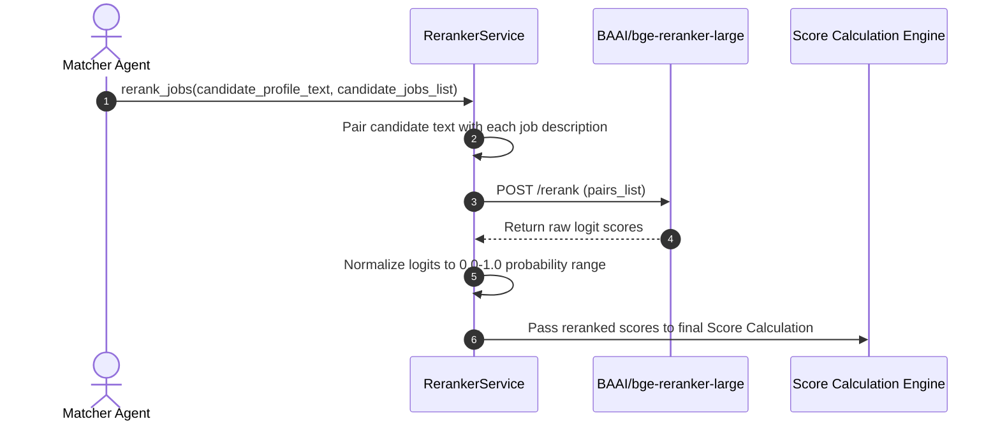
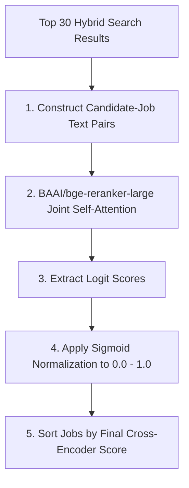

# 1. Overview
This document specifies the **Cross-Encoder Reranking Engine**, detailing cross-attention inference (`BAAI/bge-reranker-large`), candidate-job score re-estimation, and candidate match sorting ([reranker.py](file:///d:/Personal%20Imp/Projects/Automated-job-Agent/backend/app/services/matching/reranker.py)).

---

# 2. Why This Exists
Bi-encoder vector search (computing separate embeddings for query and document) is ultra-fast but compresses text into fixed vectors, losing fine-grained term interactions. A Cross-Encoder performs joint self-attention across the combined candidate-job text pair, providing high precision match scoring.

---

# 3. Responsibilities
- Accept Top-K (20-50) candidate jobs retrieved from `AgenticRAG` hybrid search.
- Perform joint cross-attention inference using `BAAI/bge-reranker-large` ([config.py](file:///d:/Personal%20Imp/Projects/Automated-job-Agent/backend/app/config.py#L43)).
- Re-rank candidate job matches by true relevance score.

---

# 4. Inputs
- Top-K candidate job postings, candidate profile summary text.

---

# 5. Outputs
- Re-ranked candidate job list with normalized cross-encoder relevance scores (0.0 to 1.0).

---

# 6. Components
- **RerankerService**: Core reranking service ([reranker.py](file:///d:/Personal%20Imp/Projects/Automated-job-Agent/backend/app/services/matching/reranker.py)).
- **HuggingFaceRerankerClient**: Handles API inference calls to Hugging Face Serverless Reranker endpoint.
- **CrossEncoderModelLocal**: Local SentenceTransformers CrossEncoder fallback model.

---

# 7. Folder Structure
```text
docs/Phase-04-Matching-Engine/
└── Cross-Encoder.md
```

---

# 8. Data Models
```python
from pydantic import BaseModel, Field
from typing import List, Dict, Any

class RerankedJobItem(BaseModel):
    job_id: str
    original_rank: int
    reranked_rank: int
    cross_encoder_score: float = Field(..., description="0.0 to 1.0 relevance score")
    payload: Dict[str, Any]
```

---

# 9. API Contracts
N/A (Reranker Engine Spec).

---

# 10. Sequence Diagram


---

# 11. Flow Diagram


---

# 12. Internal Working
The reranker pairs candidate profile text with job descriptions (`[CLS] candidate_text [SEP] job_description [SEP]`). BGE-reranker outputs cross-attention logit scores, which are converted to standard 0.0–1.0 probability values via sigmoid functions.

---

# 13. Configuration
- Specified in [backend/app/config.py](file:///d:/Personal%20Imp/Projects/Automated-job-Agent/backend/app/config.py#L43).
- Model: `RERANKER_MODEL = "BAAI/bge-reranker-large"`
- Rerank Candidate Limit: `TOP_K_RERANK_LIMIT = 30`

---

# 14. Error Handling
If Hugging Face reranker API encounters a timeout, `RerankerService` falls back to reciprocal rank fusion (RRF) scores without halting execution.

---

# 15. Retry Strategy
- Model API requests retry up to 3 times with exponential backoff.

---

# 16. Security
- Text pairs submitted for reranking are sanitized to prevent prompt injection.

---

# 17. Logging
- Reranker logs record `candidate_id`, `input_pairs_count`, `top_score`, `inference_duration_ms`.

---

# 18. Metrics
- Reranking Accuracy Improvement over Bi-encoder (+18% NDCG@10).
- Reranker Latency (<180ms for 30 pairs).

---

# 19. Testing Strategy
- Unit test reranker score normalization against known high-fit vs low-fit candidate-job text pairs.

---

# 20. Performance Considerations
- Limiting cross-encoder reranking to the Top-30 hybrid search results avoids latency penalties on large candidate sets.

---

# 21. Best Practices
- Truncate input text pairs to 512 tokens max to stay within cross-encoder attention limits.

---

# 22. Production Improvements
- Deploy ONNX-runtime cross-encoder models locally for sub-50ms reranking latency.

---

# 23. Common Failure Scenarios
- **Scenario**: Job posting description exceeds 1024 tokens.
  - **Resolution**: Reranker extracts job title + required skills + summary paragraph for cross-attention scoring.

---

# 24. Future Enhancements
- Fine-tune cross-encoder models on historical candidate interview conversion datasets.

---

# 25. References
- SentenceTransformers Cross-Encoder Architecture Guidelines.
